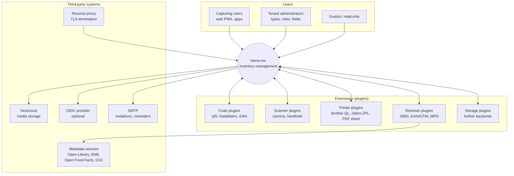

# 02 — Constraints and System Context

## 2.1 Technical constraints

These are **binding** on the design. Each has an ADR with rationale,
alternatives and consequences.

| Area | Decision | ADR |
|---|---|---|
| Server language and runtime | Java 25 (LTS), Spring Boot 4, Spring Modulith | [0001](../adr/0001-backend-platform.md) |
| Build | Gradle 9, Kotlin DSL, version catalog (`gradle/libs.versions.toml`) | [0001](../adr/0001-backend-platform.md) |
| Topology | Modular monolith, plugins optionally as separate processes | [0002](../adr/0002-modular-monolith.md) |
| Database | PostgreSQL 18, row-level security, JSONB, `uuidv7()` | [0004](../adr/0004-attribute-storage-model.md), [0016](../adr/0016-identifiers.md) |
| Search | OpenSearch | [0008](../adr/0008-search.md) |
| Messaging | RabbitMQ with quorum queues, transactional outbox | [0009](../adr/0009-messaging-and-events.md) |
| Cache, sessions, rate limits | Valkey (Redis-compatible) | [0009](../adr/0009-messaging-and-events.md) |
| Media storage | `BlobStore` port; adapters for filesystem, S3/MinIO, Nextcloud (WebDAV) | [0007](../adr/0007-media-storage.md) |
| Web | React 19, TypeScript, Vite, PWA | [0012](../adr/0012-web-frontend.md) |
| Apps | Kotlin Multiplatform, Compose Multiplatform (Android, iOS) | [0013](../adr/0013-mobile-apps.md) |
| Outward API | REST (OpenAPI 3.1) and GraphQL (read-only) | [0010](../adr/0010-api-surfaces.md) |
| Plugin and internal API | gRPC, protobuf, `buf` | [0010](../adr/0010-api-surfaces.md) |
| Container operation | **Rootless, without exception** — Podman ≥ 5.0 with Quadlet *or* rootless Docker with Compose v2; rootful is not supported | [0021](../adr/0021-podman-quadlet.md), [0022](../adr/0022-rootless.md) |
| Supported distributions | Debian ≥ 13 · Ubuntu ≥ 26.04 LTS · Fedora ≥ 43 · RHEL, CentOS Stream, Rocky Linux and AlmaLinux ≥ 9.5 resp. ≥ 10 | [0021](../adr/0021-podman-quadlet.md) |
| Deployment | Both container runtimes and the Helm chart are maintained as equals and tested in CI | [0015](../adr/0015-deployment.md), [0021](../adr/0021-podman-quadlet.md) |
| Licence | AGPL-3.0-or-later | [0018](../adr/0018-licensing.md) |

### Derived consequences that are easily overlooked

- **Java 25 no longer has a `SecurityManager`.** In-process plugins **cannot** be
  sandboxed on the JVM. That is why out-of-process is the default for foreign
  code and in-process is open only to signed plugins explicitly classified as
  trusted — see [09 Extensibility](09-extensibility-and-plugins.md) and
  [ADR-0006](../adr/0006-plugin-runtime.md).
- **RLS only works if the application role has neither `BYPASSRLS` nor ownership
  of the tables.** Migrations therefore run under a separate role. See
  [07 Data Model](07-data-model.md).
- **OpenSearch and RabbitMQ are additional failure sources.** Both are integrated
  such that their failure merely degrades the system (see
  [13 Operations](13-operations-and-observability.md), degradation levels).
- **Rootless rules out ports below 1024.** The application therefore listens on
  8080; TLS is terminated exclusively by the external reverse proxy. Likewise,
  bind mounts into host directories are out — volumes are managed by the
  container runtime, because on the host the files belong to the `subuid` range.
  See [ADR-0022](../adr/0022-rootless.md).
- **Three API surfaces mean a threefold authorization obligation.** That is why
  authorization is enforced not per surface but **once in the application
  layer**; the surfaces are pure adapters
  ([08 API Contract](08-api-contract.md)).

## 2.2 Organisational constraints

| Aspect | Constraint |
|---|---|
| Team | One person, part-time. The design must break work into small, finishable units. |
| Target environment | Proxmox VM, ≥ 8 GB RAM, ≥ 4 vCPU, SSD storage, cgroup v2 with systemd delegation |
| Executing user | An unprivileged service user without `sudo` rights; `subuid`/`subgid` range and `linger` configured |
| Existing infrastructure | A reverse proxy with TLS exists; a Nextcloud instance exists and is used as media storage |
| Not available | No Keycloak, no Prometheus/Grafana — the system brings or prepares both itself |
| Access to the production instance | Registration by invitation only; entitled users may create any number of tenants |
| Publication | Public repository under AGPL-3.0-or-later; third parties should be able to run it |
| Versioning | Semantic versioning for the application, the API, the plugin contract and the event schemas — each independently |
| Commit convention | Conventional Commits, **DCO** (`git commit -s`) **and a CLA** for third-party contributions |

## 2.3 Conventions

| Area | Convention |
|---|---|
| Product name | **Home Inventory**; technical identifiers consistently use the short form `home-inv` resp. `homeinv` |
| Repository | `https://github.com/greluc/Home-Inventory` — the repository name is the **one** long-form exception; every other identifier stays short (see [ADR-0000](../adr/0000-open-points.md), O1) |
| Documentation | **English**, Markdown, Mermaid diagrams, arc42 structure |
| Code, API, DB, protocols | **English**, without exception |
| Package root | `de.greluc.homeinv` |
| Database | `snake_case`, singular table names, every table with `tenant_id`, `created_at`, `updated_at`, `version` |
| REST | `kebab-case` in paths, `camelCase` in JSON, plural for collections |
| Protobuf | `home_inv.plugin.v1`, `buf lint` and `buf breaking` in CI |
| Time | Always stored as `timestamptz` in UTC; displayed in the user's time zone |
| Money | An in-house `Money` value type (`BigDecimal` + `java.util.Currency`), **no** money library ([ADR-0025](../adr/0025-money-representation.md)). Stored as `numeric(19,4)` plus an ISO 4217 code; **never** floating point, **never** arithmetic across currencies |
| Measures | Stored in SI base units (grams, millimetres), display unit kept separate |
| Errors | RFC 9457 (`application/problem+json`) on every HTTP surface |

## 2.4 System context — functional

## 2.5 External interfaces

| Partner | Direction | Protocol | Purpose | Behaviour on failure |
|---|---|---|---|---|
| Reverse proxy | inbound | HTTP/2 over TLS, `X-Forwarded-*` | The single point of entry. The system trusts forwarded headers only from a configured address list. | Total loss of access — accepted |
| Web PWA | inbound | REST, GraphQL, WebSocket/SSE | Operation | — |
| Apps (KMP) | inbound | REST + sync protocol | Operation, offline reconciliation | Apps keep working offline |
| Out-of-process plugins | both | gRPC over mTLS | Extension points | Plugin counts as unavailable; the dependent function degrades visibly |
| Nextcloud | outbound | WebDAV over HTTPS, app password | Media storage | Uploads are queued; reads come from the local cache |
| Metadata sources | outbound (only via resolver plugins) | HTTPS | Enrichment by ISBN/EAN | Enrichment drops out, capture still works |
| OIDC provider | outbound | OpenID Connect (Authorization Code + PKCE) | Optional federation | Local account login remains possible |
| SMTP | outbound | SMTP over TLS | Invitations, reminders, security notifications | Queued with retry; invitations stay valid |
| S3/MinIO | outbound | S3 API | Alternative media storage | As Nextcloud |

## 2.6 Threat environment (short form)

The system is reachable from the internet and executes foreign code. The full
threat catalogue is in [12 Security](12-security.md); what matters here is the
constraint that shapes the design:

> **Assume an untrusted client, an untrusted plugin and a curious fellow tenant.**
> Every protective measure must hold even when the application logic contains a
> bug. Two load-bearing decisions follow: **row-level security in the database**
> as a second, independent line of defence next to application authorization, and
> **process isolation for foreign code**.

## 2.7 Open constraints

See [ADR-0000 Open Points](../adr/0000-open-points.md). What remains there is
outstanding *work*, not undecided questions — most notably the printable width of
the Brother DK rolls.
