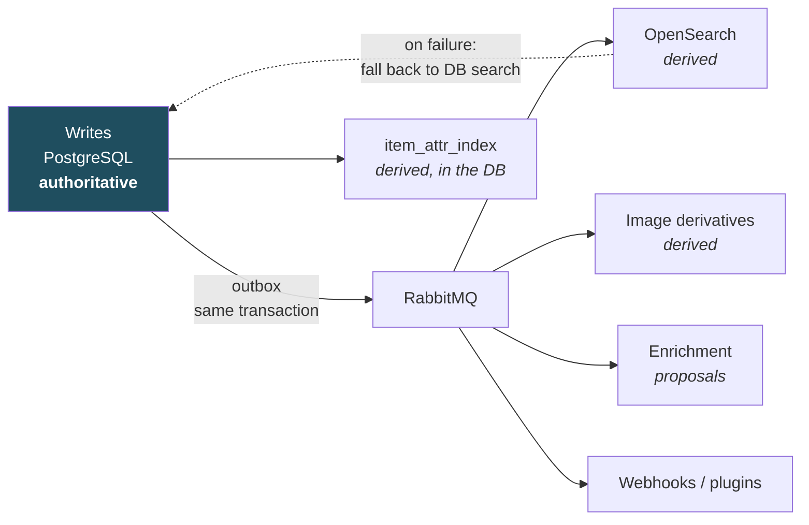

# 03 — Solution Strategy

## 3.1 The strategy in one sentence

A **modular monolith** of functionally cut building blocks that speak to each
other only through **explicit ports and events**, surrounded by a **versioned
extension layer** through which foreign code is attached **in its own process** —
deployed as a small, comprehensible stack, with documented seams for the day a
building block has to be pulled out.

## 3.2 Mapping quality goals to approaches

| Goal | Approach |
|---|---|
| **Q1 Security** | Authorization once in the application layer, not per API surface · PostgreSQL RLS as an independent second line · foreign code in its own process with its own service account and capability proof · envelope encryption for secrets · hard-wired secure defaults |
| **Q2 Modularity** | Spring Modulith with machine-verified boundaries · a separate DB schema per block · access only through published API packages · ArchUnit rules in CI |
| **Q3 Extensibility** | Everything variable behind a port (`CodeFormat`, `ScanSource`, `LabelRenderer`, `PrintTarget`, `MetadataResolver`, `BlobStore`, `SearchIndex`) · one plugin contract, two runtimes · a capability model instead of blanket access |
| **Q4 Maintainability** | Hexagonal structure per block · domain logic free of framework dependencies · test pyramid with `@ApplicationModuleTest` · contracts as artifacts in CI · every decision as an ADR |
| **Q5 Data integrity** | The database is the truth, everything else derived · transactional outbox · optimistic locking via `version` · two-stage deletion · a conflict archive in sync · verified restore |
| **Q6 Usability** | Offline-first in web and apps · client-generated UUIDv7 · scanning as the main entry point · idempotent mutations |
| **Q7 Scalability** | Stateless application layer · derived read model in OpenSearch · media outside the database · background work decoupled through RabbitMQ |

## 3.3 Structure in the small: hexagonal per building block

Every functional building block looks the same on the inside. This is the single
most important measure for maintainability: whoever knows one block knows all of
them.

```
inventory/
├── api/              ← published. The only part other blocks may look at.
│   ├── ItemService.java          (inbound port, use cases)
│   ├── ItemView.java             (immutable carriers, never entities)
│   └── events/ItemCreated.java   (events, versioned)
├── domain/           ← internal. Domain logic, no framework dependency.
│   ├── Item.java                 (aggregate root, enforces invariants)
│   ├── ItemAttributes.java
│   └── ItemRepository.java       (outbound port, defined in the domain)
├── application/      ← internal. Orchestration, transaction boundary, authorization.
│   └── ItemServiceImpl.java
└── infrastructure/   ← internal. Adapters: JPA, event dispatch, ports to others.
    ├── JpaItemRepository.java
    └── ItemSearchProjection.java
```

**Rules that CI enforces** (ArchUnit + Spring Modulith):

1. `domain` imports nothing from `application`, `infrastructure` or Spring.
2. A block imports from another block exclusively out of its `api`.
3. No block touches another block's database schema.
4. There is no cycle between blocks.
5. Entities never leave their block; only `*View` types go outward.

## 3.4 Structure in the large: blocks instead of layers

The cut follows the domain, not the technology. There are no global
"controller / service / repository" layers, but 18 building blocks each with its
own internal layering: the **eight** consistency-critical ones, the **eight**
supporting ones, plus `plugins` and `platform`. The four access blocks (`rest`, `graphql`,
`grpc`, `events-stream`) are not counted — they hold no domain logic, own no
schema and decide nothing
([04 §4.4](04-building-blocks.md)). The full catalogue is in
[04 Building Blocks](04-building-blocks.md).

Coupling between blocks is allowed on exactly three paths:

| Path | When | Property |
|---|---|---|
| **Synchronous port call** on `api` | When the result is needed inside the running transaction (e.g. `catalog.validate(typeId, attributes)`) | directed, acyclic, in-process |
| **Domain event** through the outbox | When a reaction is desired but not a precondition (e.g. search index, enrichment, webhook) | decoupled, replayable, observable |
| **Shared kernel** (`platform`) | Only for genuinely universal notions: IDs, time, money, units, errors, tenant context | kept tiny, change-averse, holds no domain logic |

## 3.5 The extension model in three levels

Not every extension needs code. The levels grow in power and in risk; the lowest
one that suffices is always chosen.

| Level | Means | Examples | Risk |
|---|---|---|---|
| **1 — Configuration** | Data in the running system, no deployment | New item type with fields, location category, label template, role, saved search, webhook | low |
| **2 — Out-of-process plugin** | Own process, gRPC over mTLS, own service account, declared capabilities, egress through the proxy | **Every outbound connection the system makes**: mail, remote object storage, federated login, webhooks, push, metadata resolvers, printer integrations, any third-party development ([ADR-0026](../adr/0026-core-outbound-via-plugins.md)) | medium, bounded by the process, network and permission boundary |
| **3 — In-process plugin** | JAR in an isolated classloader, **signed and explicitly enabled only** | First-party extensions with high call volume, e.g. code generation | high — no sandbox on the JVM, see [ADR-0006](../adr/0006-plugin-runtime.md) |

Both plugin levels serve **the same contract** (`home_inv.plugin.v1`). The core
knows only the contract, not the runtime. A plugin can change levels without
anything changing for the core.

## 3.6 Assessment: do microservices make sense here?

The question was asked explicitly and is answered in full here, not merely
decided.

### 3.6.1 Criteria and findings

| Criterion | Finding for `home-inv` | Favours |
|---|---|---|
| **Independent scalability of parts** | Load is very unevenly distributed: image processing and search indexing are compute-heavy, everything else barely. But both are already **asynchronous background work** and scale by adding worker instances of the same artifact. | Monolith with a worker role |
| **Independent delivery by separate teams** | One developer. There is no coordination problem to solve. | Monolith |
| **Technology diversity** | Everything except plugins belongs sensibly on the JVM. Foreign technology appears exactly where process boundaries are planned anyway. | Monolith + out-of-process plugins |
| **Fault isolation** | Exactly one area is genuinely risky: foreign code and access to foreign networks. That area is **already** isolated. The remaining blocks share the database as a common failure source in any case. | Monolith + isolated plugins |
| **Data consistency** | The core is tightly interwoven: an item without a type, location, tenant and permission is meaningless. Splitting it forces distributed transactions or saga patterns onto operations that are a single ACID transaction today. | Monolith, decisively |
| **Operational effort** | Part-time single-person operation. Every additional service means its own deployment, logging, tracing, certificates, migration, backup and version matrix. | Monolith, decisively |
| **Local developability** | A contributor should be able to start the system locally in under ten minutes. With a distributed system that is only achievable at considerable extra cost. | Monolith |
| **Attack surface** | Every additional service is an additional endpoint, an additional secret, an additional trust relationship. With Q1 as the top goal, that counts against splitting. | Monolith |
| **Expected load** | Even 1 M items and a dozen concurrent users stay an order of magnitude below what a single JVM instance handles. | Monolith |

### 3.6.2 What microservices would actually cost here

Concretely, not abstractly — the following operations are one transaction today
and would become distributed flows:

- *Create item*: checks the tenant quota (`tenancy`), validates attributes against
  the type definition (`catalog`), checks location existence and permission
  (`locations`, `authorization`), issues a public code (`identification`), writes
  an audit entry (`audit`) and an outbox event.
  **Six building blocks, one `COMMIT`.** Distributed: six calls, compensation
  logic, partial states, a new error class per call.
- *Move location*: moves a subtree and all contained items, checks for cycles.
  Distributed, the cycle check would have to span a service boundary — which
  makes no sense at all.
- *Delete tenant (GDPR)*: must take effect completely and demonstrably in **all**
  blocks. Distributed, that is an orchestrated, logged, resumable multi-step
  process instead of a cascading delete.

### 3.6.3 Decision

**Modular monolith with an isolated plugin runtime.** Microservices solve
problems here that do not exist, and create problems that are real. Modularity is
not enforced through network boundaries but through **machine-verified module
boundaries** — which have the same disciplining effect without distributed
transactions.

At the same time, splitting is **not foreclosed**: blocks that are attached only
through events are service-ready today.

### 3.6.4 Extractable blocks and their triggers

The following blocks are deliberately cut so that they can become a service of
their own without restructuring. For each, the trigger is named at which
extraction gets evaluated — not before.

| Block | Coupling today | Trigger for extraction |
|---|---|---|
| `media` (image derivatives) | events only + the `BlobStore` port | Image processing occupies > 50 % CPU permanently, or needs a GPU / another runtime |
| `search` (indexing) | events only + the `SearchIndex` port | Reindexing noticeably degrades API response times |
| `enrichment` | events only + resolver ports | High-latency external calls destabilise the core despite bulkheads |
| `labeling` (rendering) | events only + the `LabelRenderer` port | PDF/bitmap generation becomes memory-hungry enough to need its own limits |
| `notification` | events only | Delivery volume justifies its own scaling and rate control |
| `sync` | events + read access through `api` | Very many mobile clients create connection load that disturbs the API path |
| `identification` | the `CodeAssignment` port + events | Code resolution volume — a public, unauthenticated, rate-limited path ([08 §8.6](08-api-contract.md)) — starts competing with authenticated API traffic for the same instances |
| `portability` | events + read access through `api` | A full tenant export with media (`REQ-PORT-003`) regularly runs long enough to need its own memory and time limits, the way `labeling` does |

**Not extractable** — deliberately: `identity`, `tenancy`, `authorization`,
`catalog`, `inventory`, `locations`, `tagging`, **`audit`**. These eight form the
consistency-critical core and stay inside one transaction boundary.

> **Three blocks were in neither list until 2026-09-11** (open point **O18**).
> [04 §4.2](04-building-blocks.md) labelled all nine supporting blocks
> *extractable*, this table named six with a trigger, and
> [ADR-0002](../adr/0002-modular-monolith.md) said *"six … seven stay together"* —
> thirteen of sixteen. `identification` and `portability` have gained triggers
> above. `audit` moved the other way, and it is the one that was labelled wrongly
> rather than merely left out: `inventory` calls `AuditService` **synchronously
> inside the item transaction** ([05 §5.1](05-runtime-view.md)), and `REQ-SEC-070`
> requires a transaction's several audit entries to be chained under one lock
> acquisition. Neither survives a service boundary.

## 3.7 Data strategy



Three rules:

1. **PostgreSQL is the single source of truth.** OpenSearch, `item_attr_index`,
   thumbnails and caches are **derived** and fully regenerable from the database.
   Each has a tested rebuild path.
2. **Events come into being in the same transaction as the data.** No event
   without a data change, no data change without an event. The outbox solves the
   two-store problem without a distributed transaction.
3. **Derived stores are allowed to fail.** If OpenSearch is down, search falls
   back to PostgreSQL (slower, fewer facets, but correct). If RabbitMQ is down,
   the outbox fills up and is drained once it returns.

## 3.8 Rationale for the technology choices (short form)

In detail per item in the ADRs; here only what holds the choice together.

- **Spring Modulith** is the only widely used way to make module boundaries
  **machine-verifiable** on the JVM while getting events with a transactional
  outbox out of the box. Exactly the two things this design rests on.
- **PostgreSQL** delivers three things at once that would otherwise need three
  systems: relational integrity for the core, JSONB for the type-dependent
  fields, and RLS as a safety net for tenant separation.
- **RabbitMQ** was chosen (see [ADR-0009](../adr/0009-messaging-and-events.md)).
  Its routing and dead-letter handling fit the plugin fan-out well; the outbox
  is still needed because RabbitMQ cannot take part in the database transaction.
- **OpenSearch** was chosen (see [ADR-0008](../adr/0008-search.md)) and carries
  facets and later reporting in addition to search. The `SearchIndex` port keeps
  the PostgreSQL fallback available.
- **React as a PWA** has by far the best ecosystem for camera-based scanning and for
  offline storage. The scanning path is `BarcodeDetector` **where it exists** — Chromium
  on Android, ChromeOS and macOS — and **ZXing-WASM everywhere else**, which includes all
  of Safari and therefore every browser on iOS ([10 §10.3](10-identification-and-labels.md)).
  The WASM build is the load-bearing half, not the fallback, and the ecosystem argument
  rests on it.
- **Kotlin Multiplatform** shares sync logic, domain model and the generated API
  client between Android and iOS — the most expensive part of the apps is
  written exactly once.

## 3.9 Implementation strategy

Four stages, each usable and deployable on its own. Details and the mapping of
requirements: [Roadmap](../requirements/04-roadmap-and-stages.md).

| Stage | Content | Definition of done |
|---|---|---|
| **0 — MVP** | Login, one tenant, items with fixed fields, location tree, photos, full-text search, REST | An item can be created, photographed, stored and found again |
| **1 — Core** | Type system, tags, roles and permissions, tenant administration, GraphQL, audit, import/export, trash — **and the plugin runtime with the first-party plugins** ([ADR-0028](../adr/0028-plugin-runtime-stage-1.md)) | A tenant administrator configures types and permissions without a developer; an invitation mail goes out through `plugin-smtp` |
| **2 — Identification** | UUID codes, QR generation, in-browser scanning, label templates, sheet printing (PDF), stocktake mode | A label sheet is printed, stuck on, scanned, and leads to the item |
| **3 — Ecosystem** | The **published** contract and SDK, ISBN/EAN resolvers, printer plugins, push channels, KMP apps, offline sync | An **external** author gets a plugin running from the published SDK alone; the app works a week offline and reconciles |
