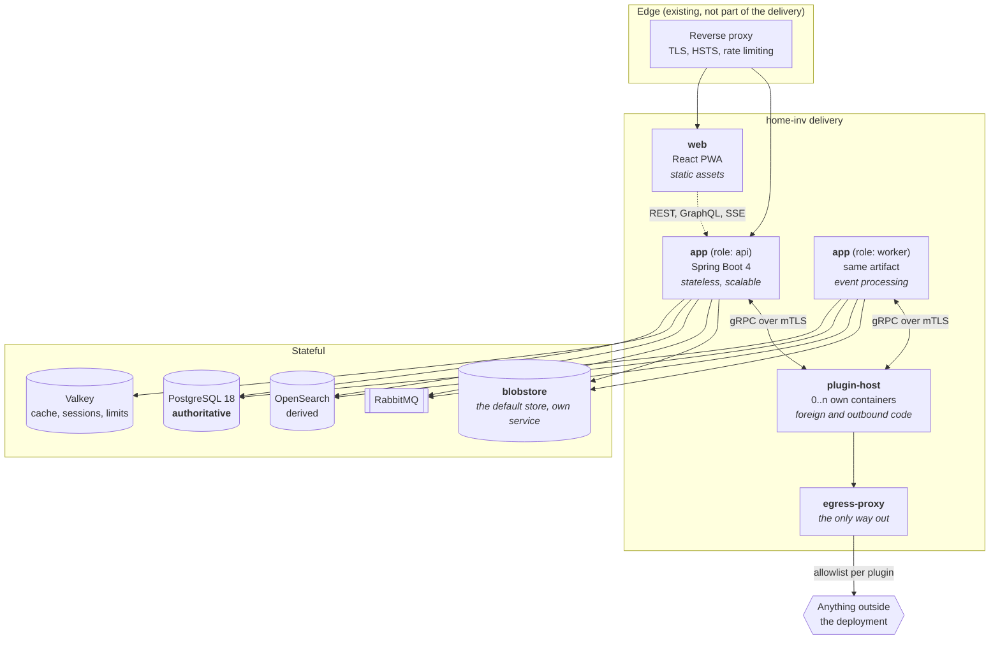
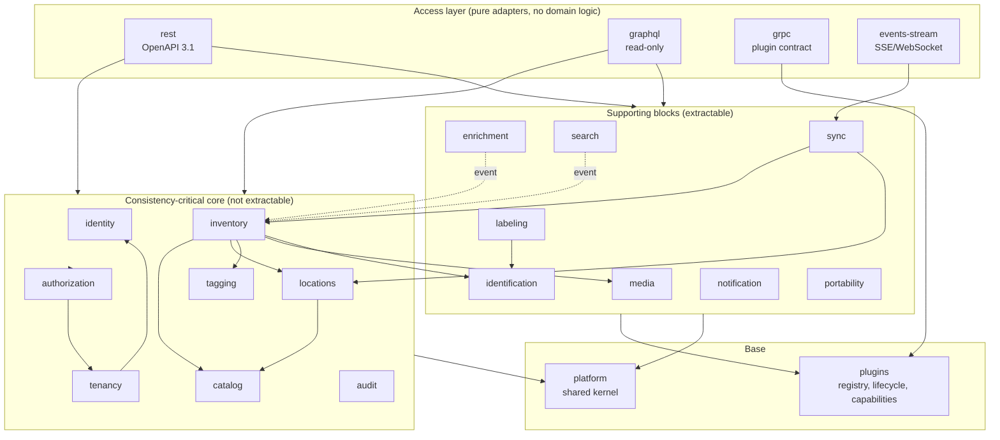

# 04 — Building Block View

## 4.1 Level 1 — Deployable units

**Read the diagram for what is missing.** Neither `api` nor `worker` has an arrow
to anything outside the deployment. Remote object storage, mail, federated login,
webhooks and push are not absent — they are reached through `plugin-host`, and
only ever through `egress-proxy`
([ADR-0026](../adr/0026-core-outbound-via-plugins.md),
[ADR-0027](../adr/0027-egress-enforcement.md)). The in-core `BlobStore` is the
filesystem adapter, which opens no socket outside the deployment — it writes to the
`blobstore` service on `internal`, which holds the volume so that `api` and `worker`
stay stateless ([ADR-0043](../adr/0043-blobstore-as-its-own-service.md)).

**Important:** `api` and `worker` are the **same container image** with a
different Spring profile. That keeps the version matrix at one and prevents
worker and API from drifting apart.

| Unit | State | Scaling | Note |
|---|---|---|---|
| `web` | none | arbitrary (static) | On `edge` and on the two-member `frontend` segment with `api`, and **not** on `internal` ([ADR-0044](../adr/0044-internal-is-not-a-trust-boundary.md)): the ingress needs the API and no datastore. Serves the application shell **and every security header** — the CSP, HSTS, COOP and CORP, `Referrer-Policy`, `Permissions-Policy` — and **not** `Cross-Origin-Embedder-Policy`, which [ADR-0040](../adr/0040-no-cross-origin-isolation.md) drops and `REQ-SEC-061` makes CI fail on if it reappears. Serving the bundle from the operator's reverse proxy instead is **not supported**: the header set would then live outside this repository and `REQ-SEC-060`'s CI comparison would have nothing to compare ([ADR-0038](../adr/0038-csp-delivery-and-first-paint.md)) |
| `app` (api) | none | horizontal | Sessions in Valkey, no local files |
| `app` (worker) | none | horizontal | Consumes RabbitMQ, competing consumers |
| `blobstore` | volume `blobdata` | one per deployment | Speaks **gRPC over mTLS with a pinned fingerprint**, the same transport as the plugin `BlobStore` adapters ([ADR-0044](../adr/0044-internal-is-not-a-trust-boundary.md)) — it holds every tenant's media, and "its port is on `internal`" was the whole of its access control until 2026-09-11. The default media store. It exists so that the `filesystem` adapter has somewhere to write **without** making `api` and `worker` stateful — a shared mount there would have cost `REQ-NFR-008`. In-deployment infrastructure behind a port, exactly like `clamd` behind `VirusScanner`; not a plugin, because it opens nothing outside the deployment ([ADR-0043](../adr/0043-blobstore-as-its-own-service.md)) |
| `plugin-host` | plugin's own | per plugin | Own service account, own UID range, **own network segment**, no route out except through the proxy ([ADR-0037](../adr/0037-per-plugin-network-segments.md)) |
| `egress-proxy` | none | one per deployment | The single chokepoint for every outbound connection, in **every** profile — `minimal` has no plugins but does have a scanner that needs its signatures ([ADR-0036](../adr/0036-scanner-egress.md)). Holds no credentials and terminates no TLS — it sees host and port, never content. One interface per plugin segment, so the caller is identified by topology rather than by a claimed source address |

## 4.2 Level 2 — Building blocks inside `app`

Solid arrows are synchronous calls into the target's `api` package. Dashed arrows
are events. **There is no cycle** — CI verifies that.

> **`audit` sits in the core group, and that is a correction** (open point
> **O18**, decided 2026-09-11). It was drawn among the extractable blocks while
> `inventory` calls `AuditService` **synchronously inside the item transaction**
> ([4.3](#43-level-3--building-block-catalogue),
> [05 §5.1](05-runtime-view.md)) — extracted, that would be a remote call held
> open across a database transaction, which is precisely the property
> [03 §3.6.2](03-solution-strategy.md) uses to argue against microservices in the
> first place. `REQ-SEC-070` compounds it: a transaction producing several audit
> entries writes them as one chained run under a **single lock acquisition**, and
> a hash chain computed across a service boundary is not that.
>
> Eight blocks are consistency-critical, eight are supporting, two are base —
> still eighteen. The three previously unclassified blocks are now each on one
> side: `audit` here, `identification` and `portability` extractable with triggers
> named in [03 §3.6.4](03-solution-strategy.md).

## 4.3 Level 3 — Building block catalogue

Every block has: one sentence of responsibility, its own DB schema, a published
`api` package, outbound ports, and emitted events.

---

### `platform` — shared kernel

**Responsibility:** universal notions every block needs and nobody owns.

| | |
|---|---|
| Schema | none |
| Contains | `TenantId`, `UserId`, `EntityId` (UUIDv7), `Money` (in-house, [ADR-0025](../adr/0025-money-representation.md)), `Quantity`/`Unit`, `Clock`, the `ProblemDetail` error hierarchy, `TenantContext`, `Result`, pagination types, event base types (CloudEvents envelope), `TenantErasure` — what one block removes when a tenant is erased, implemented by every block that holds a tenant's data and collected by `tenancy` ([ADR-0060](../adr/0060-the-erasure-runs-in-one-pass.md)) |
| Does **not** contain | any form of domain logic, any database access, any dependency on another block |

> The shared kernel is the most common place where modular monoliths decay.
> Rule: **a class only goes in if at least three blocks need it and it contains
> no decision.** Its size is monitored in CI.

---

### `identity` — who someone is

**Responsibility:** proving the identity of a person or a service.

| | |
|---|---|
| Schema | `identity` |
| Key notions | `User`, `Credential` (password/TOTP/passkey), `Session`, `RefreshToken`, `ServiceAccount`, `IdentityProvider` |
| Publishes | `AuthenticationService`, `UserDirectory` (read-only view of users), `PrincipalView`, `AccountAdministration` (what the instance operator may change about an account — entitlements and nothing else), `OperatorDirectory` (the paged listing of operators, its own port because paging signs a cursor and the one-shot `bootstrap` service is given no signing key), `AccountRegistry` implemented for `tenancy`, `SecondFactor` (enrolling, verifying and removing what an account authenticates with besides its password — `REQ-AUTH-002`) |
| Outbound ports | `PasswordHasher` (Argon2id, in-core) · `MailSender` and `OidcClient` — **both served by plugins** ([ADR-0026](../adr/0026-core-outbound-via-plugins.md)); `identity` knows only the ports, which is why moving them cost nothing structurally |
| Events | `UserRegistered`, `UserDeactivated`, `CredentialChanged`, `SuspiciousLoginDetected` |
| Notable | Knows **no** tenants and **no** permissions. Who someone is and what someone may do are separate questions. The account nevertheless carries three **instance-level** facts — `instance_operator`, `may_create_tenants` and `tenant_limit` ([ADR-0057](../adr/0057-the-instance-operator.md)) — and they are not a contradiction: nothing here evaluates them. This block stores them, `authorization` answers with them through the `AccountEntitlements` port, and no tenant can grant one. |

---

### `tenancy` — on whose behalf

**Responsibility:** tenants, memberships, invitations, quotas.

| | |
|---|---|
| Schema | `tenancy` |
| Key notions | `Tenant` (`ACTIVE` · `SUSPENDED` · `PENDING_DELETION` · `ERASED`, the last being what a tombstone carries once every block has reported; the last two are both *inaccessible* and the API answers them identically, because which of the two a tenant is in is a status oracle — open point O26), `Membership`, `Invitation` (single-use, time-limited, bound to an address — `REQ-TEN-004`; the token is stored only as a SHA-256, `REQ-SEC-048`), `Quota`, `TenantSettings` |
| Publishes | `TenantService` (creating a tenant as a person, within the account's bound), `TenantProvisioning` (the mechanism, which the one-shot `bootstrap` service uses and which has no opinion about who may), `MembershipLookup` (the memberships of one person, answerable **without** a tenant context), `MembershipAdministration`, `InvitationService`, `QuotaGuard`, `TenantLifecycle`, `ErasureCertificates` |
| Outbound ports | `MailSender` — served by `plugin-smtp` ([ADR-0026](../adr/0026-core-outbound-via-plugins.md)). Invitations therefore need that plugin installed; without it a tenant administrator can still invite, but no mail goes out — the token comes back in the answer to `POST /tenants/{id}/invitations` and the administrator passes the link on themselves, which the UI says. · `AccountRegistry` — what this block needs to know about a person (name, address, and creating one for an accepted invitation), declared **here** and implemented by `identity`, because `identity` already depends on this block and a call the other way would close a cycle |
| Events | `TenantCreated`, `TenantSuspended`, `TenantDeletionRequested`, `MemberJoined`, `MemberLeft`, `QuotaExceeded` |
| Notable | `QuotaGuard` is called **before** every creating operation (item count, bytes stored, plugin count, API calls). That way abuse limitation is not something to bolt on later. Three of the four are **stocks**, carried forward in `tenancy.quota_usage`; the fourth, API calls, is a monthly allowance counted in Valkey, because a write to PostgreSQL per request would be a write to PostgreSQL per request. A tenant's own limit is set by the instance operator through the `SECURITY DEFINER` function of [7.5](../architecture/07-data-model.md) — the operator establishes no tenant context and gains no other reach by doing it ([ADR-0057](../adr/0057-the-instance-operator.md)) |

---

### `authorization` — who may do what

**Responsibility:** evaluating permissions. The only place in the system where
"may" is answered.

| | |
|---|---|
| Schema | **`authz`** — from stage 1, and **not** `authorization`: that is a reserved word PostgreSQL will not take as a bare identifier, so the one block whose schema name differs from the block name is this one ([ADR-0058](../adr/0058-authz-schema-name.md)). Stage 0 had none and created none: the six built-in roles and their grants are code, and an empty schema passes every check while documenting nothing (the same rule `V1__extensions_schemas_grants.sql` follows). The registry is [`docs/reference/permissions.yaml`](../reference/permissions.yaml), compared against the code on every build |
| Key notions | `Role` (built-in from stage 0, tenant-owned from stage 1), `Permission`, `Entitlement` (instance-level, from stage 1 — [ADR-0057](../adr/0057-the-instance-operator.md)), `PolicyDecision`, `Scope` |
| Publishes | `AccessControl.require(permission)`, `require(permission, resource)`, `require(entitlement)` and `mayGrant(actorRole, targetRole)` (`REQ-TEN-010`, asked by `tenancy` and answered here because what a role is *worth* is this block's question), `Permission`, `Role`, `Entitlement`, `@RequiresPermission`, `@RequiresEntitlement`, `@PublicEndpoint`, and the `AccountEntitlements` port that `identity` implements |
| Events | `RoleAssigned`, `RoleDefinitionChanged`, `AccessDenied` (for audit) |
| Permission model | `<block>:<resource>:<action>` — e.g. `inventory:item:create`, `catalog:type:update`, `labeling:job:print`. Field-level visibility through `field-visibility` rules per role (e.g. purchase price only for `ADMIN`), stored in `authz.field_visibility` and keyed by the field's **key** rather than by a definition: a purchase price is the same thing on a book as on a drill. A field nobody has made a rule about is readable by `OWNER` and `ADMIN` — the default rather than "nobody", which would lock a tenant out of a field the moment it marks one sensitive (`REQ-TEN-008`, `REQ-SEC-027`) |
| Built-in roles | `OWNER`, `ADMIN`, `MEMBER`, `CONTRIBUTOR`, `VIEWER`, `GUEST` — tenant-owned roles extend, they do not replace. **Three bands:** *content* is the things in the inventory and is `MEMBER`'s in full, deletion and final removal included; *configuration* is the type system, the value lists and the members, and is `ADMIN`'s; *ownership* is the tenant itself. `ADMIN` and `OWNER` hold the same permissions until `REQ-TEN-011` adds tenant deletion; what separates them already is `REQ-TEN-010` — only an `OWNER` may make somebody an `OWNER`. The grants are in [`permissions.yaml`](../reference/permissions.yaml) and compared against the code on every build |
| Entitlements | `INSTANCE_OPERATOR` and `CREATE_TENANT`, on the **account** rather than in a tenant. A permission is evaluated against the role a session holds in the tenant it acts for; these are read where there is none — creating one's first tenant, administering the instance — and no tenant could grant one anyway ([ADR-0057](../adr/0057-the-instance-operator.md)) |
| Tenant-owned roles | A definition names one of the six as its **base** and adds permissions to it; nothing subtracts, because a role that took a permission away from its base would be a role whose name lies about what it is. A tenant never defines a new *permission* — that would be a tenant deciding what the application does, the line [ADR-0020](../adr/0020-configuration-as-data.md) draws for the type system. Removing a definition **demotes its holders to its base** rather than stranding them, which is why a membership keeps a built-in name as well (`REQ-TEN-006`) |
| Notable | **Never** decides on data it loads itself. Resources are handed in as already-loaded, tenant-checked objects. This closes time-of-check/time-of-use gaps. A definition's permissions are read **per request** rather than carried in the session: a role edited while somebody is signed in has to reach them, which is the same reason an entitlement is read from the account ([ADR-0057](../adr/0057-the-instance-operator.md)) |

---

### `catalog` — the type system

**Responsibility:** defining which fields an item type and a location category
carry. Configurable while running.

| | |
|---|---|
| Schema | `catalog` |
| Key notions | `ItemType`, `LocationCategory`, `FieldDefinition`, `FieldGroup`, `TypeVersion`, `ValueList` |
| Publishes | `TypeRegistry`, `AttributeValidator.validate(typeId, attributes) → ValidationResult`, `FieldDefinitionView`, `TypeAdministration` (the editor of REQ-CORE-020) |
| Outbound ports | `AttributeUsage` — how many rows carry a value under one field key, and the removal of those values. Declared here and implemented by `inventory` and `locations`, because both already depend on this block and a call in the other direction would close a cycle (REQ-CORE-026) |
| Events | `TypeCreated`, `TypeVersionPublished`, `FieldAdded`, `FieldDeprecated`, `FieldSearchabilityChanged` |
| Field data types | `text`, `multiline`, `integer`, `decimal`, `money`, `boolean`, `date`, `datetime`, `enum`, `multi-enum`, `url`, `email`, `quantity` (value + unit), `reference` (to item/location/value list), `secret` (encrypted, see [ADR-0019](../adr/0019-sensitive-field-encryption.md)), `file` |
| Field properties | Key, label (multilingual), required, default, unit, range/regex, help text, visibility rule, `searchable`, `sortable`, `facetable`, `sensitive`, order, group |
| Inheritance | Types form a tree. `Book` inherits from `Medium` inherits from `Item`. An inherited field may be tightened (required, narrower range) but not loosened. The parent's fields are **copied into the child at publication**, so a published version is a complete snapshot and a later change to the parent reaches nothing already written (decided 2026-09-13). |
| Versioning | Types are versioned, and a version is a **draft until it is published**. Fields are added and changed on the draft; publishing materialises what the type inherits, generates the schema and freezes it, and anything already written keeps the version it named. Removing a field marks it `deprecated` and hides it; the data stays. Actual deletion is a separate, logged administrative operation with a preview of the affected set. |
| Notable | Generates a **JSON Schema (draft 2020-12)** per type version, validated at the API boundary and additionally shipped to clients — the same check offline as online. |

---

### `inventory` — the items

**Responsibility:** the central aggregate. Master data, type-dependent
attributes, quantities, relations, lifecycle.

| | |
|---|---|
| Schema | `inventory` |
| Key notions | `Item` (aggregate root), `ItemAttributes` (JSONB), `ItemRelation`, `ItemLifecycle`, `MaintenanceEntry`, `Loan`, `Bundle`, `ConsumableStock`, `Valuation` (purchase price, current value, replacement value) |
| Publishes | `ItemService`, `ItemQuery`, `ItemRelations`, `ItemView`, `ItemRef` |
| Outbound ports | `AttributeValidator` (catalog), `LocationLookup` (locations), `QuotaGuard` (tenancy), `AccessControl` (authorization), `CodeAssignment` (identification), **`AuditService` (audit)** — [05 §5.1](05-runtime-view.md) writes an audit entry inside the item transaction, and without this port that write would be a block reaching into a foreign schema, which [4.5](#45-mapping-blocks-to-database-schemas) forbids |
| Events | `ItemCreated`, `ItemUpdated`, `ItemMoved`, `ItemDeleted`, `ItemRestored`, `ItemLent`, `ItemReturned`, `ItemDisposed`, `QuantityChanged`, `StockBelowMinimum` |
| Item kinds | `PHYSICAL` (has a location, can carry a code) and `DIGITAL` (no physical place, instead a carrier/account, licence key, expiry, seat count) |
| States | `ACTIVE` → `LENT` → `ACTIVE` · `ACTIVE` → `ARCHIVED` · `ACTIVE` → `TRASHED` → `ACTIVE`/`PURGED` · `ACTIVE` → `SOLD`/`DISPOSED` |
| Invariants | A physical item has exactly one location · attributes are valid against the type version · quantity ≥ 0 · no item is related to itself · a bundle does not contain itself · a lent item is not deleted |

---

### `locations` — where things are

**Responsibility:** the location tree and movement within it.

| | |
|---|---|
| Schema | `locations` |
| Key notions | `Location` (tree node), `LocationCategory` (from `catalog`), `LocationAttributes` (JSONB), `MoveOperation` |
| Publishes | `LocationService`, `LocationTreeQuery`, `LocationLookup`, `LocationView` |
| Events | `LocationCreated`, `LocationMoved`, `LocationDeleted`, `LocationSealed` |
| Tree representation | `parent_id` **plus** a materialised path (`ltree`) for fast subtree queries. Both maintained in one transaction, consistency guarded by a constraint. |
| Example categories | Building, floor, room, furniture, shelf, compartment, drawer, box, **moving box** (with target room, packing date, seal number), **vehicle** (with plate, mobile), warehouse, outdoor storage, locker |
| The "mobile" property | A category can be marked `mobile`. A mobile location may be moved as a whole without moving the contained items individually — that is the relocation case. The move emits **one** event for the subtree, not a thousand. |
| Invariants | No cycles · configurable maximum depth (default 12) · a non-empty location is not deleted, only emptied or archived · a category may restrict its permitted child categories (optional rule) |

---

### `tagging` — free-form labelling

| | |
|---|---|
| Schema | `tagging` |
| Key notions | `Tag`, `TagGroup`, `TagAssignment` |
| Publishes | `TagService` — creating, renaming, merging, assigning and reading what one thing carries — plus `TagView` and `TagGroupView` |
| Events | `TagCreated`, `TagMerged`, `TagAssigned`, `TagUnassigned` |
| Properties | Tenant-wide, flat with optional groups (e.g. group "condition" with `new`/`used`/`broken`), colour and icon, merging two tags as an administrative operation, applies to items **and** locations |

---

### `media` — photos and documents

| | |
|---|---|
| Schema | `media` |
| Key notions | `MediaObject`, `MediaVariant` (derivative), `Attachment` (link to item/location), `UploadSession` |
| Publishes | `MediaService`, `AttachmentQuery`, `MediaView` (returns **only** signed, short-lived URLs) |
| Outbound ports | `BlobStore` (`filesystem` in-core, speaking gRPC over mTLS to the in-deployment `blobstore` service — [ADR-0043](../adr/0043-blobstore-as-its-own-service.md), [ADR-0050](../adr/0050-blobstore-service-in-rust.md); S3 and Nextcloud/WebDAV as plugins), `ImageProcessor` (libvips, in-core), `VirusScanner` (ClamAV in the deployment) |
| Events | `MediaUploaded`, `MediaVariantsReady`, `MediaDeleted`, `MediaScanFailed` |
| The scan | **In the worker, on the upload's own event** ([ADR-0024](../adr/0024-malware-scan.md), [ADR-0054](../adr/0054-the-scan-is-asynchronous.md)). `POST /api/v1/media` answers `202` with a `Location`; the object is `PENDING_SCAN` and carries no URL until the verdict arrives, and `GET /api/v1/media/{id}` is where a client learns it — `200` clean, `422` refused, `503` not yet. A finding deletes the blob and detaches the file from everything it hangs on |
| Content addressing | Blobs are stored under `sha256/<tenantId>/<hash>` — content-addressed **within a tenant**, never across ([ADR-0032](../adr/0032-per-tenant-blob-addressing.md)). The same file uploaded twice by the same tenant is stored once, which is the case that actually occurs and what makes offline catch-up idempotent. Two tenants holding the same bytes hold two objects: a global namespace would have been an existence oracle across the tenant boundary and would have let the second tenant inherit the first one's malware verdict. Deletion follows the tenant's own reference count. |
| Derivatives | `thumb` 200 px, `preview` 1024 px, `full` (re-encoded, max 4096 px) — the original optionally retained. Generated **asynchronously in the worker**, over the broker, **from stage 0**: this row is why [ADR-0051](../adr/0051-broker-in-stage-0.md) moved RabbitMQ forward rather than letting a stage-0 requirement name an execution site it had no route to. A variant URL is offered only once its variant exists. |
| Security | Server-side type detection (magic bytes, not the file extension) · re-encoding of all images (destroys embedded payloads) · **EXIF stripping including GPS** by default, retention only on an explicit setting · SVG rejected · served from a dedicated hostname with `Content-Disposition: attachment` and `Content-Security-Policy: sandbox` |

---

### `identification` — UUID, codes, scanning

**Responsibility:** the bridge between the object in the world and the record.

| | |
|---|---|
| Schema | `identification` |
| Key notions | `PublicCode` (the printed short code), `CodeBinding` (code → entity), `ScanSession`, `ScanEvent`, `ExternalCode` (ISBN/EAN on the object, not issued by us) |
| Publishes | `CodeAssignment.issue(entityRef)`, `CodeResolver.resolve(rawScan) → ResolutionResult`, `ScanSessionService` |
| Outbound ports | `CodeFormat` (plugin: generate and parse), `ScanSource` (plugin: camera, handheld, file) |
| Events | `CodeIssued`, `CodeBound`, `CodeUnbound`, `CodeScanned`, `UnknownCodeScanned` |
| Resolution chain | A scanned raw string passes through the registered `CodeFormat` plugins in priority order until one claims it. No match → `UnknownCodeScanned` with an offer to "create a new item from this". |
| Notable | The public code is **not** the UUID — see [10 Identification](10-identification-and-labels.md) and [ADR-0016](../adr/0016-identifiers.md). |

---

### `labeling` — generating and printing labels

| | |
|---|---|
| Schema | `labeling` |
| Key notions | `LabelTemplate`, `LabelMedia` (sheet or roll geometry), `PrintJob`, `PrintTarget` |
| Publishes | `LabelService`, `PrintJobService`, `LabelMediaCatalog` |
| Outbound ports | `LabelRenderer` (template + data → image/PDF), `PrintTarget` (plugin: PDF download, Brother QL, Zebra ZPL, Dymo, CUPS), `CodeFormat` (identification) |
| Events | `PrintJobQueued`, `PrintJobRendered`, `PrintJobCompleted`, `PrintJobFailed` |
| Media geometry | Page size, margins, columns, rows, pitch, label size, corner radius, start offset — covers Avery Zweckform and Herma as well as continuous rolls. A catalogue of common formats ships with the product and is extendable as data (level 1). |
| Notable | Rendering is separate from printing. A print job is a persisted aggregate with state — which makes printing repeatable, traceable and plannable offline. |

---

### `enrichment` — metadata from outside

| | |
|---|---|
| Schema | `enrichment` |
| Key notions | `ResolverRegistration`, `EnrichmentRequest`, `EnrichmentProposal`, `FieldMapping` |
| Publishes | `EnrichmentService.propose(code) → List<Proposal>`, `ProposalReview` |
| Outbound ports | `MetadataResolver` (plugin: `supports(scheme)`, `resolve(code)`) |
| Events | `EnrichmentRequested`, `EnrichmentSucceeded`, `EnrichmentFailed`, `ProposalAccepted` |
| Flow | Enrichment **never** writes into the item directly. It produces a **proposal** with provenance, timestamp and a per-field confidence; a user accepts, rejects or edits. Automatic adoption can be switched on per tenant and per field, but is not the default. |
| Mapping | `FieldMapping` maps a resolver's output fields onto the target type's fields — configurable, not coded in. That is how an ISBN resolver also works for a self-defined "Textbook" type. |

---

### `search` — finding things

| | |
|---|---|
| Schema | `search` (indexing state only, no domain data) |
| Publishes | `SearchService.query(SearchRequest) → SearchResult`, `SavedSearchService` |
| Outbound ports | `SearchIndex` (adapters: OpenSearch primary, PostgreSQL as fallback) |
| Events | `IndexingLagged`, `ReindexStarted`, `ReindexCompleted` |
| Query capabilities | Full text across name, description, notes, attribute values, tags, location path · facets over type, category, tag, location subtree, condition, price range · filters over any field marked `facetable` · sorting over `sortable` fields |
| Consistency | Eventually consistent with a target lag < 2 s. Immediately after a write the detail view **always** reads from PostgreSQL, never from the index. Index lag is monitored as a metric. |
| Saved searches | A saved search is a named query with filters that appears as a "smart list" — also usable as the source for bulk label printing and stocktake runs. |

---

### `sync` — offline reconciliation

| | |
|---|---|
| Schema | `sync` |
| Key notions | `ChangeLogEntry`, `SyncCursor`, `DeviceRegistration`, `ConflictRecord`, `Tombstone` |
| Publishes | `SyncService.pull(cursor)`, `SyncService.push(batch)`, `ConflictQuery` |
| Events | `DeviceRegistered`, `SyncConflictRecorded`, `DeviceWiped` |
| Details | [11 Offline Synchronisation](11-offline-synchronisation.md) |

---

### `notification` — notifications and reminders

| | |
|---|---|
| Schema | `notification` |
| Key notions | `NotificationRule`, `Notification`, `DeliveryAttempt`, `Reminder`, `Subscription` |
| Publishes | `NotificationService`, `ReminderService` |
| Outbound ports | `NotificationChannel` — **every** implementation is a plugin, including e-mail and webhook, because every one of them leaves the deployment ([ADR-0026](../adr/0026-core-outbound-via-plugins.md)) |
| Events | `NotificationRaised`, `NotificationDelivered`, `NotificationFailed` |
| Triggers | Warranty expiry, maintenance interval, loan return date, minimum stock undercut, software licence expiry, stocktake discrepancy, security-relevant account events |
| Notable | Reminder rules are data (level 1), not code: a condition as a saved search + a time offset + a channel. |

---

### `portability` — import, export, data subject access

| | |
|---|---|
| Schema | `portability` |
| Key notions | `ImportJob`, `ExportJob`, `MappingProfile`, `DataSubjectRequest` |
| Publishes | `ImportService`, `ExportService`, `DataSubjectService` |
| Events | `ImportCompleted`, `ExportReady`, `DataSubjectRequestFulfilled` |
| Formats | CSV (with a configurable mapping profile, preview and dry run), JSON Lines, a full tenant export as a ZIP with media and a manifest |
| Migration in | Mapping profiles for **Homebox** and **InvenTree** ship with the product so that switching is possible |
| GDPR | `DataSubjectService` produces access (Art. 15) and portability (Art. 20) artifacts mechanically and triggers erasure (Art. 17) across all blocks |

---

### `audit` — traceability

| | |
|---|---|
| Schema | `audit` |
| Key notions | `AuditEntry`, `RevisionRecord`, `AuditChain` |
| Publishes | `AuditService.record(...)`, `AuditQuery`, `HistoryQuery` |
| Properties | Append-only, never mutable (no `UPDATE`/`DELETE` right for the application role) · every entry carries the hash of its predecessor (tamper evidence) · contains actor, tenant, action, resource, before/after diff, source IP, client, correlation ID |
| History | Beyond the audit log, `audit` keeps the **domain version history** per item and location (JSONB snapshot + diff), including restoring an earlier state |
| Retention | Configurable per tenant within fixed bounds, with a floor for security-relevant entries |

---

### `plugins` — the extension runtime

| | |
|---|---|
| Schema | `plugins` |
| Key notions | `PluginRegistration`, `PluginManifest`, `GrantedCapability`, `PluginInstance`, `HealthState`, `PluginAuditEntry` |
| Publishes | `ExtensionRegistry.lookup(Port.class, tenantId)`, `PluginLifecycle`, `CapabilityGuard` |
| Events | `PluginRegistered`, `PluginEnabled`, `PluginDisabled`, `PluginCallFailed`, `PluginCircuitOpened` |
| Details | [09 Extensibility](09-extensibility-and-plugins.md) |

---

## 4.4 The access layer

The access layer contains **no domain logic and no authorization decision**. It
translates protocol into use-case call and back.

| Block | Task | Not permitted |
|---|---|---|
| `rest` | The OpenAPI 3.1 surface under `/api/v1`, content negotiation, problem details, idempotency keys, ETag/If-Match, pagination | Its own queries, its own permission checks, entities in the response model |
| `graphql` | Read-only query surface, batch loading against N+1, depth and cost limits, persisted queries | Mutations (see [ADR-0010](../adr/0010-api-surfaces.md)) |
| `grpc` | Plugin contract, mTLS, capability check per call | Direct database access |
| `events-stream` | Server-sent events for live updating of open views | Bulk data retrieval |

## 4.5 Mapping blocks to database schemas

| Schema | Block | Note |
|---|---|---|
| `identity` | identity | Holds password hashes — separate backup strategy |
| `tenancy` | tenancy | Source schema for `tenant_id` foreign keys |
| `authorization` | authorization | |
| `catalog` | catalog | Type and field definitions, JSON Schema cache |
| `authorization` | **`authz`** | Holds `role_definition` and `role_permission`. The one block whose schema is not named after it, because `authorization` is a reserved word ([ADR-0058](../adr/0058-authz-schema-name.md)) |
| `inventory` | inventory | Holds `item`, `item_attr_index`, `item_relation` |
| `locations` | locations | Requires the `ltree` extension |
| `tagging` | tagging | |
| `media` | media | Metadata only, never binary data. The blobs themselves live under `sha256/<tenantId>/<hash>` in the `BlobStore` ([ADR-0032](../adr/0032-per-tenant-blob-addressing.md)) |
| `identification` | identification | |
| `labeling` | labeling | |
| `enrichment` | enrichment | |
| `search` | search | Indexing state only |
| `sync` | sync | `change_log` is the fastest-growing table — partitioned on its own |
| `notification` | notification | |
| `portability` | portability | |
| `audit` | audit | Append-only, own permissions, partitioned by month |
| `plugins` | plugins | |
| `outbox` | (cross-cutting) | Spring Modulith event publication registry |
| `crypto` | (cross-cutting) | The wrapped per-tenant data keys ([ADR-0019](../adr/0019-sensitive-field-encryption.md)). Several blocks encrypt, so it belongs to none of them — and not to `platform`, which has no schema. The same argument as `idempotency` below |
| `idempotency` | (cross-cutting) | `Idempotency-Key` → the first response ([07 §7.8](07-data-model.md)). It belongs to no block, because every block writes it inside its own transaction — and not to `platform`, which has no schema and no database access |

**Rule:** every block owns its schema. A block never reads or writes in another
block's schema — not even reading, not even "just briefly". Enforced through an
ArchUnit rule over the repository classes **and** over the migration files: a
statement in block A's migration that names schema B fails the build.

> **Why this is *not* enforced through a PostgreSQL role per block.** That would
> be the stronger mechanism, and it is incompatible with the rest of this design.
> A role per block means a connection per block, and a connection per block means
> a transaction per block — which destroys exactly the property the whole topology
> rests on: *create item* touches six blocks and commits **once**
> ([03 §3.6.2](03-solution-strategy.md)). Trading that for a check that ArchUnit
> already performs statically would buy a distributed transaction and call it
> modularity. Roles are therefore separated by **privilege**, not by block —
> `homeinv_app`, `homeinv_migrator`, `homeinv_readonly` ([07 §7.5](07-data-model.md)).
>
> The cross-schema foreign keys in [07 §7.3](07-data-model.md) are the deliberate
> exception to the rule above, and the only one: they are declared at migration
> time by `homeinv_migrator`, not used at runtime by a block to read foreign data.
> Their own hazard — foreign key checks bypass row-level security — is handled
> separately in [07 §7.5](07-data-model.md).
