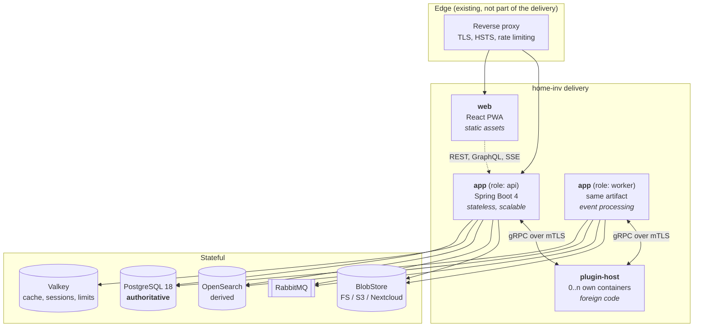
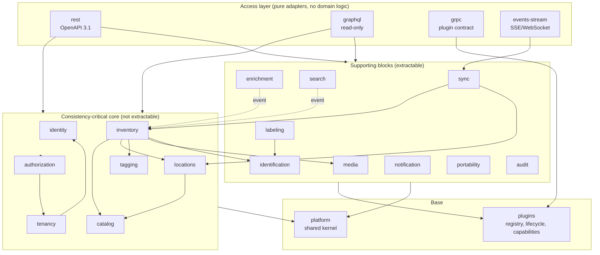

# 04 — Building Block View

## 4.1 Level 1 — Deployable units

**Important:** `api` and `worker` are the **same container image** with a
different Spring profile. That keeps the version matrix at one and prevents
worker and API from drifting apart.

| Unit | State | Scaling | Note |
|---|---|---|---|
| `web` | none | arbitrary (static) | Can also be served directly by the reverse proxy |
| `app` (api) | none | horizontal | Sessions in Valkey, no local files |
| `app` (worker) | none | horizontal | Consumes RabbitMQ, competing consumers |
| `plugin-host` | plugin's own | per plugin | Own service account, own network policy |

## 4.2 Level 2 — Building blocks inside `app`

Solid arrows are synchronous calls into the target's `api` package. Dashed arrows
are events. **There is no cycle** — CI verifies that.

## 4.3 Level 3 — Building block catalogue

Every block has: one sentence of responsibility, its own DB schema, a published
`api` package, outbound ports, and emitted events.

---

### `platform` — shared kernel

**Responsibility:** universal notions every block needs and nobody owns.

| | |
|---|---|
| Schema | none |
| Contains | `TenantId`, `UserId`, `EntityId` (UUIDv7), `Money` (in-house, [ADR-0025](../adr/0025-money-representation.md)), `Quantity`/`Unit`, `Clock`, the `ProblemDetail` error hierarchy, `TenantContext`, `Result`, pagination types, event base types (CloudEvents envelope) |
| Does **not** contain | any form of domain logic, any database access, any dependency on another block |

> The shared kernel is the most common place where modular monoliths decay.
> Rule: **a class only goes in if at least three blocks need it and it contains
> no decision.** Its size is monitored in CI.

---

### `identity` — who someone is

**Responsibility:** proving the identity of a person or a service.

| | |
|---|---|
| Schema | `identity` |
| Key notions | `User`, `Credential` (password/TOTP/passkey), `Session`, `RefreshToken`, `ServiceAccount`, `IdentityProvider` |
| Publishes | `AuthenticationService`, `UserDirectory` (read-only view of users), `PrincipalView` |
| Outbound ports | `PasswordHasher` (Argon2id), `MailSender`, `OidcClient` |
| Events | `UserRegistered`, `UserDeactivated`, `CredentialChanged`, `SuspiciousLoginDetected` |
| Notable | Knows **no** tenants and **no** permissions. Who someone is and what someone may do are separate questions. |

---

### `tenancy` — on whose behalf

**Responsibility:** tenants, memberships, invitations, quotas.

| | |
|---|---|
| Schema | `tenancy` |
| Key notions | `Tenant`, `Membership`, `Invitation`, `Quota`, `TenantSettings` |
| Publishes | `TenantService`, `MembershipQuery`, `QuotaGuard` |
| Outbound ports | `MailSender` |
| Events | `TenantCreated`, `TenantSuspended`, `TenantDeletionRequested`, `MemberJoined`, `MemberLeft`, `QuotaExceeded` |
| Notable | `QuotaGuard` is called **before** every creating operation (item count, bytes stored, plugin count, API calls). That way abuse limitation is not something to bolt on later. |

---

### `authorization` — who may do what

**Responsibility:** evaluating permissions. The only place in the system where
"may" is answered.

| | |
|---|---|
| Schema | `authorization` |
| Key notions | `Role` (system and tenant-owned), `Permission`, `PolicyDecision`, `Scope` |
| Publishes | `AccessControl.require(action, resource)`, `PermissionCatalog`, `@RequiresPermission` |
| Events | `RoleAssigned`, `RoleDefinitionChanged`, `AccessDenied` (for audit) |
| Permission model | `<block>:<resource>:<action>` — e.g. `inventory:item:create`, `catalog:type:update`, `labeling:job:print`. Field-level visibility through `field-visibility` rules per role (e.g. purchase price only for `ADMIN`). |
| Built-in roles | `OWNER`, `ADMIN`, `MEMBER`, `CONTRIBUTOR`, `VIEWER`, `GUEST` — tenant-owned roles extend, they do not replace |
| Notable | **Never** decides on data it loads itself. Resources are handed in as already-loaded, tenant-checked objects. This closes time-of-check/time-of-use gaps. |

---

### `catalog` — the type system

**Responsibility:** defining which fields an item type and a location category
carry. Configurable while running.

| | |
|---|---|
| Schema | `catalog` |
| Key notions | `ItemType`, `LocationCategory`, `FieldDefinition`, `FieldGroup`, `TypeVersion`, `ValueList` |
| Publishes | `TypeRegistry`, `AttributeValidator.validate(typeId, attributes) → ValidationResult`, `FieldDefinitionView` |
| Events | `TypeCreated`, `TypeVersionPublished`, `FieldAdded`, `FieldDeprecated`, `FieldSearchabilityChanged` |
| Field data types | `text`, `multiline`, `integer`, `decimal`, `money`, `boolean`, `date`, `datetime`, `enum`, `multi-enum`, `url`, `email`, `quantity` (value + unit), `reference` (to item/location/value list), `secret` (encrypted, see [ADR-0019](../adr/0019-sensitive-field-encryption.md)), `file` |
| Field properties | Key, label (multilingual), required, default, unit, range/regex, help text, visibility rule, `searchable`, `sortable`, `facetable`, `sensitive`, order, group |
| Inheritance | Types form a tree. `Book` inherits from `Medium` inherits from `Item`. An inherited field may be tightened (required, narrower range) but not loosened. |
| Versioning | Types are versioned. Removing a field marks it `deprecated` and hides it; the data stays. Actual deletion is a separate, logged administrative operation with a preview of the affected set. |
| Notable | Generates a **JSON Schema (draft 2020-12)** per type version, validated at the API boundary and additionally shipped to clients — the same check offline as online. |

---

### `inventory` — the items

**Responsibility:** the central aggregate. Master data, type-dependent
attributes, quantities, relations, lifecycle.

| | |
|---|---|
| Schema | `inventory` |
| Key notions | `Item` (aggregate root), `ItemAttributes` (JSONB), `ItemRelation`, `ItemLifecycle`, `MaintenanceEntry`, `Loan`, `Bundle`, `ConsumableStock`, `Valuation` (purchase price, current value, replacement value) |
| Publishes | `ItemService`, `ItemQuery`, `ItemView`, `ItemRef` |
| Outbound ports | `AttributeValidator` (catalog), `LocationLookup` (locations), `QuotaGuard` (tenancy), `AccessControl` (authorization), `CodeAssignment` (identification) |
| Events | `ItemCreated`, `ItemUpdated`, `ItemMoved`, `ItemDeleted`, `ItemRestored`, `ItemLent`, `ItemReturned`, `ItemDisposed`, `QuantityChanged`, `StockBelowMinimum` |
| Item kinds | `PHYSICAL` (has a location, can carry a code) and `DIGITAL` (no physical place, instead a carrier/account, licence key, expiry, seat count) |
| States | `ACTIVE` → `LENT` → `ACTIVE` · `ACTIVE` → `ARCHIVED` · `ACTIVE` → `TRASHED` → `ACTIVE`/`PURGED` · `ACTIVE` → `SOLD`/`DISPOSED` |
| Invariants | A physical item has exactly one location · attributes are valid against the type version · quantity ≥ 0 · a bundle does not contain itself · a lent item is not deleted |

---

### `locations` — where things are

**Responsibility:** the location tree and movement within it.

| | |
|---|---|
| Schema | `locations` |
| Key notions | `Location` (tree node), `LocationCategory` (from `catalog`), `LocationAttributes` (JSONB), `MoveOperation` |
| Publishes | `LocationService`, `LocationTreeQuery`, `LocationLookup`, `LocationView` |
| Events | `LocationCreated`, `LocationMoved`, `LocationDeleted`, `LocationSealed` |
| Tree representation | `parent_id` **plus** a materialised path (`ltree`) for fast subtree queries. Both maintained in one transaction, consistency guarded by a constraint. |
| Example categories | Building, floor, room, furniture, shelf, compartment, drawer, box, **moving box** (with target room, packing date, seal number), **vehicle** (with plate, mobile), warehouse, outdoor storage, locker |
| The "mobile" property | A category can be marked `mobile`. A mobile location may be moved as a whole without moving the contained items individually — that is the relocation case. The move emits **one** event for the subtree, not a thousand. |
| Invariants | No cycles · configurable maximum depth (default 12) · a non-empty location is not deleted, only emptied or archived · a category may restrict its permitted child categories (optional rule) |

---

### `tagging` — free-form labelling

| | |
|---|---|
| Schema | `tagging` |
| Key notions | `Tag`, `TagGroup`, `TagAssignment` |
| Publishes | `TagService`, `TagQuery`, `TagView` |
| Events | `TagCreated`, `TagMerged`, `TagAssigned`, `TagUnassigned` |
| Properties | Tenant-wide, flat with optional groups (e.g. group "condition" with `new`/`used`/`broken`), colour and icon, merging two tags as an administrative operation, applies to items **and** locations |

---

### `media` — photos and documents

| | |
|---|---|
| Schema | `media` |
| Key notions | `MediaObject`, `MediaVariant` (derivative), `Attachment` (link to item/location), `UploadSession` |
| Publishes | `MediaService`, `AttachmentQuery`, `MediaView` (returns **only** signed, short-lived URLs) |
| Outbound ports | `BlobStore` (adapters: filesystem, S3, Nextcloud/WebDAV), `ImageProcessor`, `VirusScanner` |
| Events | `MediaUploaded`, `MediaVariantsReady`, `MediaDeleted`, `MediaScanFailed` |
| Content addressing | Blobs are stored under `sha256/<hash>`. The same file is stored once; deletion removes the blob only when no link remains (reference counting). That makes offline upload idempotent. |
| Derivatives | `thumb` 200 px, `preview` 1024 px, `full` (re-encoded, max 4096 px) — the original optionally retained. Generated asynchronously in the worker. |
| Security | Server-side type detection (magic bytes, not the file extension) · re-encoding of all images (destroys embedded payloads) · **EXIF stripping including GPS** by default, retention only on an explicit setting · SVG rejected · served from a dedicated hostname with `Content-Disposition: attachment` and `Content-Security-Policy: sandbox` |

---

### `identification` — UUID, codes, scanning

**Responsibility:** the bridge between the object in the world and the record.

| | |
|---|---|
| Schema | `identification` |
| Key notions | `PublicCode` (the printed short code), `CodeBinding` (code → entity), `ScanSession`, `ScanEvent`, `ExternalCode` (ISBN/EAN on the object, not issued by us) |
| Publishes | `CodeAssignment.issue(entityRef)`, `CodeResolver.resolve(rawScan) → ResolutionResult`, `ScanSessionService` |
| Outbound ports | `CodeFormat` (plugin: generate and parse), `ScanSource` (plugin: camera, handheld, file) |
| Events | `CodeIssued`, `CodeBound`, `CodeUnbound`, `CodeScanned`, `UnknownCodeScanned` |
| Resolution chain | A scanned raw string passes through the registered `CodeFormat` plugins in priority order until one claims it. No match → `UnknownCodeScanned` with an offer to "create a new item from this". |
| Notable | The public code is **not** the UUID — see [10 Identification](10-identification-and-labels.md) and [ADR-0016](../adr/0016-identifiers.md). |

---

### `labeling` — generating and printing labels

| | |
|---|---|
| Schema | `labeling` |
| Key notions | `LabelTemplate`, `LabelMedia` (sheet or roll geometry), `PrintJob`, `PrintTarget` |
| Publishes | `LabelService`, `PrintJobService`, `LabelMediaCatalog` |
| Outbound ports | `LabelRenderer` (template + data → image/PDF), `PrintTarget` (plugin: PDF download, Brother QL, Zebra ZPL, Dymo, CUPS), `CodeFormat` (identification) |
| Events | `PrintJobQueued`, `PrintJobRendered`, `PrintJobCompleted`, `PrintJobFailed` |
| Media geometry | Page size, margins, columns, rows, pitch, label size, corner radius, start offset — covers Avery Zweckform and Herma as well as continuous rolls. A catalogue of common formats ships with the product and is extendable as data (level 1). |
| Notable | Rendering is separate from printing. A print job is a persisted aggregate with state — which makes printing repeatable, traceable and plannable offline. |

---

### `enrichment` — metadata from outside

| | |
|---|---|
| Schema | `enrichment` |
| Key notions | `ResolverRegistration`, `EnrichmentRequest`, `EnrichmentProposal`, `FieldMapping` |
| Publishes | `EnrichmentService.propose(code) → List<Proposal>`, `ProposalReview` |
| Outbound ports | `MetadataResolver` (plugin: `supports(scheme)`, `resolve(code)`) |
| Events | `EnrichmentRequested`, `EnrichmentSucceeded`, `EnrichmentFailed`, `ProposalAccepted` |
| Flow | Enrichment **never** writes into the item directly. It produces a **proposal** with provenance, timestamp and a per-field confidence; a user accepts, rejects or edits. Automatic adoption can be switched on per tenant and per field, but is not the default. |
| Mapping | `FieldMapping` maps a resolver's output fields onto the target type's fields — configurable, not coded in. That is how an ISBN resolver also works for a self-defined "Textbook" type. |

---

### `search` — finding things

| | |
|---|---|
| Schema | `search` (indexing state only, no domain data) |
| Publishes | `SearchService.query(SearchRequest) → SearchResult`, `SavedSearchService` |
| Outbound ports | `SearchIndex` (adapters: OpenSearch primary, PostgreSQL as fallback) |
| Events | `IndexingLagged`, `ReindexStarted`, `ReindexCompleted` |
| Query capabilities | Full text across name, description, notes, attribute values, tags, location path · facets over type, category, tag, location subtree, condition, price range · filters over any field marked `facetable` · sorting over `sortable` fields |
| Consistency | Eventually consistent with a target lag < 2 s. Immediately after a write the detail view **always** reads from PostgreSQL, never from the index. Index lag is monitored as a metric. |
| Saved searches | A saved search is a named query with filters that appears as a "smart list" — also usable as the source for bulk label printing and stocktake runs. |

---

### `sync` — offline reconciliation

| | |
|---|---|
| Schema | `sync` |
| Key notions | `ChangeLogEntry`, `SyncCursor`, `DeviceRegistration`, `ConflictRecord`, `Tombstone` |
| Publishes | `SyncService.pull(cursor)`, `SyncService.push(batch)`, `ConflictQuery` |
| Events | `DeviceRegistered`, `SyncConflictRecorded`, `DeviceWiped` |
| Details | [11 Offline Synchronization](11-offline-synchronization.md) |

---

### `notification` — notifications and reminders

| | |
|---|---|
| Schema | `notification` |
| Key notions | `NotificationRule`, `Notification`, `DeliveryAttempt`, `Reminder`, `Subscription` |
| Publishes | `NotificationService`, `ReminderService` |
| Outbound ports | `NotificationChannel` (plugin: e-mail, webhook, web push, Firebase, APNs, ntfy, Matrix) |
| Events | `NotificationRaised`, `NotificationDelivered`, `NotificationFailed` |
| Triggers | Warranty expiry, maintenance interval, loan return date, minimum stock undercut, software licence expiry, stocktake discrepancy, security-relevant account events |
| Notable | Reminder rules are data (level 1), not code: a condition as a saved search + a time offset + a channel. |

---

### `portability` — import, export, data subject access

| | |
|---|---|
| Schema | `portability` |
| Key notions | `ImportJob`, `ExportJob`, `MappingProfile`, `DataSubjectRequest` |
| Publishes | `ImportService`, `ExportService`, `DataSubjectService` |
| Events | `ImportCompleted`, `ExportReady`, `DataSubjectRequestFulfilled` |
| Formats | CSV (with a configurable mapping profile, preview and dry run), JSON Lines, a full tenant export as a ZIP with media and a manifest |
| Migration in | Mapping profiles for **Homebox** and **InvenTree** ship with the product so that switching is possible |
| GDPR | `DataSubjectService` produces access (Art. 15) and portability (Art. 20) artifacts mechanically and triggers erasure (Art. 17) across all blocks |

---

### `audit` — traceability

| | |
|---|---|
| Schema | `audit` |
| Key notions | `AuditEntry`, `RevisionRecord`, `AuditChain` |
| Publishes | `AuditService.record(...)`, `AuditQuery`, `HistoryQuery` |
| Properties | Append-only, never mutable (no `UPDATE`/`DELETE` right for the application role) · every entry carries the hash of its predecessor (tamper evidence) · contains actor, tenant, action, resource, before/after diff, source IP, client, correlation ID |
| History | Beyond the audit log, `audit` keeps the **domain version history** per item and location (JSONB snapshot + diff), including restoring an earlier state |
| Retention | Configurable per tenant within fixed bounds, with a floor for security-relevant entries |

---

### `plugins` — the extension runtime

| | |
|---|---|
| Schema | `plugins` |
| Key notions | `PluginRegistration`, `PluginManifest`, `GrantedCapability`, `PluginInstance`, `HealthState`, `PluginAuditEntry` |
| Publishes | `ExtensionRegistry.lookup(Port.class, tenantId)`, `PluginLifecycle`, `CapabilityGuard` |
| Events | `PluginRegistered`, `PluginEnabled`, `PluginDisabled`, `PluginCallFailed`, `PluginCircuitOpened` |
| Details | [09 Extensibility](09-extensibility-and-plugins.md) |

---

## 4.4 The access layer

The access layer contains **no domain logic and no authorization decision**. It
translates protocol into use-case call and back.

| Block | Task | Not permitted |
|---|---|---|
| `rest` | The OpenAPI 3.1 surface under `/api/v1`, content negotiation, problem details, idempotency keys, ETag/If-Match, pagination | Its own queries, its own permission checks, entities in the response model |
| `graphql` | Read-only query surface, batch loading against N+1, depth and cost limits, persisted queries | Mutations (see [ADR-0010](../adr/0010-api-surfaces.md)) |
| `grpc` | Plugin contract, mTLS, capability check per call | Direct database access |
| `events-stream` | Server-sent events for live updating of open views | Bulk data retrieval |

## 4.5 Mapping blocks to database schemas

| Schema | Block | Note |
|---|---|---|
| `identity` | identity | Holds password hashes — separate backup strategy |
| `tenancy` | tenancy | Source schema for `tenant_id` foreign keys |
| `authz` | authorization | |
| `catalog` | catalog | Type and field definitions, JSON Schema cache |
| `inventory` | inventory | Holds `item`, `item_attr_index` |
| `locations` | locations | Requires the `ltree` extension |
| `tagging` | tagging | |
| `media` | media | Metadata only, never binary data |
| `identification` | identification | |
| `labeling` | labeling | |
| `enrichment` | enrichment | |
| `search` | search | Indexing state only |
| `sync` | sync | `change_log` is the fastest-growing table — partitioned on its own |
| `notification` | notification | |
| `portability` | portability | |
| `audit` | audit | Append-only, own permissions, partitioned by month |
| `plugins` | plugins | |
| `outbox` | (cross-cutting) | Spring Modulith event publication registry |

**Rule:** every block owns its schema. A block never reads or writes in another
block's schema — not even reading, not even "just briefly". Enforced through
separate PostgreSQL roles with a restricted `search_path` and through an ArchUnit
rule over the migration files.
