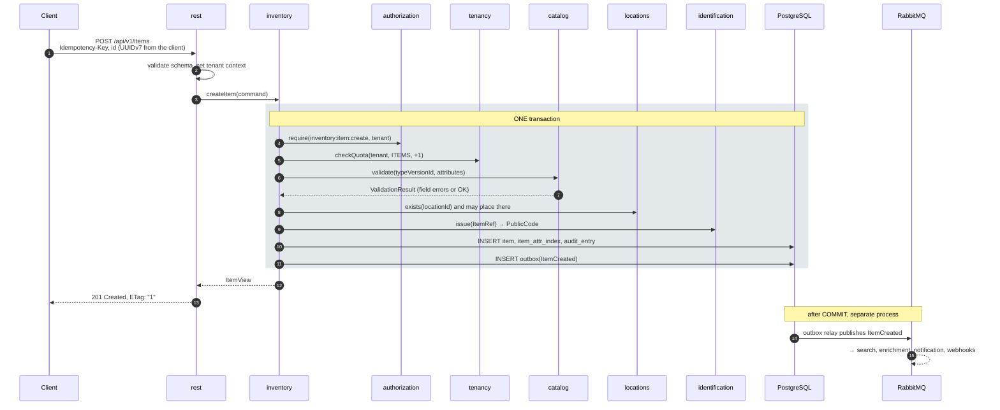
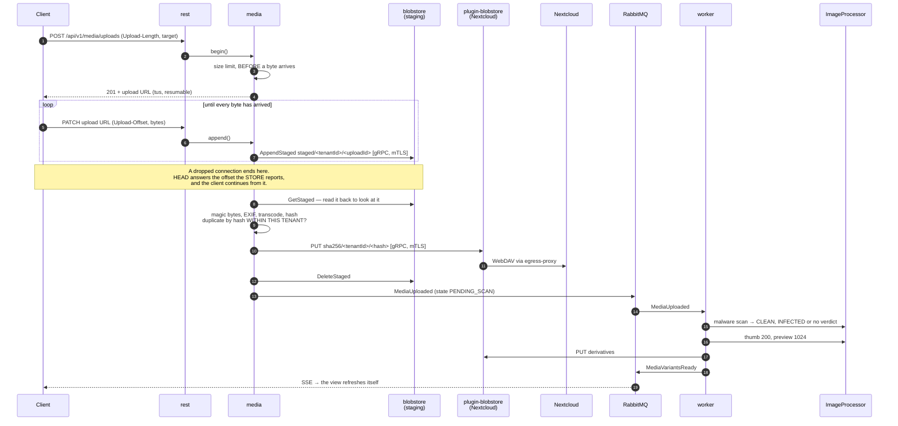
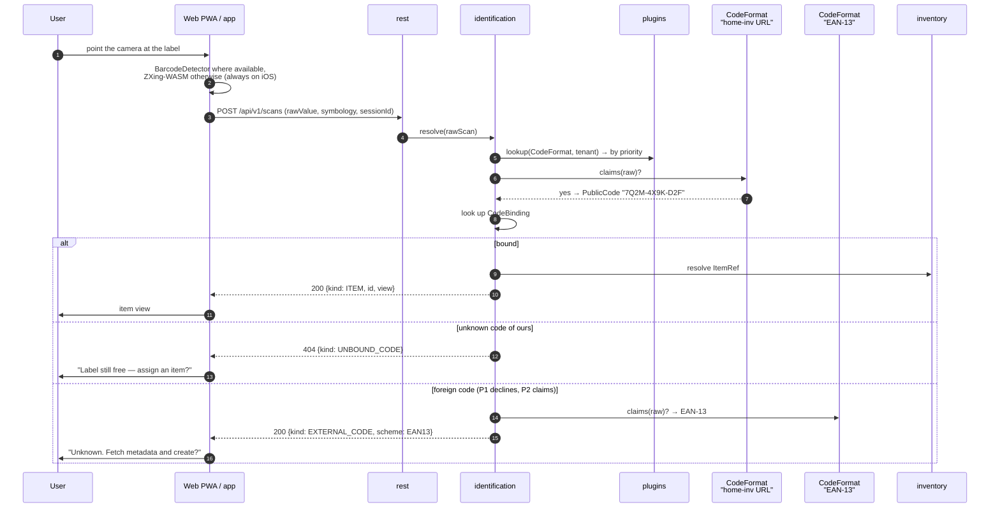
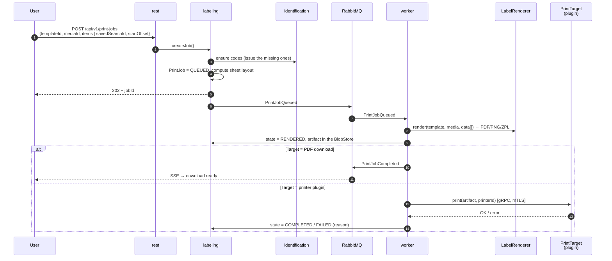
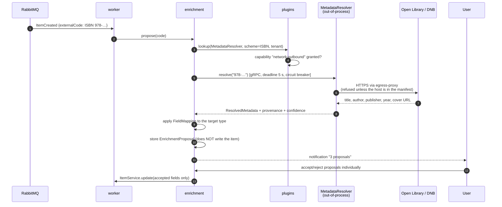
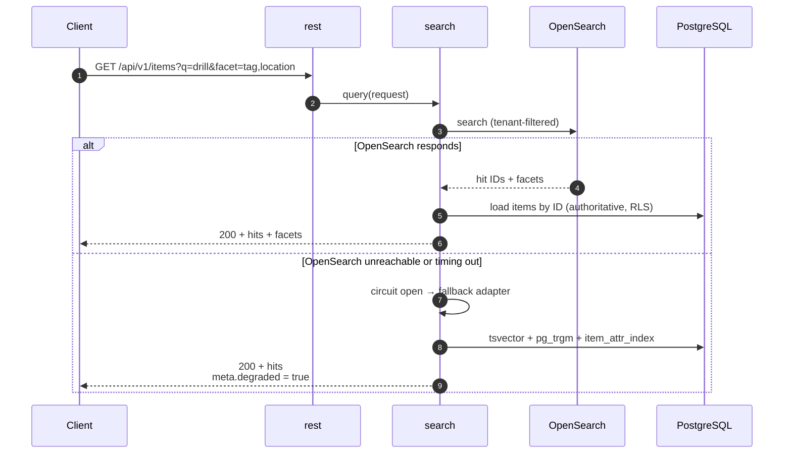
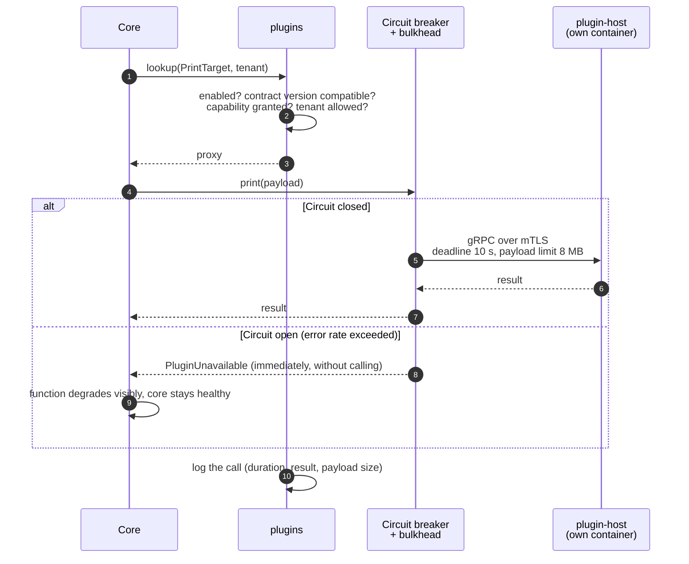
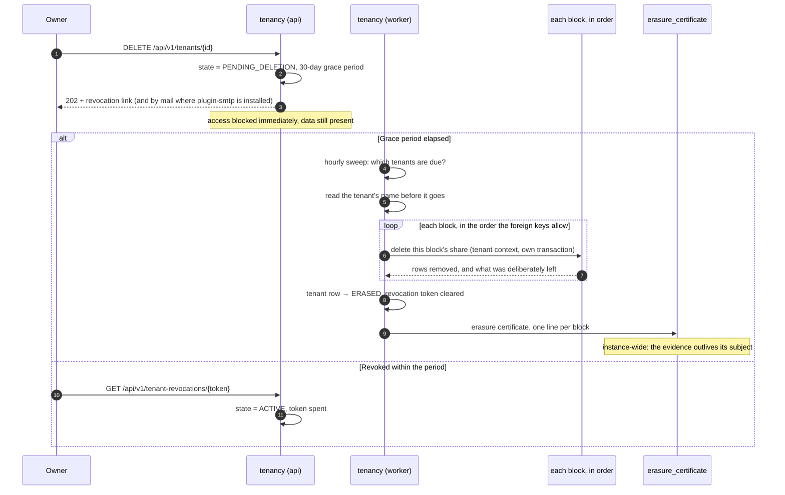
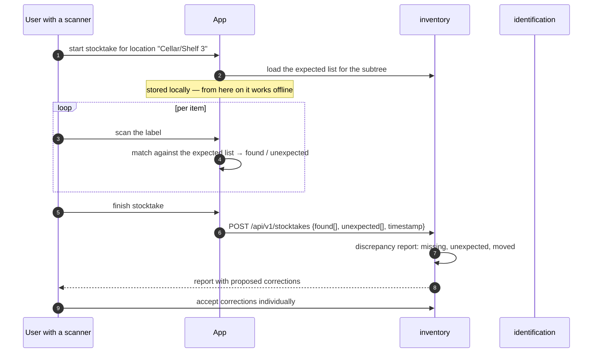

# 05 — Runtime View

Selected flows that make the load-bearing design decisions visible. Each flow
ends by naming the property it demonstrates.

## 5.1 Creating an item

The most important flow — it shows why the core stays inside **one** transaction.



**Demonstrates:** the consistency-critical core needs no distributed transaction.
The client generates the UUID itself (a prerequisite for offline creation). The
idempotency key makes a retry after a network drop harmless.

**Error cases:**

| Case | Response |
|---|---|
| Attribute violates the type definition | `422` with problem details, `errors[]` per field path |
| Quota exhausted | `403` with `type: .../quota-exceeded`, current and permitted amount |
| Location belongs to another tenant | `404` — **not** `403`, so as not to reveal existence |
| Same idempotency key, same payload | `200` with the result of the first call |
| Same idempotency key, different payload | `409` |

## 5.2 Uploading and processing a photo



*The re-encode and the EXIF stripping are **not** in the worker, though an earlier
version of this diagram put them there: `full` is produced in the request, because
until it exists the only bytes on hand are the ones that must not be stored
([ADR-0052](../adr/0052-one-stored-image-format.md)). The scan is the worker's
([ADR-0054](../adr/0054-the-scan-is-asynchronous.md)), and `thumb` and `preview`
are too ([ADR-0051](../adr/0051-broker-in-stage-0.md)).*

*This diagram showed the client declaring the file's **SHA-256** at creation and the
server answering `200 + existing mediaId` when the tenant already held it, so that a
duplicate needed no upload at all. It was written before anything implemented it, and
what was built on 2026-09-22 does not do that: a client does not know the digest of
what it is about to send, and — more to the point — the digest of what it sends is not
the digest of what is stored, because every image is re-encoded on the way in
([ADR-0052](../adr/0052-one-stored-image-format.md)). Deduplication is therefore **after**
the pipeline rather than before it, where it still costs the tenant no second copy
([ADR-0084](../adr/0084-an-upload-arrives-in-pieces-and-is-staged-where-the-volume-is.md)).*

**Demonstrates:** an interrupted upload is continued and not restarted (`REQ-MED-008`),
and the offset a client resumes from comes from **the store that holds the bytes** rather
than from either side's belief about them. Content addressing then makes a repeated
upload cost no second copy — **within the tenant**
([ADR-0032](../adr/0032-per-tenant-blob-addressing.md)); a hash known from
elsewhere yields nothing, and never skips the mandatory scan. Image processing
sits outside the request path. Nextcloud is reached by a plugin, not by the core
([ADR-0026](../adr/0026-core-outbound-via-plugins.md)) — which is why the storage
backend is replaceable **and** why a core compromise does not hand over the
Nextcloud app password.

## 5.3 Scanning and resolving a code



**Demonstrates:** code formats are replaceable. The core knows no symbology, only
the resolution chain. A barcode plugin extends level 2 without a core change.

## 5.4 Printing labels



**Demonstrates:** rendering and printing are separate. A print job is an
aggregate with state, hence repeatable and traceable. Printing leaves the
process — a stuck printer does not block the core.

## 5.5 Enriching metadata by ISBN



**Demonstrates:** foreign data is never adopted unchecked. The external call
leaves the process, has a deadline and a circuit breaker, and the capability
`network:outbound` had to be granted explicitly.

## 5.6 Search with fallback



The degraded response is a `200` carrying `meta.degraded: true` and
`degradedReason: "search-fallback"` — not a `Warning` header, which RFC 9111 §5.5
obsoleted in 2022 ([ADR-0039](../adr/0039-degraded-response-signalling.md)). The
results are correct; only the facets and the ranking are poorer, so the status
code stays `200`.

**Demonstrates:** search is a derived read model. Its failure degrades the
system, it does not destroy anything. Hits are always re-loaded from PostgreSQL —
the index supplies IDs only, never authoritative content. A stale index therefore
cannot display wrong data and cannot breach a tenant boundary.

## 5.7 Offline reconciliation with a conflict

```mermaid
sequenceDiagram
    participant A as App (changed offline)
    participant SY as sync
    participant INV as inventory
    participant DB as PostgreSQL

    Note over A: offline: item X note edited (base v7)<br/>item Y created (UUIDv7 locally)
    A->>SY: POST /api/v1/sync/push<br/>{deviceId, changes[], cursor}
    SY->>DB: per change: load the current version

    alt Server version == base (v7)
        SY->>INV: apply update
        SY-->>A: applied
    else Server version is v9 (someone else's change)
        SY->>SY: three-way compare base v7 / local / server v9
        alt disjoint fields
            SY->>INV: merge and apply (v10)
            SY-->>A: merged
        else same field, different values
            SY->>DB: ConflictRecord (both versions, the base)
            SY-->>A: conflict + ConflictRecord ID
            Note over A: user decides later;<br/>nothing is lost
        end
    end

    A->>SY: GET /api/v1/sync/pull?since=cursor
    SY->>DB: change_log from cursor (tenant-filtered)
    SY->>SY: per entry: AccessControl check for THIS principal,<br/>strip sensitive fields, synthesise tombstones for<br/>anything newly out of scope
    SY-->>A: changes + tombstones + new cursor
```

**Demonstrates:** the principle "nothing is lost silently". A conflict is a
stored record, not a discarded write. Details:
[11 Offline Synchronisation](11-offline-synchronisation.md).

## 5.8 Calling an out-of-process plugin



**Demonstrates:** foreign code can neither block the core nor act beyond the
capabilities granted to it. Every call is logged and bounded.

## 5.9 Deleting a tenant (GDPR Art. 17)



**Demonstrates:** erasure is a supervised, evidenced flow with a completion
report per block — not a `DELETE CASCADE` after which nobody knows whether
everything really went. The audit entry about the erasure itself remains
(pseudonymised), and so does the tenant's audit log: the application may not
delete it (`REQ-SEC-069`), the retention run does within the tenant's own period
(`REQ-PRIV-010`), and the certificate says so rather than implying it went.

**The run is one pass in the worker, not a choreography**
([ADR-0060](../adr/0060-the-erasure-runs-in-one-pass.md)). This diagram drew
`TenantDeletionConfirmed` on RabbitMQ until 2026-09-13, with each block
consuming it and reporting back. A choreography has a middle — "three of seven
have reported" — and the blocks are not independent: an item references a place
and a type version, a membership the location a member is confined to. The pass
walks them in a declared order, each in its own transaction, and marks the tenant
erased only after the last of them, so a run interrupted halfway is one the next
sweep finishes.

**Blobs are not removed by the run.** They are reclaimed by the orphan sweep of
[13 §13.8](13-operations-and-observability.md), which removes what no reference
points at, with a grace period. Every derived store — the search index, the
thumbnails — is rebuilt from PostgreSQL and holds nothing the erasure needs to
be asked about.

## 5.10 A stocktake run



**Demonstrates:** Q6 — the device works in the cellar without a network, and
reconciliation happens later. No change is applied automatically; the report
proposes.

## 5.11 Startup and shutdown

| Phase | Flow |
|---|---|
| **Migration** | A **one-shot `migrate` service** runs first and exits: the same image as `api` and `worker` with `SPRING_PROFILES_ACTIVE=migrate`, on `internal` only, holding `db-migration-password` and **nothing else in the stack holding it** ([ADR-0041](../adr/0041-migration-as-its-own-service.md)). Flyway runs under `homeinv_migrator`. Under Quadlet it is `Type=oneshot` with `Requires=`/`After=` from `api` and `worker`; under Compose a `service_completed_successfully` dependency; under Kubernetes the pre-upgrade `Job` that already existed |
| **Startup** (`api`, `worker`) | Validate configuration (**abort on a missing secret, never a silent default**) → **validate** the schema version and **refuse to start** if it is not the one this build expects → verify the Modulith structure → bind ports and adapters (the API on the two-member `frontend` segment, where `web` reaches it and no datastore does — `api` is not on `edge` and publishes nothing ([ADR-0042](../adr/0042-edge-is-not-internal.md), [ADR-0044](../adr/0044-internal-is-not-a-trust-boundary.md)); the management listener on `internal` only, [13 §13.3](13-operations-and-observability.md)) → load the plugin registry and probe reachability (does **not** block) → `/readyz` turns true only after a full database connection and a schema that validates |
| **Why validation and not migration** | The application connects only as `homeinv_app`, which has no DDL rights ([07 §7.5](07-data-model.md)). Migrating from inside a long-running, internet-facing process would mean mounting `homeinv_migrator` — the one role that can rewrite an RLS policy — for that process's whole life. Validating instead keeps the guarantee that mattered: a skipped migration stops the rollout at `/readyz` rather than appearing later as a missing column at request time |
| **Shutdown** | `/readyz` to false (the proxy takes the instance out of rotation) → grace period → let in-flight requests drain (max 30 s) → deregister RabbitMQ consumers, finish the message in hand → close connections |
| **Migration with multiple instances** | Migrations must be backward compatible (expand, then switch, then clean up — across three releases). A migration that drops a column must not ship in the same release as the code that stops writing it. |
