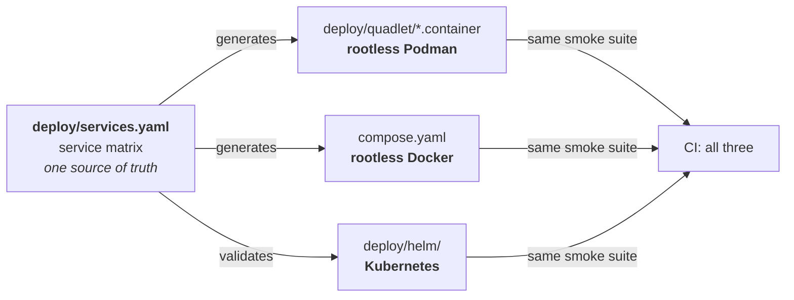
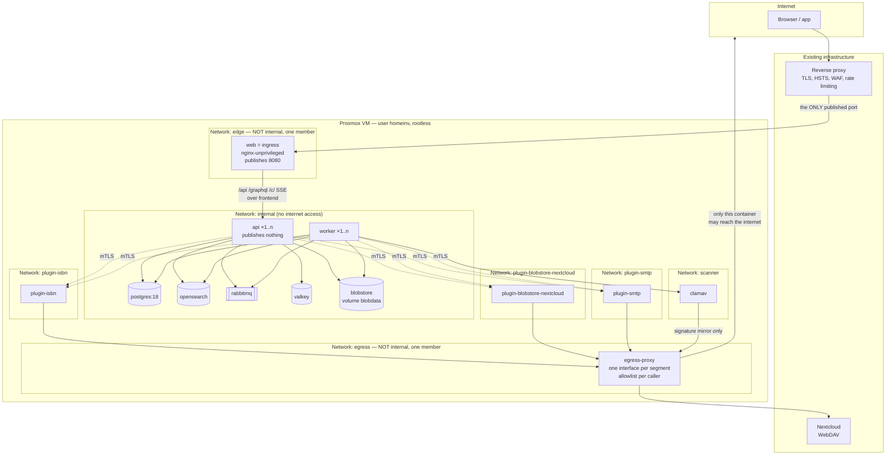

# 06 — Deployment View

## 6.1 The principle: rootless

> **Every supported way of running this system runs rootless.** There is no path
> that operates a container daemon or a container as `root` on the host.

That is not a recommendation but a constraint of the design
([ADR-0022](../adr/0022-rootless.md)). It acts on two independent levels that are
frequently confused:

| Level | Meaning | Without it |
|---|---|---|
| **Non-root inside the container** (`User=10001`) | The process in the container is not `root` | An application bug acts with every privilege inside the container |
| **Rootless on the host** (user namespace) | Container `root` is an unprivileged user on the host | An escape from the container lands as `root` on the host |

Both are binding. The second is the more important one, and the one almost always
missing from self-hosting guides.

## 6.2 Target environment

| Property | Value |
|---|---|
| Platform | Proxmox VM, Debian stable |
| Sizing | ≥ 4 vCPU, ≥ 8 GB RAM, SSD |
| Kernel | cgroup v2 with systemd delegation (default on current Debian) |
| Container runtime | **Podman ≥ 5.0 rootless with Quadlet** *or* **rootless Docker with Compose v2** |
| Service user | An unprivileged user (e.g. `homeinv`) without `sudo` rights |
| TLS and access | An existing reverse proxy in front of the VM |
| Media storage | An existing Nextcloud instance (WebDAV) |
| Backup | Proxmox snapshots **plus** an application-level, consistent backup |

### Verified Podman versions (as of 2026-09-11)

Quadlet exists from Podman **4.4**, `pasta` as the default rootless network from
**5.0**. Checked against the distributions' package indexes.

**Minimum requirement: Podman ≥ 5.0.**

| Distribution | Podman | Quadlet (≥ 4.4) | `pasta` (≥ 5.0) | Suitability |
|---|---|---|---|---|
| **Debian 13 trixie** (current *stable*) | **5.4.2** | ✓ | ✓ | **target environment — no backport needed** |
| Debian 14 forky / sid | 5.8.6 | ✓ | ✓ | suitable |
| Ubuntu 26.04 LTS (resolute) | 5.7.0 | ✓ | ✓ | suitable |
| **Fedora 45** | 6.1.0 | ✓ | ✓ | suitable |
| Fedora 43 / 44 | 5.8.4 | ✓ | ✓ | suitable |
| **RHEL 10 / CentOS Stream 10 / Rocky 10 / AlmaLinux 10** | 5.6.0 (as of 10.1) | ✓ | ✓ | suitable |
| **RHEL 9.5+ / CentOS Stream 9 / Rocky 9.5+ / AlmaLinux 9.5+** | 5.0 (9.5), 5.2+ (9.6+) | ✓ | ✓ | suitable |
| RHEL family 9.4 and older | 4.9.x | ✓ | ✗ — `slirp4netns` | limited |
| Ubuntu 24.04 LTS (noble) | 4.9.3 | ✓ | ✗ — `slirp4netns` | limited |
| Debian 12 bookworm (*oldstable*) | 4.3.1 | ✗ | ✗ | **unsuitable** |
| Ubuntu 22.04 LTS (jammy) | 3.4.4 | ✗ | ✗ | unsuitable |

*Limited* means: it runs, but with `slirp4netns` instead of `pasta` — functional,
slower on the network. The installation guide says so.

> **About the RHEL family:** container tools come from a *rolling* AppStream there
> that rebases onto the current stable Podman up to four times a year. The Podman
> version therefore follows the distribution's **minor release**, not a fixed
> package version. That is why the guide states the minor release as the floor
> (RHEL/Rocky/Alma **9.5** resp. **10**) rather than a Podman number the operator
> would first have to look up. CentOS Stream runs ahead of the corresponding RHEL
> minor and is therefore always suitable.

### What differs per distribution family

| | Debian / Ubuntu | Fedora / RHEL / CentOS Stream / Rocky / AlmaLinux |
|---|---|---|
| Package manager | `apt` | `dnf` |
| `newuidmap` / `newgidmap` | package **`uidmap`** — only a `Recommends`, must be requested explicitly | part of `shadow-utils`, present in every base install |
| `pasta` | package **`passt`** — only a `Recommends` | a dependency of `podman` |
| `netavark` / `aardvark-dns` | `netavark` is a `Depends`, **`aardvark-dns` is absent** and must be added | both hard dependencies of `podman` |
| User D-Bus | package **`dbus-user-session`** — only a `Recommends` | standard component |
| Mandatory access control | AppArmor | **SELinux, `enforcing` by default** |
| Host firewall | `nftables` / `ufw` | `firewalld` — port 8080 (`web`, the only publisher) must be opened explicitly for the reverse proxy |

**The Debian side is the more error-prone one.** Four of the required packages are
mere recommendations there; on the RHEL side they are dependencies or present
anyway (see the finding below).

### SELinux — and why it causes none of the usual trouble here

On the RHEL family SELinux runs in `enforcing` mode. The classic Podman pitfall
is volume labelling: a **bind mount** from a host directory gets **no** suitable
context from Podman, the container cannot write, and the error looks like a UID
problem. The usual remedy are the mount flags `:z` (shared) and `:Z` (private).

This project is **unaffected**, because a rule adopted for an entirely different
reason already applies: **runtime-managed volumes only, no bind mounts**
([ADR-0022](../adr/0022-rootless.md), derived from UID mapping). Named volumes
are created by Podman itself and labelled correctly in the process. The same rule
thus solves two different problems on two distribution families.

> **A trap that looks like a solution:** Quadlet knows `SecurityLabelDisable=true`.
> It makes every SELinux problem disappear — and an entire layer of defence with
> it. The key is **not** used in this project; a CI check rejects it. Whoever has
> a labelling problem has a bind mount that should not exist.

> **A finding that leaves an installation quietly half-broken:** in Debian,
> `uidmap`, `passt`, `dbus-user-session` and `slirp4netns` are only
> **`Recommends`** of `podman`, not `Depends`. An install with
> `--no-install-recommends` — the norm in minimal images and automated setups —
> therefore yields **no `newuidmap`** (rootless does not start at all), **no
> `pasta`** (networking falls back or is missing) and **no user D-Bus session**
> (`systemctl --user` behaves unreliably). The packages are therefore installed
> **explicitly** and verified at startup instead of relying on recommendation
> resolution.

## 6.3 What rootless enforces

Rootless is not a switch; it has consequences reaching into the design. These
four are already worked in:

| Consequence | How it is handled |
|---|---|
| **No ports below 1024.** An unprivileged user may not bind 80 and 443. | The application listens on **8080** (HTTP) and the reverse proxy terminates TLS. That was the topology anyway; rootless makes it mandatory. A `sysctl net.ipv4.ip_unprivileged_port_start` is **not** required. |
| **Volume ownership goes through UID mapping.** What is `uid 999` inside the container is an ID from the `subuid` range on the host. | All volumes are managed by the container runtime, no bind mounts into host directories. Backup and restore go through the runtime, not through `cp` (see 6.13). |
| **The application must write nothing onto the host.** | Already a requirement: all state lives in PostgreSQL, in the `BlobStore` or in Valkey; the containers' filesystem is read-only. |
| **No privileged capabilities, no host network, no container socket inside a container.** | No shipped service needs any of it. A plugin that demands it is not supported. |

### Host prerequisites

One-time setup, provided as a script in the installation guide:

```bash
# --- Debian / Ubuntu -------------------------------------------------------
# Required packages explicitly — only "Recommends" of podman, see 6.2.
# aardvark-dns does not appear in podman's dependencies at all; without it
# containers do not resolve each other by name — and that is exactly what the
# stack needs (app → postgres via the service name).
sudo apt install --yes podman uidmap passt dbus-user-session netavark aardvark-dns

# --- Fedora / RHEL / CentOS Stream / Rocky / AlmaLinux ---------------------
# netavark, aardvark-dns and passt are hard dependencies of podman here, and
# newuidmap comes from shadow-utils (base install). Plus firewalld.
sudo dnf install -y podman
# ONE port. `web` is the only container that publishes, and it proxies to `api`
# over the internal segment (ADR-0042). This was two rules, 8080 for api and
# 8081 for web, until api stopped publishing.
sudo firewall-cmd --permanent --add-port=8080/tcp --source=<reverse-proxy-CIDR>
sudo firewall-cmd --reload

# --- identical on every supported distribution from here on ----------------
# Service user without a login and without sudo
sudo useradd --create-home --shell /usr/sbin/nologin homeinv

# Namespace ranges (at least 65536 IDs). Some distributions allocate them on
# useradd — the script checks /etc/subuid and only adds what is missing rather
# than overwriting blindly.
sudo usermod --add-subuids 100000-165535 --add-subgids 100000-165535 homeinv

# Without linger the services end at logout and do not start at boot.
# This is by far the most common rootless mistake.
sudo loginctl enable-linger homeinv

# Check: cgroup v2 with delegated controllers
cat /sys/fs/cgroup/user.slice/user-$(id -u homeinv).slice/cgroup.controllers
# expected: cpu io memory pids

# OpenSearch needs this, and it is a HOST setting: a rootless container cannot
# raise it, and the service user has no sudo. Profiles standard and ha only.
echo 'vm.max_map_count=262144' | sudo tee /etc/sysctl.d/99-homeinv-opensearch.conf
sudo sysctl --system
```

Without delegated `memory` and `cpu` controllers the resource limits do not take
effect. The installation script checks this and **aborts with a clear message**
rather than running silently without limits — likewise on a missing `newuidmap`,
a missing `pasta`, a missing `subuid` allocation, a missing `linger`, and (in the
`standard` and `ha` profiles) a `vm.max_map_count` below 262144. Six checks, six
clear messages; none of them a warning that gets overlooked.

> **`vm.max_map_count` is the one root action rootless cannot absorb.** Everything
> else in this design runs as an unprivileged user; this single kernel parameter
> is set once at install time by root and then never again. Hiding that fact would
> not make it go away — it would only move the discovery to the first OpenSearch
> start, where it appears as a stack trace rather than as a prerequisite. The
> `minimal` profile has no OpenSearch and therefore does not need it at all.

## 6.4 Three supported ways of running it



| Path | Status | For whom |
|---|---|---|
| **Rootless Podman + Quadlet** | **Supported, documented, tested in CI** | Operating on a Linux VM with systemd — the target environment |
| **Rootless Docker + Compose v2** | **Supported, documented, tested in CI** | Anyone already running Docker or preferring Compose |
| **Kubernetes (Helm)** | Supported, tested in CI against `kind` | Operators with a cluster; the prerequisite for high availability |
| Rootful Docker or Podman | **Not supported** | — |
| Bare metal (JAR + systemd) | Not supported; the expected third-party versions are documented | — |
| Nomad | Not supported | — |

### Drift protection

Three separately maintained descriptions of the same topology drift apart
inevitably. The countermeasures:

1. **One service matrix** (`deploy/services.yaml`) describes per service: image
   with digest, role, ports, networks, volumes, environment keys, secrets,
   resource limits, health check, dependencies.
2. **Quadlet units and `compose.yaml` are generated from it** — both are flat and
   mechanically derivable. A hand-written deviation fails a CI comparison.
3. The **Helm chart** is not generated (too different in shape) but **validated**
   against the matrix: same services, same environment keys, same limits.
4. **The same smoke suite** runs in CI against all three: start up, migrate,
   create an item, upload a photo, search, shut down cleanly.

## 6.5 Path A — rootless Podman with Quadlet

Quadlet describes containers as systemd units. There is **no daemon**:
`systemd --user` starts, supervises and stops the containers directly. That is
why this path is named first — the permanently running attack surface of a root
daemon disappears entirely.

```
~/.config/containers/systemd/     (user homeinv)
├── homeinv-edge.network
├── homeinv-egress.network
├── homeinv-frontend.network       (web + api only, ADR-0044)
├── homeinv-internal.network
├── homeinv-scanner.network
├── homeinv-plugin-<id>.network    (one per installed plugin, ADR-0037)
├── homeinv-blobdata.volume
├── homeinv-pgdata.volume
├── homeinv-pgwal.volume           (the WAL archive, ADR-0045)
├── homeinv-osdata.volume
├── homeinv-mqdata.volume
├── homeinv-kvdata.volume
├── homeinv-cvddata.volume
├── homeinv-postgres.container
├── homeinv-valkey.container
├── homeinv-blobstore.container
├── homeinv-rabbitmq.container
├── homeinv-opensearch.container
├── homeinv-clamav.container
├── homeinv-egress-proxy.container  (every profile, ADR-0036)
├── homeinv-migrate.container       (Type=oneshot; api and worker Require= it)
├── homeinv-bootstrap.container     (Type=oneshot; the first owner, ADR-0053)
├── homeinv-api.container
├── homeinv-worker.container
├── homeinv-web.container
└── plugins/…                     (one .container file per plugin)
```

```
~/.config/systemd/user/           (ordinary systemd units, not Quadlet's)
├── homeinv-minimal.target        (Requires= every service of the profile)
├── homeinv-standard.target
└── homeinv-ha.target
```

> **This listing was incomplete until 2026-09-11**, and incompletely in a way that
> mattered: it omitted `homeinv-egress.network`, `homeinv-egress-proxy.container` — the
> container [ADR-0036](../adr/0036-scanner-egress.md) runs in *every* profile — and the
> `kvdata` and `cvddata` volumes that [`deploy/services.yaml`](../../deploy/services.yaml)
> declares. A file listing is how a reader checks what the generator emits, so a listing
> that is short by four is a drift check nobody can perform by eye.

```ini
# homeinv-api.container
[Unit]
Description=home-inv API
Requires=homeinv-postgres.service homeinv-migrate.service
After=homeinv-postgres.service homeinv-valkey.service homeinv-migrate.service
# migrate is Type=oneshot with RemainAfterExit=yes: api starts only after it has
# exited 0. api itself has no DDL credentials — it validates the schema and
# refuses to start against an unexpected one (ADR-0041).

[Container]
Image=ghcr.io/greluc/home-inv@sha256:…          # always by digest, never by tag
                                                 # NB: the image name is set explicitly —
                                                 # derived from the repository it would
                                                 # read ghcr.io/greluc/home-inventory
ContainerName=homeinv-api
AutoUpdate=disabled                              # digest-pinned, no auto-update

Network=homeinv-internal.network                 # NOT edge: api publishes nothing and
Network=homeinv-frontend.network                 # is reached through web over the
                                                 # two-member frontend segment
                                                 # (ADR-0042, ADR-0044)
Network=homeinv-plugin-smtp.network              # one per installed plugin (ADR-0037);
                                                 # generated, never hand-listed
                                                 # No PublishPort at all. 8080 is reached by
                                                 # web over `frontend`; 8090 (management)
                                                 # binds to the internal address — 13 §13.3

Environment=SPRING_PROFILES_ACTIVE=api,standard
Environment=MANAGEMENT_SERVER_PORT=8090
Environment=MANAGEMENT_SERVER_ADDRESS=%i_internal_addr
Environment=HOMEINV_DB_PASSWORD_FILE=/run/secrets/db-password
                                                 # NO migration credential here —
                                                 # only homeinv-migrate gets it (ADR-0041)
Secret=homeinv-db-password,type=mount,target=/run/secrets/db-password
Secret=homeinv-data-encryption-master-key,type=mount,target=/run/secrets/data-encryption-master-key

User=10001:10001                                 # non-root INSIDE the container
ReadOnly=true
Tmpfs=/tmp:rw,noexec,nosuid,nodev,size=64m
NoNewPrivileges=true
DropCapability=ALL

HealthCmd=/usr/bin/healthcheck
HealthInterval=15s
HealthStartPeriod=90s
Notify=healthy                                   # dependants start only afterwards
LogDriver=journald

[Service]
Restart=on-failure
RestartSec=10
MemoryMax=1536M
CPUQuota=200%

                                                 # No [Install] on a container unit.
                                                 # Enabling them one by one would start
                                                 # every service in the matrix at the next
                                                 # login, OpenSearch included, because a
                                                 # Quadlet unit knows nothing about
                                                 # profiles. The profile target carries it.
```

#### The profile targets

systemd has no equivalent of a Compose profile, so one is generated: a
`homeinv-<profile>.target` per profile, naming exactly the services that profile
contains, with `Requires=` and `After=` on each. The target is reached when the
whole profile is up, which is what lets one command start a deployment and fail
when part of it did not come up. The targets are ordinary systemd units and are
installed into `~/.config/systemd/user/` — Quadlet reads only its own directory,
and systemd never reads Quadlet's.

Operation — ordinary systemd tooling, nothing container-specific:

```bash
deploy/setup.sh podman minimal           # installs the units and starts the profile

systemctl --user daemon-reload           # after changing the unit files
systemctl --user start homeinv-minimal.target
systemctl --user enable homeinv-minimal.target   # and at every boot
systemctl --user status homeinv-api
journalctl --user -u homeinv-api -f
```

| Advantage over Compose | |
|---|---|
| No daemon | No permanently running privileged component, no socket that confers root equivalence |
| Real dependencies | `Requires=`/`After=` with `Notify=healthy` — start order is reliable, not "wait and hope" |
| Uniform supervision | `systemctl`, `journalctl`, restart rules, resource limits through systemd — the same tool used for every other service on the VM |
| Resource limits | Through the `[Service]` section, i.e. cgroup v2 directly |
| Start at boot | Through `linger` and `WantedBy=default.target`, without a root unit |

### UID mapping and volumes

The classic pitfall. Binding decisions:

| Point | Decision |
|---|---|
| Volumes | **Podman-managed volumes only** (`.volume` units). No bind mounts into host directories — that is where the ownership mess starts. |
| Mapping mode | Fixed **once and documented** during implementation (default mapping or `UserNS=keep-id:uid=…`), and per service, because PostgreSQL, OpenSearch and RabbitMQ use different inside UIDs. The choice is guarded by a test that checks write access and a restart against an existing volume. |
| Separate namespaces per plugin | `UserNS=auto` gives each plugin container its **own** UID range so that two plugins cannot see each other. Whether that is viable rootless with the planned `subuid` size is verified during implementation; otherwise separate users per plugin remain. Since [ADR-0037](../adr/0037-per-plugin-network-segments.md) the **network** boundary is a second, independent one around the same unit, so the two no longer fail together: if `UserNS=auto` proves unworkable, plugins still cannot reach one another. |
| Maintenance access to volumes | `podman unshare` — never `sudo chown` on the storage directories |

## 6.6 Path B — rootless Docker with Compose

```bash
# Setup as the service user, without sudo
dockerd-rootless-setuptool.sh install
export DOCKER_HOST=unix://$XDG_RUNTIME_DIR/docker.sock
systemctl --user enable --now docker
```

`compose.yaml` is the same file for rootful and rootless — it deliberately uses
**no** features that rootless cannot carry:

```yaml
# Binding for every shipped service. `user` is the FIRST-PARTY value; upstream
# images (postgres, opensearch, rabbitmq, valkey, clamav) carry their own uid and
# their own writable paths, declared per service in deploy/services.yaml. The rule
# is "not uid 0", not "uid 10001".
user: "10001:10001"
read_only: true
tmpfs: [/tmp]                  # plus whatever the service declares
cap_drop: [ALL]
security_opt:
  - no-new-privileges:true
restart: unless-stopped        # generated from startOnBoot: true — the Compose
                               # equivalent of Quadlet's WantedBy=default.target
healthcheck: { ... }
deploy:
  resources:
    limits: { cpus: "2.0", memory: 1536M }
logging:
  driver: json-file
  options: { max-size: 10m, max-file: "5" }
```

**Explicitly not used** (and checked in CI): `privileged`, `pid: host`,
`network_mode: host`, `cap_add`, mounting `/var/run/docker.sock`, ports below
1024, bind mounts into system directories, `user: root`.

| Difference from rootful Docker that operators must know | |
|---|---|
| Ports < 1024 | Not bindable — hence 8080 |
| Storage location | `~/.local/share/docker` instead of `/var/lib/docker` |
| Network performance | Slightly lower (user-space networking), irrelevant at this load |
| AppArmor | On some distributions rootless needs its own profile — covered in the installation guide |
| `docker.sock` | Lives under `$XDG_RUNTIME_DIR` and no longer confers root equivalence |

## 6.7 Services and sizing

| Service | Image | RAM (reservation/limit) | Persistence | Networks |
|---|---|---|---|---|
| `web` (**the ingress**) | own, `nginx-unprivileged` | 64 / 256 MB | none | edge, **frontend** ([ADR-0044](../adr/0044-internal-is-not-a-trust-boundary.md)) |
| `api` | own, distroless JRE 25 | 768 MB / 1.5 GB | none | internal, frontend, every `plugin-<id>` |
| `worker` | **the same image** | 512 MB / 1.5 GB | none | internal, scanner, every `plugin-<id>` |
| `migrate` | **the same image**, one-shot | 256 / 512 MB *while running* | none | internal |
| `bootstrap` | **the same image**, one-shot | 256 / 512 MB *while running* | none | internal |
| `postgres` | `postgres:18-alpine` | 1 / 2 GB | volumes `pgdata`, **`pgwal`** ([ADR-0045](../adr/0045-wal-archive-volume.md)) | internal |
| `opensearch` | `opensearchproject/opensearch:3` | 1.5 / 2 GB | volume `osdata` | internal |
| `rabbitmq` | `rabbitmq:4-management-alpine` | 256 / 512 MB | volume `mqdata` | internal |
| `valkey` | `valkey/valkey:8-alpine` | 128 / 256 MB | volume (AOF) | internal |
| `blobstore` | own, minimal | 32 / 128 MB | volume `blobdata` | internal |
| `clamav` | `clamav/clamav` | 1 / 1.5 GB | volume `cvddata` (signatures) | scanner |
| `egress-proxy` | own, minimal | 16 / 32 MB | none | **egress**, scanner, and every `plugin-<id>` |
| `plugin-*` | per plugin | 64 / 256 MB | plugin's own | its own `plugin-<id>` |

### The memory budget, and the fact it turns on

| | `minimal` | `standard` |
|---|---|---|
| Services | web, api, worker, **blobstore**, postgres, valkey, **rabbitmq**, clamav, egress-proxy | + opensearch, first-party plugins |
| Where a plugin counts | — | in the **adder**, not the base: `plugin-webhook` reserves 32 MB and is the first one the matrix declares ([ADR-0072](../adr/0072-first-party-plugins-live-here.md)) |
| Sum of **reservations** | ≈ **3.7 GB** | ≈ **5.2 GB** (+ 64 MB per plugin) |
| Sum of **limits** | ≈ **7.7 GB** | ≈ **9.7 GB** (+ 256 MB per plugin) |
| VM | ≥ 8 GB | ≥ 8 GB |

**The reservations are the budget; the limits deliberately over-commit.** That is
a choice and not an oversight, so it is stated rather than hidden behind a
"peaks up to 7.5 GB" figure that was not derivable from the table — the earlier
wording implied a ceiling the matrix does not have.

The limits are per-service ceilings sized for *that service's* worst case: a
label sheet of 500 codes in the worker, an OpenSearch reindex, a large upload
being re-encoded. Those worst cases do not coincide — `worker` rendering labels
is not also `api` under peak read load — and sizing every limit so the sum fits
8 GB would mean throttling each service to roughly half of what it needs when it
is the one doing work.

What follows from it, and what an operator must know:

- **The sum of limits exceeding RAM means the kernel OOM killer is the last
  resort, not the limits.** Each container is still bounded, so one runaway
  service cannot take the host — which is the property the limits exist for.
- **`vm.overcommit` stays at the distribution default.** No tuning is required
  and none is recommended.
- **The `ha` profile does not over-commit**, because it runs on ≥ 16 GB and
  across several nodes.
- A load test that drives `api`, `worker` and OpenSearch to their ceilings
  *simultaneously* on one 8 GB VM is expected to fail. It is not a supported
  configuration; the sizing row in 6.2 says ≥ 8 GB, not exactly 8.

The egress proxy runs in **every** profile since
[ADR-0036](../adr/0036-scanner-egress.md) — `minimal` has no plugins but does have a
scanner whose signatures have to come from somewhere. First-party plugins add
roughly 0.2–0.4 GB depending on how many are installed; a deployment using the
filesystem `BlobStore` and no mail runs none of them.

`api` and `worker` are **the same container image** with a different Spring
profile. That keeps the version matrix at one and prevents worker and API from
drifting apart.

### Network segmentation

Applies equally to Podman (`netavark`) and Docker:

| Network | Members | Route out of the deployment |
|---|---|---|
| `edge` | **`web` only** — the one container with a published port | **yes, and it has to be.** See the measurement below |
| `egress` | **`egress-proxy` only** — the route the chokepoint needs | **yes, and it has to be** |
| `frontend` | **`web` and `api`, and nothing else** ([ADR-0044](../adr/0044-internal-is-not-a-trust-boundary.md)). It carries the `web` → `api` hop of [ADR-0042](../adr/0042-edge-is-not-internal.md) | **no** (`internal: true`) |
| `internal` | database, search, broker, cache, **`blobstore`**, `api`, `worker`, `migrate` — **and the only segment the management listener binds to** ([13 §13.3](13-operations-and-observability.md)). **`web` is not a member**, and every service on it authenticates its callers: reachability is not authorisation ([ADR-0044](../adr/0044-internal-is-not-a-trust-boundary.md)) | **no** (`internal: true` resp. `Internal=true`) |
| `scanner` | `clamav`, `worker`, `egress-proxy` | **only through `egress-proxy`**, and only to the signature mirror ([ADR-0036](../adr/0036-scanner-egress.md)). `api` is deliberately absent: the scan runs in the worker, never in the request path |
| `plugin-<id>` — **one per installed plugin** | that plugin, `api`, `worker`, `egress-proxy`. Nothing else, and never a second plugin | **only through `egress-proxy`**, and only to the hosts the granting plugin's manifest declared ([ADR-0027](../adr/0027-egress-enforcement.md)). Plugin containers get no gateway of their own |

The per-plugin segments replaced a single shared `plugins` network on 2026-09-11
([ADR-0037](../adr/0037-per-plugin-network-segments.md)). On the shared one, any
plugin could read the core's management port, stop the fail-closed scanner, and
use another plugin's forwarding port on the proxy — none of which needs a granted
capability. The proxy now has one interface per segment and identifies the caller
by which interface the connection arrived on.

### Why two segments are not internal — measured, not assumed

This chapter previously marked **every** segment internal, `edge` included, on the
grounds that a published port needs no outward route. That was flagged for
verification as **A5** rather than asserted, and the verification found it false
([ADR-0042](../adr/0042-edge-is-not-internal.md)):

| Topology | `docker port` | Published port from the host | Container outbound |
|---|---|---|---|
| `internal` network only | **empty — no mapping is created** | **unreachable** | blocked |
| ordinary network | mapping present | HTTP 200 | **reaches the internet** |

So *"publishes a port"* and *"has no route out"* cannot both be true of one
container. Exactly two containers therefore sit on a non-internal segment, and
**neither holds data, a credential or domain logic**:

- **`web`** — the ingress. It publishes the single host port, serves the bundle
  and the security headers, and proxies `/api`, `/graphql`, `/c/`, `/.well-known`
  and the SSE stream to `api` over `frontend`. `api` publishes nothing and is not
  on `edge` at all, which is stricter than the shape this replaced.
- **`egress-proxy`** — which until the same pass sat only on internal segments and
  so could not make the one call it exists to make. That was the identical defect
  one segment over, and it would have surfaced the first time `plugin-smtp` tried
  to send an invitation.

Measured end to end on that topology before it was written down:

```
host -> web:8080 -> api (inbound path)        HTTP 200
api    outbound                               blocked
plugin outbound                               blocked
egress-proxy outbound                         reaches
web    outbound                               reaches   (the accepted cost)
plugin -> egress-proxy on its own segment     reachable
plugin -> api (the gRPC path)                 reachable
plugin A -> plugin B                          isolated
```

Only Docker was measured; Podman with `pasta` and `kind` remain as CI work. That
does not weaken the conclusion — the service matrix generates **one** topology for
all three, so a shape Docker cannot carry is a shape the design cannot use.

Seven properties, all verified in CI by a connectivity test rather than asserted:

- **A plugin reaches PostgreSQL, OpenSearch, RabbitMQ or Valkey not at all.** It
  speaks gRPC with the core and HTTP with the proxy, nothing else.
- **A plugin reaches no other plugin, and no plugin reaches `clamd`.** Two
  plugins are started and each tries the other, and the scanner; every attempt
  must fail.
- **A plugin reaches neither core role's management port.** Port 8090 on `api`
  and on `worker` must refuse from every plugin segment.
- **`api` and `worker` reach nothing outside the deployment.** After
  [ADR-0026](../adr/0026-core-outbound-via-plugins.md) they have no external
  target left to reach: object storage, mail, OIDC, webhooks and push are all
  plugins. The test takes them, tries a known external host, and expects a
  refusal.
- **Only `web` and `egress-proxy` sit on a non-internal segment.** A third one
  appearing there fails the build — that is the assertion that keeps the two
  exceptions from becoming a habit (`REQ-SEC-102`).
- **Exactly one host port is published in the whole deployment.** It was two until
  `api` stopped publishing.
- **`web` reaches `api` and nothing else.** From the `frontend` segment, `postgres`,
  `valkey`, `rabbitmq`, `opensearch`, `blobstore` and `:8090` on both core roles must all
  refuse. This assertion did not exist until 2026-09-11, and until then `web` — the one
  container an attacker meets first — was a full member of `internal` with every one of
  those ports open to it ([ADR-0044](../adr/0044-internal-is-not-a-trust-boundary.md)).
  `REQ-SEC-102`'s "holds no data, no credential, no domain logic" was true of what it
  *holds* and silent about what it could *reach* — the same distinction
  [ADR-0037](../adr/0037-per-plugin-network-segments.md) drew for plugins.

**The one port a plugin segment is meant to reach is 8091 on `api`** — the host
channel of [ADR-0071](../adr/0071-the-core-answers-plugins-on-one-channel.md), off
unless `HOMEINV_PLUGIN_HOST_PORT` names it. It is the one core listener that is *not*
bound to a segment, because there is no single segment to bind it to: `api` is a member
of every plugin segment. What refuses a caller there is the TLS handshake — the
certificate must be the one pinned at that plugin's registration — and that is proved
by `HostChannelIT` over a real socket rather than by this suite, which opens TCP
connections and can neither present a client certificate nor read a gRPC status. The
network-shape half of it — a plugin segment reaches 8091 and no other core port —
joins the list above with the first plugin container in `deploy/services.yaml`
(`REQ-PLG-013`), of which there is none yet.

### The `web` → `api` hop, and what it must not do

[ADR-0042](../adr/0042-edge-is-not-internal.md) put `web` on the request path of
**every** API call, not just of the static shell. That is a new hop, and a hop
that is not specified is one each runtime's generated config will specify
differently. Five rules, all checkable (`REQ-NFR-078`, `REQ-SEC-103`):

| Rule | Why it is not a detail |
|---|---|
| **`web` terminates no TLS.** It speaks HTTP to `api` over `frontend`; the operator's reverse proxy terminates TLS in front of it | Consistent with `REQ-NFR-061`. Two TLS terminations in one delivery would mean two certificate lifecycles for one hostname |
| **`web`'s body limit is not below the API's.** The rejection of an oversized request must come from `api` | `REQ-API-003` puts RFC 9457 on **every** HTTP surface. A limit enforced at `web` returns an nginx HTML error page, and the client that was promised `application/problem+json` gets markup it cannot parse |
| **`web`'s read timeout exceeds the API's 30 s ceiling** ([08 §8.2](08-api-contract.md)) | Same failure one layer up: `web` would emit its own `504` instead of the API's handled response, and long operations already return `202` plus a job resource rather than holding a connection |
| **Response buffering is off for the SSE stream** | `REQ-API-011` is live updating. A buffering proxy holds events until the buffer fills, so the feature appears to work in development and silently stops working in the deployment — which is the class of defect this chapter keeps finding |
| **`web` rewrites and drops no header `api` sets** — `ETag`, `Retry-After`, `RateLimit-*`, `Deprecation`, `Sunset`, `Link`, `Content-Disposition` | Each carries a documented contract. A proxy that drops `RateLimit-*` breaks `REQ-SEC-064`'s acceptance criterion without breaking anything visible |

**The forwarded-header chain is the security-relevant half.** There are now two
hops in front of `api`, and `REQ-SEC-063` only ever described one:

```
client → operator's reverse proxy → web → api
         sets X-Forwarded-For        appends its step
```

`HOMEINV_TRUSTED_PROXIES` must therefore contain **both** the operator's proxy
and `web`'s address on `frontend`, and `web` must **append** to `X-Forwarded-For`
rather than overwrite it. Get it wrong in either direction and one of two things
happens, neither loud:

- **Too narrow** — `web` is not trusted, so every request appears to come from
  `web`. Per-IP rate limiting (`REQ-SEC-064`) then throttles all tenants as one
  client, and every audit entry records the same source IP (`REQ-SEC-068`).
- **Too wide** — a header a client supplied is believed, and per-IP rate limiting
  and the audit trail become attacker-controlled.

A startup check verifies that `web`'s address is in the list, because a
deployment where it is not produces no error — only wrong numbers.



Compared with the previous revision of this diagram, two arrows are gone:
`APP --> NC` and `WRK --> NC`. They contradicted the sentence above them and were
the visible half of the finding that produced
[ADR-0026](../adr/0026-core-outbound-via-plugins.md).

**A segment the diagram cannot draw:** `frontend` holds `web` and `api`, and a Mermaid
node belongs to one subgraph, so it lives on the `WEB --> APP` edge label instead. It is
the whole of that segment — the ingress reaches the API and nothing else
([ADR-0044](../adr/0044-internal-is-not-a-trust-boundary.md)). `web` is **not** in the
`internal` box any more, and that is the visible half of the finding: the one container
with a published port used to sit beside every datastore in it.

Four things changed again on 2026-09-11:

- **The one `plugins` box became one box per plugin plus a `scanner` box.** On the
  shared segment a plugin could reach `clamd`, the core's management port and
  another plugin's forwarding port on the proxy, none of which needs a granted
  capability ([ADR-0037](../adr/0037-per-plugin-network-segments.md)).
- **`clamav` gained an arrow to the proxy.** It was drawn without one while
  ADR-0024 claimed it had outbound access to the signature mirror — the missing
  arrow that made the mandatory scan a scanner with frozen signatures
  ([ADR-0036](../adr/0036-scanner-egress.md)).
- **`api` left the `edge` box and lost its published port.** Every request now
  arrives through `web`, which is the only publisher
  ([ADR-0042](../adr/0042-edge-is-not-internal.md)).
- **`edge` and `egress` are drawn as *not* internal, with one member each.** That
  is the measured correction: a published port on an internal network is never
  wired up, and the proxy on internal segments alone had no way through. Two boxes
  carry the outbound route so that no box holding data has to.

## 6.8 Kubernetes

The Helm chart is maintained as an equal and tested in CI against `kind`.
Rootless applies there too.

| Object | Content |
|---|---|
| `Deployment` api | HPA on CPU and requests/s, `readinessProbe` = `/readyz`, `livenessProbe` = `/livez`, `PodDisruptionBudget` |
| `Deployment` worker | HPA on RabbitMQ queue length (KEDA optional) |
| `securityContext` (pod and container) | `runAsNonRoot: true`, `runAsUser: 10001`, `allowPrivilegeEscalation: false`, `readOnlyRootFilesystem: true`, `capabilities.drop: [ALL]`, `seccompProfile: RuntimeDefault` |
| User namespaces | `hostUsers: false` wherever the cluster version supports it — the counterpart to rootless Podman |
| `PodSecurity` | Namespace with the `restricted` profile in `enforce` mode |
| `NetworkPolicy` | Default `deny-all`, then targeted allowances — mirrors the three networks |
| `ServiceAccount` per plugin | Own account, own `NetworkPolicy`, `automountServiceAccountToken: false` |
| Secrets | `ExternalSecret`/`SealedSecret`; never in the chart |
| `Job` | Migration as a pre-upgrade hook under the migration role — the same one-shot `migrate` service the other two runtimes run, not a Kubernetes special case ([ADR-0041](../adr/0041-migration-as-its-own-service.md)). It is the only workload the migration secret is mounted into |
| `CronJob` | Backup, restore verification, housekeeping, reminder evaluation |

## 6.9 Assessment of the deployment options

| Criterion | Rootless Podman + Quadlet | Rootless Docker + Compose | Kubernetes | Rootful Docker | Bare metal |
|---|---|---|---|---|---|
| Rootless | **native, mature** | **possible, well supported** | via `securityContext`/`hostUsers` | no | n/a |
| Daemon as attack surface | **none** | one, unprivileged | cluster components | one, **as root** | n/a |
| Barrier to entry | low (needs systemd knowledge) | **very low** | high | very low | medium |
| Ongoing operational effort | **low** | low | high | low | medium–high |
| Dependencies and start order | **systemd, reliable** | `depends_on` with health check | complete | as Docker | manual |
| Supervision and logs | **journald, `systemctl`** | own command set | cluster tooling | as Docker | journald |
| Resource limits | **cgroup v2 through systemd** | through Compose | complete | through Compose | systemd |
| High availability | no | no | **yes** | no | no |
| Horizontal scaling | manual (unit templates) | manual (`--scale`) | **automatic** | manual | manual |
| Adoption among self-hosters | growing | **largest** | niche | large | rare |
| CI effort | low | low | medium | — | high |
| **Supported** | **yes** | **yes** | yes | **no** | no |

**Why rootful Docker is no longer supported:** the daemon runs as `root`, and
whoever can reach its socket is effectively `root` on the host. For a system
reachable from the internet that executes foreign plugin code, that is an
enlargement of the blast radius that cannot be justified — especially since both
alternatives run rootless without any loss of function.

**Why bare metal is not supported:** the application is not the problem;
PostgreSQL with `ltree`, OpenSearch, RabbitMQ and Valkey in matching versions
are. That shifts reproducibility problems onto the user and produces bug reports
nobody can recreate.

## 6.10 Operating profiles

So that a small installation does not need the full stack, there are three
profiles. They change **no** application logic, only the active adapters.
**ClamAV is part of every profile** — the malware scan cannot be deselected
([ADR-0024](../adr/0024-malware-scan.md)); it is the reason `minimal` also needs
about 3 GB.

| Profile | `search` | Events | Media | Plugins | RAM (reserved) | Purpose |
|---|---|---|---|---|---|---|
| `minimal` | PostgreSQL adapter | outbox, in-process dispatch | filesystem (in-core adapter → the `blobstore` service, [ADR-0043](../adr/0043-blobstore-as-its-own-service.md)) | none — but the `egress-proxy` runs, for the scanner | ≈ 3.7 GB | Small home server, Raspberry Pi 5 **with 8 GB**, development |
| `standard` | **OpenSearch** | **RabbitMQ** | Nextcloud/S3 **via plugin** | `egress-proxy` + `plugin-blobstore-*` + `plugin-smtp` | ≈ 5.2 GB (+ 64 MB per plugin) | **The profile of this installation** |
| `ha` | OpenSearch cluster | RabbitMQ cluster | S3 via plugin | as `standard` | ≥ 16 GB | Kubernetes, multiple instances |

> **`minimal` opens exactly one connection outside the deployment, and it is the
> malware scanner's.** This paragraph used to claim it opened none — *"no proxy,
> no plugins"* — and that was true of everything except the one service the same
> profile cannot run without. ClamAV is mandatory in every profile
> ([ADR-0024](../adr/0024-malware-scan.md)) and a scanner whose signatures freeze
> at the image build date reports clean and means nothing. So the `egress-proxy`
> runs here too, with a single fixed allowlist entry for the signature mirror
> ([ADR-0036](../adr/0036-scanner-egress.md)).
>
> The point that survives is the one worth having: **`minimal` still opens nothing
> for the sake of a feature.** No object storage, no mail, no federated login, no
> webhook, no push — what it gives up is invitations and password-reset mail,
> which such an installation typically does not need. Every outbound connection it
> does make passes the same proxy and the same access log as everywhere else.

> **These two figures disagreed with the rest of the corpus until 2026-09-11.** They read
> 3.4 GB and 5.4 GB, against ≈ 3.7 GB and ≈ 5.2 GB in [6.7](#67-services-and-sizing),
> `REQ-NFR-009` and [`deploy/services.yaml`](../../deploy/services.yaml) — and 5.4 was
> precisely the superseded convention that folded three first-party plugins into the
> reservation total while leaving them out of the limit total. `REQ-NFR-009` measures
> against the computed sums, so the computed sums are what this table shows. A fourth
> figure, "roughly 2.5–3 GB", lived in [ADR-0024](../adr/0024-malware-scan.md) and is
> corrected there.

Moving `minimal` → `standard` is a configuration change plus an index build — no
data loss, no migration.

## 6.11 Configuration and secrets

**Rules:**

1. Configuration comes from environment variables (12-factor); everything has a
   default except secrets.
2. **A missing secret aborts startup with a clear message.** There is no
   generated default key, no "insecure but running".
3. Secrets are passed as **files** (`*_FILE` convention) — as a `podman secret`
   with `type=mount`, a Docker secret or a Kubernetes secret. Never on the command
   line, never as an environment variable holding the value itself.

   **One exception, and the list is closed** ([ADR-0044](../adr/0044-internal-is-not-a-trust-boundary.md),
   `REQ-NFR-054`), in the shape [07 §7.1](07-data-model.md) uses for instance-wide tables:

   | Variable | Why the rule cannot be kept |
   |---|---|
   | `OPENSEARCH_INITIAL_ADMIN_PASSWORD` | The OpenSearch image reads this variable and implements **no** `_FILE` variant — that convention belongs to the Docker Official Images, not to every image. The matrix declared `…_FILE`, which the image ignores, so the security plugin would have started with **no** admin password while `DISABLE_INSTALL_DEMO_CONFIG` also denied it certificates, and the health check called `https://`. The generator reads the secret file and injects the value. A wrapper image was rejected for the reason [ADR-0036](../adr/0036-scanner-egress.md) rejected one for ClamAV |

   A second entry needs a row here and a sentence saying why that image cannot read a
   file. That is deliberately more friction than shipping a variable nothing reads.
4. At startup the application logs a **configuration overview with masked
   secrets**.
5. If `HOMEINV_PUBLIC_BASE_URL` differs from a base already printed onto labels,
   the application warns at startup **with the number of affected labels** and
   shows a banner in the administration UI. Startup is not blocked — a domain
   migration should be possible without downtime.

| Variable | Required | Purpose |
|---|---|---|
| `HOMEINV_DB_URL`, `_USER`, `_PASSWORD_FILE` | yes | Application role (**no** DDL rights, **no** `BYPASSRLS`) |
| `HOMEINV_DB_MIGRATION_USER`, `_PASSWORD_FILE` | yes, **on the `migrate` service only** | For Flyway. The one-shot migration service holds it and exits; `api` and `worker` never see it ([ADR-0041](../adr/0041-migration-as-its-own-service.md)) |
| `HOMEINV_DB_MIGRATE_ON_START` | no (`false` on `api`/`worker`, `true` on `migrate`) | The application validates the schema at startup; it does not change it |
| `HOMEINV_JWT_SIGNING_KEY_FILE` | yes | Ed25519 key pair, rotatable (two active keys) |
| `HOMEINV_DATA_ENCRYPTION_MASTER_KEY_FILE` | yes | Master key for envelope encryption ([ADR-0019](../adr/0019-sensitive-field-encryption.md)). At least 32 bytes, raw or base64; **startup fails without it**, because a generated key differs per instance and every value sealed under it would be unreadable by the next process to start — data loss that looks like a configuration change |
| `HOMEINV_DATA_ENCRYPTION_MASTER_KEY_VERSION` | no (`1`) | Which version the mounted master key is, 1…255. It is one byte of the authenticated data that wraps each tenant's data key, so a wrapped key cannot be replayed as if another master had produced it — `SensitiveFieldCryptoIT` relabels one and the unwrap refuses it |
| `HOMEINV_DATA_ENCRYPTION_PREVIOUS_MASTER_KEY_FILE` | no | The version **one below** the active one, mounted only while a rotation is in progress (`REQ-SEC-049`). Decided 2026-09-13 as a second file rather than a second key inside the first: every secret here is one file holding one key, which is what a container runtime's secret is, and a file with a syntax of its own would need a parser in the application and tooling everywhere else. Mounting it while the active version is still 1 aborts startup, because the version below 1 is not a version |
| `HOMEINV_PUBLIC_BASE_URL` | yes | Base for code resolution, links in e-mails, CORS, cookie domain, and the relying party every **passkey** is bound to (`REQ-AUTH-002`). **⚠ This value is printed onto every label. Changing it later invalidates every label already printed** — see [10 §10.2.1](10-identification-and-labels.md) — **and stops every registered passkey verifying**, which is recoverable with a code or a recovery code but affects everybody at once ([ADR-0062](../adr/0062-passkeys-with-webauthn4j.md)). |
| `HOMEINV_LEGACY_BASE_URLS` | no | Comma-separated list of former bases under which `/c/{code}` is still accepted, so old labels keep working after a domain change |
| `HOMEINV_MEDIA_BASE_URL` | yes | **A dedicated hostname** for serving media. Prefer a subdomain of the application host: media responses send `Cross-Origin-Resource-Policy: same-site` to stop foreign sites embedding tenant media, and from a **different registrable domain** that same header blocks our own pages — such a host must send `cross-origin` instead, or every image silently fails to load. CORP is enforced independently of `Cross-Origin-Embedder-Policy`, which this deployment does not send at all ([12 §12.9](12-security.md), [ADR-0040](../adr/0040-no-cross-origin-isolation.md)). A startup check warns when the two hosts are not same-site |
| `HOMEINV_PLUGIN_UI_BASE_URL` | no | A wildcard hostname for plugin UI panels, one subdomain per plugin ID (`<plugin-id>.plugins.inv.example.org`). Required only when a plugin with `ui:panel` is installed; without it the capability cannot be granted, and the administration UI says why (`REQ-PLG-012`) |
| `HOMEINV_BLOBSTORE_TYPE` | no (`filesystem`) | `filesystem` / `s3` / `nextcloud` |
| `HOMEINV_CREDENTIAL_KEY_FILE` | yes | Seals the TOTP secrets of `REQ-AUTH-002` at rest (`REQ-SEC-109`). At least 32 bytes, raw or base64; **startup fails without it**, because a generated key differs per instance and would lock out every account enrolled against another. Held by `api` and by `worker`, which runs the same image and the same beans |
| `HOMEINV_TOTP_ISSUER` | no (`Home Inventory`) | What an authenticator app calls this instance in its list. Shown to a person and nothing depends on it, which is why it is the one authentication setting with a default. Useful where somebody runs two instances and would otherwise see two entries with the same name |
| `HOMEINV_URL_SIGNING_KEY_FILE` | yes | Signs the short-lived media URLs of `REQ-MED-010` and the opaque pagination cursors of [08 §8.2](08-api-contract.md). Both were specified as **signed** from stage 0 and neither named a key. Deliberately separate from the JWT key: a URL signature must not be forgeable by anything that can mint a session token ([ADR-0044](../adr/0044-internal-is-not-a-trust-boundary.md)) |
| `HOMEINV_VALKEY_USER`, `_PASSWORD_FILE` | yes | Valkey ACL user; `default` is disabled |
| `HOMEINV_MQ_USER`, `_PASSWORD_FILE` | yes in `standard`/`ha` | RabbitMQ user. There was none, and `guest` is loopback-only — the generated stack could not connect at all |
| `HOMEINV_SEARCH_USER`, `_PASSWORD_FILE` | yes in `standard`/`ha` | The core's OpenSearch client user, distinct from the admin account |
| `HOMEINV_PLUGINS_FILE` | no | Where the generated list of installed plugins is (`REQ-PLG-013`). Generated from `deploy/services.yaml` beside the units, the per-plugin network segment ([ADR-0037](../adr/0037-per-plugin-network-segments.md)) and the egress allowlist, so the registration and the container cannot disagree. The core reads that list and nothing else — it fetches nothing and installs nothing, because installation stays an operator action. Unset means no plugins, which is what `minimal` is and is a complete deployment rather than a degraded one |
| `HOMEINV_PLUGIN_HOST_PORT` | no (`0`, off) | The port on which `api` answers the plugins that call **it** — the one channel whose direction is reversed ([ADR-0071](../adr/0071-the-core-answers-plugins-on-one-channel.md), `REQ-PLG-016`), serving `HostServices.RenderDocument` and nothing else. `0` is off, and off is right until a plugin is installed that holds `host:render-document`: a listener nothing can authenticate to is still a listener. Set it to `8091`, which is what `deploy/services.yaml` reserves. Unlike the management port it is **not** bound to one segment, because `api` sits on every plugin segment and there is no single segment to bind to — what gates it is mTLS against the fingerprint pinned at registration, refused in the handshake rather than in the call. `worker` runs no second copy: every plugin segment has `api` on it |
| `HOMEINV_SEARCH_ENGINE` | no (`postgresql`) | Which engine answers a search: `postgresql` or `opensearch` ([ADR-0008](../adr/0008-search.md), `REQ-SRCH-005`). `minimal` has no OpenSearch at all and leaves this alone; `standard` and `ha` set `opensearch`. Deliberately a **switch and not a probe** — "use it if it answers" would erase the difference between an installation deliberately running without an index and one whose index is down, and the second is what `meta.degraded` reports ([ADR-0039](../adr/0039-degraded-response-signalling.md)). Choosing `opensearch` without `HOMEINV_SEARCH_URL`, `_USER` and `_PASSWORD_FILE` **aborts startup**: an operator who asked for OpenSearch and silently got the other engine has a deployment that is not the one they described. The generated Quadlet unit deliberately does not state the default: systemd does not interpolate `Environment=`, so a unit carrying `${HOMEINV_SEARCH_ENGINE:-postgresql}` handed the container those characters and the worker refused to start on a circular placeholder (fixed 2026-09-15, and the generator now refuses to emit one). An operator who wants `opensearch` sets it in the environment file the unit already reads |
| `HOMEINV_SEARCH_URL` | yes in `standard`/`ha` | Where OpenSearch listens, scheme included (`https://opensearch:9200` in the generated stack). Named like `HOMEINV_DB_URL` rather than as a host, because the scheme is part of reaching a TLS-only service |
| `HOMEINV_SEARCH_FINGERPRINT` | yes in `standard`/`ha` | The SHA-256 fingerprint of the one certificate OpenSearch may present, checked on every connection — the same mechanism `HOMEINV_BLOBSTORE_FINGERPRINT` uses (`REQ-SEC-056`). The deployment's CA signs every service and every plugin, so trusting it alone would let any of them answer as the index ([ADR-0044](../adr/0044-internal-is-not-a-trust-boundary.md)). An `https` URL without one **aborts startup**; a plain `http` URL skips the pin and is a test's shape, never a deployment's |
| `HOMEINV_BLOBSTORE_FINGERPRINT` | yes | The pinned certificate fingerprint of the in-deployment `blobstore`, checked on every connection — the same mechanism a plugin registration uses (`REQ-SEC-056`). [ADR-0043](../adr/0043-blobstore-as-its-own-service.md) gave that service every tenant's media and no authentication |
| `HOMEINV_TRUSTED_PROXIES` | yes | CIDR list; `X-Forwarded-*` is honoured only from here. **Both hops**: the operator's reverse proxy **and** `web`'s address on `frontend` (`REQ-SEC-103`) |
| `HOMEINV_REGISTRATION_MODE` | no (`invite_only`) | `invite_only` / `open` / `closed` (`REQ-AUTH-004`). `invite_only`: an invitation makes an account and there is no sign-up. `closed`: nothing makes one — an invitation still adds an **existing** account to a tenant, and one for an address nobody has is refused with `registration-closed`. `open`: anybody may sign up **after confirming the address**, which needs `plugin-smtp` — an instance configured for it without one **refuses to start**, as it does for a value that names no mode at all. Neither is guessed at: the setting decides who may come to exist here |
| `HOMEINV_QUOTA_ITEMS`, `_STORAGE_BYTES`, `_PLUGINS`, `_API_CALLS` | no (`100000`, `53687091200`, `10`, `100000`) | The instance-wide default for each of the four quotas of `REQ-TEN-009`, used for any tenant the operator has set no limit for. Storage is 50 GiB; API calls are counted per calendar month. A tenant that reaches one is answered `403` with `quota-exceeded` and both numbers — distinct from the rate limiting of `REQ-SEC-064`, which answers `429` and means "too fast" rather than "spent" |
| `HOMEINV_TENANT_ERASURE_GRACE_DAYS` | no (`30`) | How long a tenant waits between being asked to be erased and being erased (`REQ-TEN-011`, `REQ-PRIV-005`). Configurable so that a test does not have to wait a month; the shipped default is what the requirements name |
| `HOMEINV_TENANT_ERASURE_INTERVAL_MS` | no (`3600000`) | How often the `worker` looks for tenants whose grace period has elapsed (`REQ-TEN-011`). A fixed delay measured from the end of the last run, so a sweep that took longer than the interval does not have a second one starting on top of it. `api` reads it and never acts on it: the sweep is `worker`-only ([ADR-0060](../adr/0060-the-erasure-runs-in-one-pass.md)) |
| `HOMEINV_TENANTS_PER_USER` | no (`10`) | How many tenants one account may be in, unless the operator sets a limit on the account itself. Between 0 and **200**, which is the page size `REQ-NFR-010` caps every collection at — so a person's tenants always fit in one answer and the switcher never silently omits one. A value outside that range **aborts startup** rather than being clamped ([ADR-0057](../adr/0057-the-instance-operator.md)) |
| `HOMEINV_NOTIFICATION_INTERVAL_MS`, `_REMINDER_`, `_EXPORT_`, `_IMPORT_`, `_BLOB_SWEEP_`, `_AUDIT_ANCHOR_`, `_DEPRECIATION_` | no (`30000`, `3600000`, `30000`, `30000`, `604800000`, `900000`, `86400000`) | How often the `worker` runs each of its seven queues — delivering notifications, raising reminders (`REQ-NOTI-001`), building an export (`REQ-PORT-005`), reading an uploaded archive (`REQ-PORT-003`), removing blobs nothing points at (`REQ-MED-011`), anchoring the audit chain (`REQ-SEC-070`) and keeping the depreciated values current (`REQ-LIFE-009`, daily because a straight line over months does not move between breakfast and lunch). All six are a **fixed delay** measured from the end of the last run rather than a rate, so a run that took longer than its interval does not have a second one starting on top of it. `api` reads them and acts on none: every one of these is `worker`-only, and the two containers share a database and nothing else |
| `HOMEINV_PROFILE` | no (`standard`) | see 6.10 |

### 6.11.1 Rotating the data encryption master key

`REQ-SEC-049` asks for a rotation that touches no ciphertext, and this is it. The
master key wraps each tenant's **data** key; the data keys seal the fields. Rotating
the master therefore re-wraps a handful of small rows and leaves every sealed value
exactly as it was.

1. Create the new key and mount it as
   `HOMEINV_DATA_ENCRYPTION_MASTER_KEY_FILE`, with the old one moved to
   `HOMEINV_DATA_ENCRYPTION_PREVIOUS_MASTER_KEY_FILE`.
2. Raise `HOMEINV_DATA_ENCRYPTION_MASTER_KEY_VERSION` by one and restart `api`
   and `worker`. Both keys are now active: the new one wraps, either one unwraps.
3. **Nothing else is required of the operator.** Each tenant re-wraps its own
   data key the next time it writes a sealed field, in the transaction that was
   writing anyway. There is no sweep across tenants, and deliberately so — row
   level security means an instance-wide one would have to be able to read every
   tenant's rows, which is the property this whole chapter exists to keep.
4. Watch the rows that still name the old version, as the read-only role:

   ```sql
   SELECT kek_version, count(*) FROM crypto.tenant_data_key GROUP BY kek_version;
   ```

   When none name it, unmount the previous key. A tenant that never writes again
   keeps its old wrapping, so a long-idle instance may need step 5.
5. Optional, for the last stragglers: sign in as each remaining tenant's owner and
   change anything sealed. There is no cross-tenant shortcut on purpose.

**A lost master key is permanent loss of every sealed field.** It is backed up
separately from the database backup, in a different place — see
[6.13](#613-backup-and-restore).

## 6.12 Upgrading

| Step | Podman/Quadlet | Docker/Compose |
|---|---|---|
| Preparation | Take a backup and **verify it restores** (automated) | same |
| Pull images | `podman pull <digest>` | `docker compose pull` |
| Update units | New digests into the `.container` files, `systemctl --user daemon-reload` | New digests into `compose.yaml` |
| Order | Migration → `worker` → `api` → `web`, each `systemctl --user restart`. The order is **enforced**, not merely recommended: `homeinv-migrate` is `Type=oneshot` and both roles `Requires=` it ([ADR-0041](../adr/0041-migration-as-its-own-service.md)) | `docker compose up -d`; `api` and `worker` carry `depends_on: { migrate: { condition: service_completed_successfully } }`, so the same order comes out of the file rather than out of the operator's fingers |
| Rollback | Restore the previous unit revision (versioned in the repository) | Previous `compose.yaml` |

| Rule | |
|---|---|
| N−1 compatibility | Every version runs against the previous database version. That makes a rollback possible without restoring data. |
| Schema evolution | Three steps: (1) expand, write both shapes, (2) switch, read the new shape, (3) clean up in the release after next |
| Plugins | The core checks every plugin's contract version at startup. Incompatible ones are disabled and reported — they do **not** prevent startup. |
| Search index | On an index schema change: new index, switch by alias, remove the old one after confirmation — without a search outage |
| No auto-update | `AutoUpdate=disabled`; images are digest-pinned. An update is always a deliberate act. |

## 6.13 Backup and restore

| Subject | Method | Frequency | Verification |
|---|---|---|---|
| PostgreSQL | `pg_dump --format=custom` **inside the container** (not over the volume) plus WAL archiving into the **`pgwal` volume** ([ADR-0045](../adr/0045-wal-archive-volume.md)) | daily full, WAL continuous (`archive_timeout` 900 s, so an idle instance still closes a segment inside the objective) | weekly automated restore into a throwaway container **with an archive replay to a point in time**, then a consistency check. A restore that only replays the dump proves the RTO and says nothing about the RPO |
| WAL archive (`pgwal`) | Exported through the runtime with the dump and restored with it. Segments older than the newest verified base backup are pruned daily; the volume's fill level is a metric and an alert, because a full archive volume stops PostgreSQL writing | daily | part of the weekly point-in-time restore above. **This row did not exist until 2026-09-11** — [6.13](#613-backup-and-restore) promised continuous WAL archiving and `REQ-NFR-014` turned it into RPO ≤ 15 min, with no volume, no `archive_command` and no target anywhere ([ADR-0045](../adr/0045-wal-archive-volume.md)) |
| Volumes generally | Export through the runtime (`podman volume export`, for Docker through a helper container) — **never** by copying directly out of the storage directory, because the files belong to the `subuid` range and ownership is lost on restore | daily | weekly spot check |
| Blobs (`blobstore`, the default) | Volume `blobdata` exported through the runtime, plus a manifest reconciliation (every referenced hash exists). **This row did not exist until 2026-09-11** — the default media store had no volume and no backup at all ([ADR-0043](../adr/0043-blobstore-as-its-own-service.md)) | daily | weekly automated restore, with the reconciliation as the check |
| Blobs (Nextcloud or S3, where configured) | Backed up through Nextcloud resp. the object store; plus the same manifest reconciliation | daily | weekly spot check |
| OpenSearch | **no backup** — rebuildable from PostgreSQL | — | rebuild rehearsed quarterly |
| RabbitMQ | No message backup; the outbox is the truth | — | — |
| Valkey (`kvdata`) | No backup (cache, sessions and rate-limit counters only; loss means re-login and, for an in-flight OIDC login, a retry) | — | — |
| ClamAV signatures (`cvddata`) | **No backup** — `freshclam` refetches them, and a restored signature set would be stale by definition. The row exists because [`deploy/services.yaml`](../../deploy/services.yaml) requires every persisted volume to have one, and this one was simply absent | — | The daily `freshclam` run is the verification; the 48-hour staleness alert is the failure signal |
| Quadlet units / `compose.yaml` | **Versioned in the repository**, not only on the host | on change | part of the deployment |
| Configuration and secrets | Separate from the data backup, encrypted, stored in a different place | on change | annually |

**Recovery objectives:** RPO ≤ 15 min (WAL), RTO ≤ 2 h. A backup that has not
been restored automatically counts as non-existent.

## 6.14 Development environment

| Aspect | Decision |
|---|---|
| Start | One command, ≤ 10 min including the first build — either `make dev-podman` or `make dev-docker`, both rootless |
| Profile | `minimal` by default; OpenSearch and RabbitMQ switchable by profile |
| Test data | A reproducible data set (fixed random seed) with types, a location tree, 5 000 items, images |
| Integration tests | Testcontainers against **the same image digests** as production; runs under Podman (through the Docker-compatible socket) and under Docker |
| Frontend | Vite dev server proxying to `api` |
| Plugin development | An example plugin in Java **and** Python in the repository, startable locally without a container |
| CI | The smoke suite runs against **both** container runtimes and against `kind`; a change that works under only one runtime fails the build |
