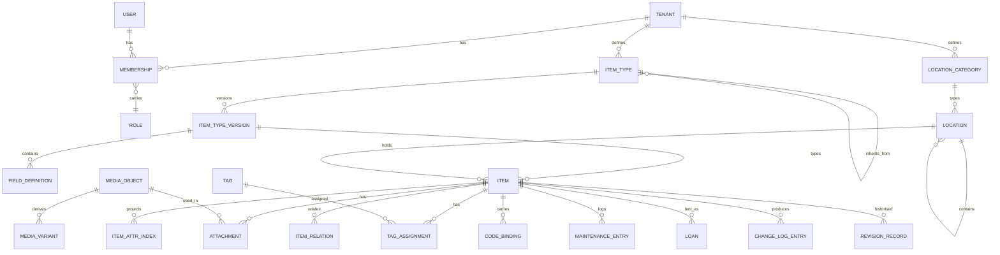

# 07 — Data Model

## 7.1 Ground rules

1. **PostgreSQL 18 is the single source of truth.** Every other store is derived
   and rebuildable.
2. **Every domain table carries `tenant_id`** and is subject to row-level
   security. There is no exception for "but this table is global" — but there are
   four tables that are **not domain tables**, and pretending otherwise would
   force either a fake `tenant_id` or a silently weakened check. They are listed
   exhaustively here, and the RLS check reads this list rather than treating them
   as violations:

   | Table | Why it is instance-wide | What protects it instead |
   |---|---|---|
   | `identification.public_code` | The printed code must resolve **before** any tenant is known, and `UNIQUE(code)` is global so a scan is unambiguous ([ADR-0030](../adr/0030-public-code-format.md)). A per-tenant code space would make resolution impossible | The code reveals nothing about the tenant. Resolution goes through one `SECURITY DEFINER` function that returns a binding only after the caller's permission is checked — it is on the documented list of `REQ-SEC-008` |
   | `identification.code_binding` | Follows `public_code` for the same reason | Carries `tenant_id` and is RLS-protected on read; only the resolver function crosses it |
   | `identification.label_base_url_usage` | Records which base URLs this **instance** has ever printed. It is deployment history, not tenant data ([10 §10.2.1](10-identification-and-labels.md)) | Readable by the operator only; contains no tenant reference at all |
   | `audit.chain_anchor` | The anchor spans all tenants by design — that is the property it provides ([ADR-0031](../adr/0031-audit-chain-per-tenant.md)) | Contains hashes only, never content. Readable by the operator; a tenant verifies its own chain against its own entries |

   **The list is closed.** A new instance-wide table needs an entry here and a
   sentence saying what protects it instead — which is deliberately more friction
   than adding `tenant_id`.
3. **Primary keys are UUIDv7** (`uuidv7()`, built into PostgreSQL 18). They are
   time-ordered — unlike UUIDv4, therefore index-friendly — and can be generated
   by the client while offline ([ADR-0016](../adr/0016-identifiers.md)).
4. **Every domain table carries `version bigint`** for optimistic locking, plus
   `created_at`/`updated_at`/`created_by`/`updated_by`. The DDL in this chapter
   spells them out rather than eliding them for brevity — the first draft did
   elide them, and four of the five sample tables then disagreed with this rule.
   A migration check enforces it, so the samples and the rule cannot drift again.
5. **No deletion without a tombstone.** A domain delete sets `deleted_at`; final
   removal is a separate, logged operation that leaves a tombstone for
   reconciliation.
6. **Every building block owns its schema** and touches no other.

## 7.2 Overview



## 7.3 The attribute model (variant D)

The central decision: **JSONB as the source of truth, plus a fixed,
application-maintained index side table for searchable fields** — with no DDL at
runtime. Rationale and alternatives in
[ADR-0004](../adr/0004-attribute-storage-model.md).

### Schema definition (relational, versioned)

```sql
CREATE TABLE catalog.item_type (
    id              uuid PRIMARY KEY DEFAULT uuidv7(),
    tenant_id       uuid NOT NULL REFERENCES tenancy.tenant(id),
    key             text NOT NULL,                    -- 'book', 'power-tool'
    parent_id       uuid,
    kind            text NOT NULL CHECK (kind IN ('PHYSICAL','DIGITAL')),
    icon            text,
    archived_at     timestamptz,
    created_at      timestamptz NOT NULL DEFAULT now(),
    updated_at      timestamptz NOT NULL DEFAULT now(),
    created_by      uuid, updated_by uuid,
    version         bigint NOT NULL DEFAULT 1,
    UNIQUE (tenant_id, key),
    UNIQUE (tenant_id, id),                           -- the target of composite FKs, see 7.5
    FOREIGN KEY (tenant_id, parent_id) REFERENCES catalog.item_type (tenant_id, id)
);

CREATE TABLE catalog.item_type_version (
    id              uuid PRIMARY KEY DEFAULT uuidv7(),
    item_type_id    uuid NOT NULL,
    tenant_id       uuid NOT NULL,
    version_number  int  NOT NULL,
    json_schema     jsonb NOT NULL,       -- generated, never hand-written
    published_at    timestamptz,
    created_at      timestamptz NOT NULL DEFAULT now(),
    created_by      uuid,
    version         bigint NOT NULL DEFAULT 1,
    UNIQUE (item_type_id, version_number),
    UNIQUE (tenant_id, id),
    FOREIGN KEY (tenant_id, item_type_id)
        REFERENCES catalog.item_type (tenant_id, id) ON DELETE CASCADE
);

CREATE TABLE catalog.field_definition (
    id                  uuid PRIMARY KEY DEFAULT uuidv7(),
    item_type_version_id uuid NOT NULL,
    tenant_id           uuid NOT NULL,
    key                 text NOT NULL,                -- 'isbn', 'purchasePrice'
    data_type           text NOT NULL,                -- see the type list in 04
    labels              jsonb NOT NULL,               -- {"de":"ISBN","en":"ISBN"}
    required            boolean NOT NULL DEFAULT false,
    default_value       jsonb,
    constraints         jsonb,        -- {"pattern":"…","min":0,"max":10,"unit":"g"}
    field_group         text,
    display_order       int NOT NULL DEFAULT 0,
    searchable          boolean NOT NULL DEFAULT false,
    sortable            boolean NOT NULL DEFAULT false,
    facetable           boolean NOT NULL DEFAULT false,
    sensitive           boolean NOT NULL DEFAULT false,   -- encrypted + permission-gated
    deprecated_at       timestamptz,
    created_at          timestamptz NOT NULL DEFAULT now(),
    updated_at          timestamptz NOT NULL DEFAULT now(),
    created_by          uuid, updated_by uuid,
    version             bigint NOT NULL DEFAULT 1,
    UNIQUE (item_type_version_id, key),
    FOREIGN KEY (tenant_id, item_type_version_id)
        REFERENCES catalog.item_type_version (tenant_id, id) ON DELETE CASCADE
);
```

### Values (JSONB, one item = one row)

```sql
CREATE TABLE inventory.item (
    id                  uuid PRIMARY KEY,                -- from the client (UUIDv7)
    tenant_id           uuid NOT NULL,
    item_type_version_id uuid NOT NULL,
    name                text NOT NULL,
    description         text,
    kind                text NOT NULL CHECK (kind IN ('PHYSICAL','DIGITAL')),
    location_id         uuid,
    quantity            numeric(19,4) NOT NULL DEFAULT 1 CHECK (quantity >= 0),
    quantity_unit       text,
    lifecycle_state     text NOT NULL DEFAULT 'ACTIVE',
    attributes          jsonb NOT NULL DEFAULT '{}'::jsonb,
    search_vector       tsvector                         -- fallback search; GENERATED,
                        GENERATED ALWAYS AS (                -- so it cannot drift from
                            to_tsvector('simple',            -- the row it describes
                                coalesce(name,'') || ' ' || coalesce(description,''))
                        ) STORED,
    created_at          timestamptz NOT NULL DEFAULT now(),
    updated_at          timestamptz NOT NULL DEFAULT now(),
    created_by          uuid, updated_by uuid,
    deleted_at          timestamptz,
    version             bigint NOT NULL DEFAULT 1,
    CONSTRAINT physical_needs_location
        CHECK (kind <> 'PHYSICAL' OR location_id IS NOT NULL OR deleted_at IS NOT NULL),
    UNIQUE (tenant_id, id),                          -- the target of composite FKs, see 7.5
    -- Composite, so a reference cannot cross a tenant boundary even though
    -- foreign key checks bypass RLS — see 7.5.
    CONSTRAINT item_location_same_tenant
        FOREIGN KEY (tenant_id, location_id)
        REFERENCES locations.location (tenant_id, id),
    CONSTRAINT item_type_version_same_tenant
        FOREIGN KEY (tenant_id, item_type_version_id)
        REFERENCES catalog.item_type_version (tenant_id, id)
);

CREATE INDEX item_attributes_gin ON inventory.item
    USING gin (attributes jsonb_path_ops);
CREATE INDEX item_tenant_updated ON inventory.item (tenant_id, updated_at DESC)
    WHERE deleted_at IS NULL;
CREATE INDEX item_search_fts ON inventory.item USING gin (search_vector);
```

### The index side table

```sql
CREATE TABLE inventory.item_attr_index (
    tenant_id   uuid    NOT NULL,
    item_id     uuid    NOT NULL,
    field_key   text    NOT NULL,
    num_value   numeric(38,10),
    text_value  text,
    date_value  timestamptz,
    bool_value  boolean,
    ref_value   uuid,
    unit_value  text,          -- ISO 4217 code for `money`, unit symbol for `quantity`
    PRIMARY KEY (item_id, field_key),
    FOREIGN KEY (tenant_id, item_id)
        REFERENCES inventory.item (tenant_id, id) ON DELETE CASCADE
);

CREATE INDEX iai_num  ON inventory.item_attr_index (tenant_id, field_key, num_value)
    WHERE num_value IS NOT NULL;
CREATE INDEX iai_text ON inventory.item_attr_index (tenant_id, field_key, text_value)
    WHERE text_value IS NOT NULL;
CREATE INDEX iai_date ON inventory.item_attr_index (tenant_id, field_key, date_value)
    WHERE date_value IS NOT NULL;
CREATE INDEX iai_ref  ON inventory.item_attr_index (tenant_id, field_key, ref_value)
    WHERE ref_value IS NOT NULL;
CREATE INDEX iai_unit ON inventory.item_attr_index (tenant_id, field_key, unit_value, num_value)
    WHERE unit_value IS NOT NULL;
```

> **Why `unit_value` exists — and why leaving it out was a defect.** Two of the
> declared field types carry a unit alongside their number: `money` (amount +
> ISO 4217 code) and `quantity` (value + unit). Projected into `num_value` alone,
> that unit is lost, and `SUM(num_value)` would cheerfully add EUR to USD, or
> grams to kilograms, and return a plausible-looking wrong number. Any aggregation
> over a `money` or `quantity` field therefore **groups by `unit_value`**; a
> mixed-unit total is never produced silently
> ([REQ-CORE-032](../requirements/01-functional.md),
> [REQ-LIFE-017](../requirements/01-functional.md),
> [ADR-0025](../adr/0025-money-representation.md)).

**Properties:**

| Property | Implementation |
|---|---|
| Who maintains it | The application layer, in **the same transaction** as the `item` `UPDATE`. Only fields marked `searchable`, `sortable` or `facetable` are mirrored. |
| How much write cost | A `DELETE`+`INSERT` of that item's rows — typically 3–8 rows, not 50. |
| On a field definition change | `FieldSearchabilityChanged` triggers a background run that re-projects the affected items. No DDL, no lock, cancellable at any time. |
| Rebuild | A `REINDEX_ATTRIBUTES` administrative run, entirely from `item.attributes` — through the same code path as a normal write, so there is no second truth. |
| Consistency proof | A nightly reconciliation compares samples between `attributes` and `item_attr_index` and reports deviations as a metric. |
| Relation to OpenSearch | OpenSearch serves full text and facets; `item_attr_index` serves **transactionally exact** filters, sorting and reporting, plus search in the `minimal` profile and during an OpenSearch outage. |

### Example

```jsonc
// inventory.item.attributes of a book
{
  "isbn": "9783836287456",
  "author": ["Kent Beck"],
  "publishedYear": 2022,
  "purchasePrice": { "amount": "49.90", "currency": "EUR" },
  "condition": "good",
  "warrantyUntil": "2027-03-01"
}
```

```
-- item_attr_index (searchable/sortable/facetable only)
item_id | field_key      | text_value      | num_value | unit_value | date_value
--------+----------------+-----------------+-----------+------------+------------------------
 …      | isbn           | 9783836287456   |           |            |
 …      | publishedYear  |                 | 2022      |            |
 …      | purchasePrice  |                 | 49.90     | EUR        |
 …      | condition      | good            |           |            |
 …      | warrantyUntil  |                 |           |            | 2027-03-01 00:00:00+00
```

### Validation

Validation happens in **three** places, deliberately redundant:

1. **Client** (web and apps) against the shipped JSON Schema of the type version —
   instant feedback, works offline.
2. **Application layer** against the same schema — the binding check. Plus domain
   rules JSON Schema cannot express (references exist and belong to the tenant,
   units are convertible).
3. **Database** through a `CHECK` that secures the basic shape (`attributes` is
   an object, no forbidden keys, size limit) — protection against writes that
   bypass the application.

## 7.4 The location tree

```sql
CREATE TABLE locations.location (
    id              uuid PRIMARY KEY,
    tenant_id       uuid NOT NULL,
    category_id     uuid NOT NULL,
    parent_id       uuid,
    name            text NOT NULL,
    path            ltree NOT NULL,      -- materialised path
    depth           int   NOT NULL,
    is_mobile       boolean NOT NULL DEFAULT false,
    attributes      jsonb NOT NULL DEFAULT '{}'::jsonb,
    sealed_at       timestamptz,          -- moving box closed
    created_at      timestamptz NOT NULL DEFAULT now(),
    updated_at      timestamptz NOT NULL DEFAULT now(),
    created_by      uuid, updated_by uuid,
    deleted_at      timestamptz,
    version         bigint NOT NULL DEFAULT 1,
    CONSTRAINT depth_limit CHECK (depth <= 12),
    UNIQUE (tenant_id, id),               -- the target of composite FKs, see 7.5
    FOREIGN KEY (tenant_id, category_id)
        REFERENCES catalog.location_category (tenant_id, id),
    FOREIGN KEY (tenant_id, parent_id)
        REFERENCES locations.location (tenant_id, id)
);

CREATE INDEX location_path_gist ON locations.location USING gist (path);
CREATE INDEX location_tenant_parent ON locations.location (tenant_id, parent_id);
```

| Question | Query |
|---|---|
| Everything below "cellar" | `WHERE path <@ 'cellar'` — one index lookup, no recursion |
| A location's path for display | Straight from `path`, no join |
| Move a subtree | `UPDATE … SET path = 'new' \|\| subpath(path, nlevel(old))` for the subtree, in one transaction |
| Prevent cycles | A `CHECK` that the target is not `<@` the source, plus an application check |

`parent_id` **and** `path` are both maintained: `parent_id` is the truth for
foreign keys and cascades, `path` is the accelerator. A trigger keeps `path` and
`depth` consistent; a nightly reconciliation verifies the agreement.

## 7.5 Tenant isolation: row-level security

The **second, independent** line of defence. It works even when a query in the
application forgets the tenant filter.

```sql
ALTER TABLE inventory.item ENABLE ROW LEVEL SECURITY;
ALTER TABLE inventory.item FORCE  ROW LEVEL SECURITY;   -- applies to the owner too

CREATE POLICY tenant_isolation ON inventory.item
    USING      (tenant_id = current_setting('app.tenant_id', true)::uuid)
    WITH CHECK (tenant_id = current_setting('app.tenant_id', true)::uuid);
```

**What it takes for this to actually hold:**

| Point | Rule |
|---|---|
| Roles | `homeinv_app` (the application): **no** `BYPASSRLS`, **no** table ownership, **no** DDL rights · `homeinv_migrator`: owner, active only at startup · `homeinv_readonly`: for reporting |
| Setting the context | `SET LOCAL app.tenant_id` at the start of every transaction, from the authenticated context — never from a request parameter |
| Connection pool | `SET LOCAL` is transaction-scoped and is discarded automatically when the connection returns. A test ensures no connection goes back into the pool with a tenant still set. |
| Missing context | `current_setting(..., true)` returns `NULL` → the policy fails → **zero rows**. A forgotten context yields empty results, not foreign data. |
| Cross-tenant administration | An explicit, logged `SECURITY DEFINER` function with its own permission check — never `BYPASSRLS` |
| Proof | A test procedure creates two tenants, sets the context wrongly or not at all, and verifies for **every** table that nothing leaks. A new table without RLS fails the test. |

### The gap RLS does not close: foreign keys

PostgreSQL documents it plainly: *referential integrity checks, such as unique or
primary key constraints and foreign key references, always bypass row security.*
The referential triggers run outside the policy, and no `FORCE` changes that.

That matters here, because the tables in [7.3](#73-the-attribute-model-variant-d)
reference across schemas — `inventory.item.location_id` into
`locations.location`, `item_type_version_id` into `catalog.item_type_version`,
`locations.location.category_id` into `catalog.location_category`. Written
naively, an `INSERT` carrying a **foreign tenant's** `location_id` passes the
`WITH CHECK` policy on `item` (its own `tenant_id` is correct) and passes the
foreign key check (which ignores RLS). The row comes into existence, pointing
across a tenant boundary. The application layer catches it
([05 §5.1](05-runtime-view.md): foreign location → `404`) — but the whole purpose
of RLS here is to hold **when the application layer is wrong**.

**Therefore every cross-aggregate reference carries the tenant in the key:**

```sql
-- Referenced side: the tenant-qualified key the reference points at.
ALTER TABLE locations.location
    ADD CONSTRAINT location_tenant_key UNIQUE (tenant_id, id);

-- Referencing side: the tenant travels with the reference.
ALTER TABLE inventory.item
    ADD CONSTRAINT item_location_same_tenant
    FOREIGN KEY (tenant_id, location_id)
    REFERENCES locations.location (tenant_id, id);
```

The check still bypasses RLS — it now simply cannot succeed across a tenant
boundary, because `tenant_id` is part of what is matched. The same pattern
applies to `item_type_version_id`, `category_id`, `media_object`, `code_binding`
and every other reference between aggregates.

| Point | Rule |
|---|---|
| Every referenced table | carries `UNIQUE (tenant_id, id)` in addition to its primary key |
| Every foreign key between aggregates | is composite: `(tenant_id, <ref>_id)`, never `<ref>_id` alone |
| Proof | The isolation test is extended: it is not enough that tenant A cannot **read** tenant B's rows — tenant A must also be unable to **create a reference** to one. A single-column foreign key between two tenant-scoped tables fails the build, checked over the migration files. |

## 7.6 The change log for reconciliation

```sql
CREATE TABLE sync.change_log (
    tenant_id     uuid    NOT NULL,
    seq           bigint  NOT NULL,      -- strictly monotonic per tenant
    entity_type   text    NOT NULL,      -- see the entity type list below
    entity_id     uuid    NOT NULL,
    operation     text    NOT NULL,      -- 'UPSERT' | 'DELETE'
    entity_version bigint NOT NULL,
    payload       jsonb,                 -- NULL on DELETE
    actor_id      uuid,
    device_id     uuid,                  -- originating device, for echo suppression
    occurred_at   timestamptz NOT NULL DEFAULT now(),
    PRIMARY KEY (tenant_id, seq, occurred_at)
) PARTITION BY RANGE (occurred_at);

-- The cursor lookup path. Not UNIQUE: uniqueness of (tenant_id, seq) is
-- guaranteed by the per-tenant sequence, not by an index — see the note below.
CREATE INDEX change_log_cursor ON sync.change_log (tenant_id, seq);
```

> **Why `occurred_at` sits in the primary key — and why leaving it out was a
> defect.** PostgreSQL requires every unique constraint on a partitioned table to
> contain **all** partition key columns. `PRIMARY KEY (tenant_id, seq)` with
> `PARTITION BY RANGE (occurred_at)` does not satisfy that, and the
> `CREATE TABLE` fails outright. Adding `occurred_at` makes the DDL valid but
> moves the guarantee: the database no longer enforces that `seq` is unique
> within a tenant. That enforcement therefore rests entirely on the per-tenant
> sequence, allocated in the same transaction as the change — which is where the
> monotonicity comes from in any case. A nightly check verifies the invariant
> (no duplicate `(tenant_id, seq)`, no gap that is not explained by a rolled-back
> transaction) and reports deviations as a metric, the same way
> `item_attr_index` is reconciled.

| Aspect | Decision |
|---|---|
| Monotonic sequence | One sequence per tenant. The entry is created in the same transaction as the change. Uniqueness of `(tenant_id, seq)` is a property of the sequence, not of a constraint — see the note above. |
| Entity types, reconciled **both ways** | `item`, `location`, `tag`, `tag_assignment`, `item_relation`, `attachment`, `maintenance_entry`, `loan`, `stocktake`, `code_binding` |
| Entity types, **download only** | `item_type`, `item_type_version`, `field_definition`, `location_category`, `value_list`, `label_template` — configuration is never edited offline ([11 §11.2](11-offline-synchronization.md)) |
| Partitioning | Monthly. Old partitions are detached after the retention period. |
| Retention | **Configurable per tenant** within fixed bounds: at least 30, at most 365 days, default 90. A device whose cursor is older is asked to perform a **full sync** — which is why tombstones must live at least as long. The UI states explicitly how long a device may stay offline at the chosen setting. |
| Echo suppression | `device_id` prevents a device from receiving its own changes back. |
| Size | By far the fastest-growing table. Its size is monitored as a metric. |

## 7.7 The event outbox

Provided by Spring Modulith and extended:

```sql
CREATE TABLE outbox.event_publication (
    id                uuid PRIMARY KEY,
    listener_id       text NOT NULL,
    event_type        text NOT NULL,
    serialized_event  text NOT NULL,
    tenant_id         uuid,
    trace_id          text,
    publication_date  timestamptz NOT NULL,
    completion_date   timestamptz
);
CREATE INDEX outbox_incomplete ON outbox.event_publication (publication_date)
    WHERE completion_date IS NULL;
```

A relay process reads incomplete entries and publishes them to RabbitMQ.
`completion_date` is set only after the broker acknowledges. That yields
**at-least-once** delivery; all consumers are therefore built to be idempotent
(deduplicating on the event ID).

## 7.8 Other load-bearing tables

| Table | Purpose | Notable |
|---|---|---|
| `identification.public_code` | The printed short code | `UNIQUE(code)` **globally**, not per tenant — otherwise a scan could not be resolved unambiguously. The code reveals nothing about the tenant. |
| `identification.code_binding` | Code → entity | Historising: a label can be reassigned, the history stays |
| `identification.label_base_url_usage` | Which base URLs have ever been printed onto labels | The source for the "labels with the old base" report ([10 §10.2.1](10-identification-and-labels.md)) |
| `media.media_object` | Blob metadata | `sha256` with `UNIQUE(tenant_id, sha256)`, `ref_count` per tenant. The blob path carries the tenant (`sha256/<tenantId>/<hash>`), so metadata and storage are scoped the same way — they were not before, and the mismatch is what made the dedup short cut leak ([ADR-0032](../adr/0032-per-tenant-blob-addressing.md)) |
| `audit.audit_entry` | Append-only log | Partitioned monthly; `prev_hash`/`entry_hash` form a chain **per tenant**, so a write locks only against that tenant's other writes and a tenant can verify its own chain under its own RLS context ([ADR-0031](../adr/0031-audit-chain-per-tenant.md)). The application role has only `INSERT` and `SELECT` |
| `audit.chain_anchor` | Hourly Merkle root over all tenants | Instance-wide, no `tenant_id` — see the exception list in [7.1](#71-ground-rules). The per-tenant chains prove internal consistency; the anchor is what a rewrite cannot reproduce, because it spans every tenant and chains to its own predecessor. Never pruned: ~9 000 rows a year, and pruning would discard exactly the evidence |
| `audit.revision_record` | Domain history | JSONB snapshot per version, restore possible |
| `inventory.item_relation` | Relations | `relation_type` (`ACCESSORY_OF`, `PART_OF`, `REPLACEMENT_FOR`, `RELATED`), directed, `CHECK` against self-reference |
| `inventory.loan` | Lending | Borrower (internal or free text), handed out, due back, returned |
| `plugins.plugin_registration` | Plugin registry | Manifest, contract version, certificate fingerprint |
| `plugins.granted_capability` | Granted capabilities | Per tenant, with timestamp, granting person and revocation |
| `tenancy.quota_usage` | Usage counters | Carried forward, not counted on every query |
| `platform.idempotency_record` | `Idempotency-Key` → the first response | `PRIMARY KEY (tenant_id, key)`, plus the payload hash and the serialised response. Written **in the same transaction** as the record it protects ([ADR-0009](../adr/0009-messaging-and-events.md)); a daily run removes entries older than 24 h |

## 7.9 Migrations

| Aspect | Decision |
|---|---|
| Tool | Flyway, numbered SQL scripts, one script per change |
| Executing role | `homeinv_migrator` — the application role **never** has DDL rights |
| Location | `src/main/resources/db/migration/<schema>/V<n>__<description>.sql` — one directory per building block |
| CI checks | Migration against a copy of a realistic data set · no lock held longer than 5 s · backward compatibility with the previous code version · every new table has RLS and `tenant_id` (checked automatically) · every new domain table has `version` and the four audit columns ([7.1](#71-ground-rules), rule 4) · **no single-column foreign key between two tenant-scoped tables** — references are composite on `(tenant_id, id)` ([7.5](#75-tenant-isolation-row-level-security)) · no statement in one block's migration names another block's schema ([04 §4.5](04-building-blocks.md)) |
| Forbidden | Destructive changes in the same release as the corresponding code change (the three-step from [06 §6.12](06-deployment-view.md)) |
| Test data | Separate from migrations, never inside `V*` scripts |

## 7.10 Volume estimate

| Subject | Assumption | Size |
|---|---|---|
| `item` | 1 M rows, attributes ⌀ 2 KB | ~2.5 GB |
| `item_attr_index` | ⌀ 6 rows per item | ~600 MB including indexes |
| `change_log` | 90 days, 5 000 changes/day | ~1.5 GB |
| `audit_entry` | 1 year | ~2 GB |
| Media | 1 M items, 30 % with photos, ⌀ 2 MB + derivatives | ~700 GB → **lives in Nextcloud, not in the database** |
| OpenSearch | 1 M documents | ~3 GB |

From this follow the sizing in [06 §6.7](06-deployment-view.md) and the decision
never to store media in the database.
