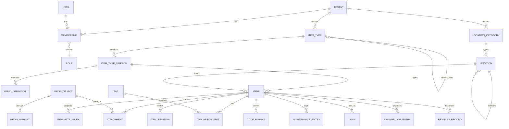

# 07 — Data Model

## 7.1 Ground rules

1. **PostgreSQL 18 is the single source of truth.** Every other store is derived
   and rebuildable.
2. **Every domain table carries `tenant_id`** and is subject to row-level
   security. There is no exception for "but this table is global" — but the tables
   below are **not domain tables**, and pretending otherwise would force either a
   fake `tenant_id` or a silently weakened check. They are listed exhaustively
   here, and the RLS check reads this list rather than treating them as
   violations:

   | Table | Why it is instance-wide | What protects it instead |
   |---|---|---|
   | `identification.public_code` | The printed code must resolve **before** any tenant is known, and `UNIQUE(code)` is global so a scan is unambiguous ([ADR-0030](../adr/0030-public-code-format.md)). A per-tenant code space would make resolution impossible | The code reveals nothing about the tenant. Resolution goes through one `SECURITY DEFINER` function that returns a binding only after the caller's permission is checked — it is on the documented list of `REQ-SEC-008` |
   | `identification.code_binding` | Follows `public_code` for the same reason | Carries `tenant_id` and is RLS-protected on read; only the resolver function crosses it |
   | `identification.label_base_url_usage` | Records which base URLs this **instance** has ever printed. It is deployment history, not tenant data ([10 §10.2.1](10-identification-and-labels.md)) | Readable by the operator only; contains no tenant reference at all |
   | `identity.app_user` | Authentication happens **before** any tenant is known: the credential presented is an e-mail address, and an e-mail address does not name a tenant. A `tenant_id` here would have to be read before the row carrying it has been found. It is also where the three **instance-level** entitlements live — `instance_operator`, `may_create_tenants` and `tenant_limit` ([ADR-0057](../adr/0057-the-instance-operator.md)) — for the same reason: each is a property of a person *on this instance*, and no tenant could carry one | Reachable only through `tenancy.membership`, which is RLS-protected: no endpoint returns a user by anything but the caller's own session or a membership of the caller's tenant, with the single exception of `/api/v1/instance/**`, which is gated on `INSTANCE_OPERATOR`. Enumeration is answered identically for a known and an unknown address (`REQ-SEC-110`) |
   | `audit.chain_anchor` | The anchor spans all tenants by design — that is the property it provides ([ADR-0031](../adr/0031-audit-chain-per-tenant.md)) | Contains hashes only, never content. Readable by the operator; a tenant verifies its own chain against its own entries |
   | `identity.credential` | The second factor is asked for **between the password and the session** (`REQ-AUTH-002`), and at that moment there is no `app.tenant_id` to scope a policy with — the value is derived from the membership the login goes on to choose. A tenant column here would have to be read before the row carrying it had been found, which is `app_user`'s reason one step further on | Reachable only through the caller's own session: no endpoint takes a user id, and there is no instance-operator path to it either — an operator administers entitlements ([ADR-0057](../adr/0057-the-instance-operator.md)), and somebody else's authenticator is not one. The TOTP secret is sealed with `HOMEINV_CREDENTIAL_KEY_FILE` and recovery codes are Argon2id hashes, so the rows are of no use even to a reader who has them (`REQ-SEC-109`) |
   | `tenancy.erasure_certificate` | Evidence of an erasure has to outlive the thing it is about: a tenant-scoped certificate would be removed by the very run that writes it (`REQ-TEN-011`, [ADR-0060](../adr/0060-the-erasure-runs-in-one-pass.md)) | It holds no content — the tenant id, the name it had, which account asked and when, and a row count per block. Granted `SELECT` and `INSERT` and nothing else, so a certificate cannot be edited afterwards, and read only through `/api/v1/instance/**`, which is gated on `INSTANCE_OPERATOR`. A tenant that has been erased has no members left to ask |
   | `plugins.plugin_registration` | An operator installs a plugin the way they install any other container, once for the instance — there is no installation from inside the running system (`REQ-PLG-013`). A tenant-scoped registration would mean installing it once per tenant. | It holds no tenant data: a manifest, a contract range, an endpoint and a certificate fingerprint, all of which the operator wrote. What each tenant *permits* it lives beside it in `plugins.capability_grant`, which carries `tenant_id` and a forced policy — and a plugin has no permissions at all until a row appears there (09 §9.4) |
   | `identity.password_reset` | A reset is asked for **at the login page**: there is no session, therefore no tenant, and for an address nobody has an account for there is none even in principle. A policy keyed on a context that does not exist yields zero rows rather than an error, so a tenant-scoped table would let the request appear to succeed while nothing happened. It is `identity.credential`'s reason one step earlier — before the password, not between it and the session (`REQ-SEC-018`) | Reachable only by presenting the token: no endpoint takes a user id, and the lookup is by the token's SHA-256, which is the only form stored (`REQ-SEC-048`). A partial unique index allows **one open reset per account**, so asking twice replaces the first rather than opening a second way in. `homeinv_app` may insert, read and spend a row and `homeinv_housekeeping` may delete an expired one; nothing may edit one otherwise |
   | `notification.security_notification` | What the deployment owes an **account** rather than a tenant (`REQ-NOTI-004`, [ADR-0066](../adr/0066-instance-level-capability-grants.md)). The recipient may belong to several tenants or to none, and "always reported, not switchable off" cannot be conditional on a subscription that lives in a tenant. A tenant's delivery history is not the place for another person's account mail either | Written only by the identity block and read only by the delivery run and the account holder's own surface. It holds no tenant data: an account id, a kind, the address as it stood when the message was raised, and the text that was sent. The address is copied at raise time rather than read at delivery, so a reset still reaches the address the account had (`REQ-SEC-018`) |
   | `notification.security_delivery_attempt` | Follows `security_notification` for the same reason | Append-only, `SELECT` and `INSERT` only. Holds what the far side said and never a credential, never the message body and never the token the message carried |
   | `plugins.instance_capability_grant` | What the **instance operator** permitted a plugin to do for the deployment itself ([ADR-0066](../adr/0066-instance-level-capability-grants.md)). The row's whole purpose is that it belongs to no tenant: it authorises the calls the instance makes on its own behalf, for an account that may be a member of nothing (`REQ-NOTI-004`). A tenant column here would be the thing it exists to avoid, and a policy keyed on a context that does not exist would disable the one path it was added to make possible | Written only by the instance operator ([ADR-0057](../adr/0057-the-instance-operator.md)) and read only when resolving a port for an instance call. It grants no access to tenant data of any kind: an instance call runs with **no** tenant context, so every policy in the database yields zero rows, and the manifest still governs — a grant for a capability the current manifest no longer declares is a leftover rather than a permission |
   | `outbox.event_publication` | The one entry that carries a `tenant_id` and is still on this list, because what it is exempt from is the **policy**, not the column. The relay publishes every tenant's rows by design, and a forced policy would hide them from the one process whose job it is to see them ([ADR-0009](../adr/0009-messaging-and-events.md)) | The column is there, so every row still says whose event it is and the tenant context is restored from it when a consumer runs. Nothing reads the table but the relay, under `homeinv_app`; no endpoint exposes it, and the payload is a domain event that has already been through the authorization the write went through |

   **The list is closed.** A new instance-wide table needs an entry here and a
   sentence saying what protects it instead — which is deliberately more friction
   than adding `tenant_id`.

   *Two corrections on 2026-09-16, both found while adding
   `plugins.instance_capability_grant`.* *This paragraph said **seven** tables
   over a list of eight, and had since
   `identity.credential` was added. And `outbox.event_publication` was exempted by
   `MigrationRulesTest.INSTANCE_WIDE` — with its justification written out in a
   comment there — while this list, which that check is supposed to read, did not
   name it: the check was reading a longer list than the chapter published. The
   count now follows the table rather than being restated, and the justification
   lives where the chapter says it must.*
3. **Primary keys are UUIDv7** (`uuidv7()`, built into PostgreSQL 18). They are
   time-ordered — unlike UUIDv4, therefore index-friendly — and can be generated
   by the client while offline ([ADR-0016](../adr/0016-identifiers.md)).
4. **Every domain table carries `version bigint`** for optimistic locking, plus
   `created_at`/`updated_at`/`created_by`/`updated_by`. The DDL in this chapter
   spells them out rather than eliding them for brevity — the first draft did
   elide them, and four of the five sample tables then disagreed with this rule.
   `MigrationRulesTest.everyDomainTableIsVersionedAndAudited` enforces it, so the
   samples and the rule cannot drift again. *That sentence read "a migration
   check enforces it" from the day the chapter was written until 2026-09-13, when
   the check was finally written and found five tables: two that were right to
   have no such columns and are on the list below, three that were wrong and now
   have them.*

   **A *domain* table is one that holds mutable state a user edits.** Five kinds
   of table are not that. They carry no `version`, and of the four audit columns
   only the ones that can mean anything for them, and they are listed here
   exhaustively for the same reason the instance-wide list above is closed —
   otherwise the check contradicts this chapter's own DDL, which it did. *Said
   "three kinds" over a table of four until 2026-09-13, when the fifth was added
   with `catalog.location_category_child`.*

   | Kind | Tables | Why the columns would be meaningless |
   |---|---|---|
   | **Derived** | `inventory.item_attr_index` | A projection of `item.attributes`, rebuilt wholesale by `REINDEX_ATTRIBUTES`. It has no version of its own — the row it mirrors does — and no author but the application |
   | **Append-only records of an event** | `sync.change_log`, `audit.audit_entry`, `audit.chain_anchor`, `audit.chain_truncation` ([ADR-0046](../adr/0046-truncatable-audit-chain.md)), `audit.revision_record`, `notification.delivery_attempt`, `notification.security_delivery_attempt`, `identification.label_base_url_usage`, `tenancy.erasure_certificate` | Nothing updates them, so `version`, `updated_at` and `updated_by` would be dead columns. `occurred_at` and the actor are already in the row, under the names the record uses. `revision_record` is the history *of* an edit — a row per change with the state after it — and editing the history is the one thing it must not permit |
   | **Infrastructure** | `outbox.event_publication`, `idempotency.processed_request`, `crypto.tenant_data_key`, `notification.notification`, `notification.security_notification`, `identity.password_reset` | Owned by a mechanism, not by a block's domain model. A data key is issued and retired, never edited. A queued notification is a unit of work: its `state` and `next_attempt_at` are the delivery mechanism's bookkeeping, and an `updated_by` on it would name the scheduler rather than a person. The account queue beside it is the same shape with no tenant ([ADR-0066](../adr/0066-instance-level-capability-grants.md)), and a reset token is the same shape again: `used_at` is the spend, nothing else about the row ever changes, an `updated_by` would name whoever presented the token — who is anonymous at that moment, which is the property `REQ-SEC-018` rests on — and the single-use guarantee comes from that column and a partial unique index rather than from an optimistic lock |
   | **A rule that exists or does not** | `catalog.location_category_child` | A row *is* the permission for one category to sit under another (`REQ-CORE-047`). There is nothing in it to edit — withdrawing it is a `DELETE` and granting it again is an `INSERT` — so an `updated_by` could only ever repeat `created_by`. The whole set is replaced in one transaction, which is also why it needs no optimistic lock: the last writer's set is the rule, and half a whitelist is not a smaller answer but a wrong one |
   | **Issued, never edited** | `identification.public_code`, `identification.code_binding`, `inventory.item_relation`, `inventory.item_bundle` | A code is drawn, printed and bound; nobody edits one. `public_code` has no `tenant_id` at all (see rule 2), so it has no `updated_by` that could mean anything, and `code_binding` is **historised** — a reassignment appends a row rather than updating one, which is what preserves the binding history (`REQ-IDENT-004`). Both were on rule 2's closed list and on neither of rule 4's, so rule 4 demanded `version` and four audit columns from tables with no tenant and no editing user. A relation is made or broken and never altered — changing one is a delete and an insert, which is also what its `UNIQUE (tenant_id, source_id, target_id, relation_type)` leaves room for. A bundle membership is the same shape: the row *is* the containment, and moving a thing from one bundle to another is two operations because it is two facts |

   **The list is closed.** A new table that is none of the five needs the columns;
   a new table that claims to be one of the five needs a row here.
5. **No deletion without a tombstone.** A domain delete sets `deleted_at`; final
   removal is a separate, logged operation that leaves a tombstone for
   reconciliation.
6. **Every building block owns its schema** and touches no other.

## 7.2 Overview



## 7.3 The attribute model (variant D)

The central decision: **JSONB as the source of truth, plus a fixed,
application-maintained index side table for searchable fields** — with no DDL at
runtime. Rationale and alternatives in
[ADR-0004](../adr/0004-attribute-storage-model.md).

### Schema definition (relational, versioned)

```sql
CREATE TABLE catalog.item_type (
    id              uuid PRIMARY KEY DEFAULT uuidv7(),
    tenant_id       uuid NOT NULL,                    -- see the note under 7.5 on why
                                                      -- this is NOT a foreign key
    key             text NOT NULL,                    -- 'book', 'power-tool'
    parent_id       uuid,
    kind            text NOT NULL CHECK (kind IN ('PHYSICAL','DIGITAL')),
    icon            text,
    archived_at     timestamptz,
    created_at      timestamptz NOT NULL DEFAULT now(),
    updated_at      timestamptz NOT NULL DEFAULT now(),
    created_by      uuid, updated_by uuid,
    version         bigint NOT NULL DEFAULT 1,
    UNIQUE (tenant_id, key),
    UNIQUE (tenant_id, id),                           -- the target of composite FKs, see 7.5
    FOREIGN KEY (tenant_id, parent_id) REFERENCES catalog.item_type (tenant_id, id)
);

CREATE TABLE catalog.item_type_version (
    id              uuid PRIMARY KEY DEFAULT uuidv7(),
    item_type_id    uuid NOT NULL,
    tenant_id       uuid NOT NULL,
    version_number  int  NOT NULL,
    json_schema     jsonb NOT NULL,       -- generated, never hand-written
    published_at    timestamptz,
    created_at      timestamptz NOT NULL DEFAULT now(),
    updated_at      timestamptz NOT NULL DEFAULT now(),
    created_by      uuid,
    updated_by      uuid,                 -- who published it, or removed a field from it
    version         bigint NOT NULL DEFAULT 1,
    UNIQUE (item_type_id, version_number),
    UNIQUE (tenant_id, id),
    FOREIGN KEY (tenant_id, item_type_id)
        REFERENCES catalog.item_type (tenant_id, id) ON DELETE CASCADE
);

CREATE TABLE catalog.location_category_version (   -- the mirror of item_type_version
    id                   uuid PRIMARY KEY DEFAULT uuidv7(),
    location_category_id uuid NOT NULL,
    tenant_id            uuid NOT NULL,
    version_number       int  NOT NULL,
    json_schema          jsonb NOT NULL DEFAULT '{}'::jsonb,
    published_at         timestamptz,
    created_at           timestamptz NOT NULL DEFAULT now(),
    updated_at           timestamptz NOT NULL DEFAULT now(),
    created_by           uuid,
    updated_by           uuid,
    version              bigint NOT NULL DEFAULT 1,
    UNIQUE (location_category_id, version_number),
    UNIQUE (tenant_id, id),
    FOREIGN KEY (tenant_id, location_category_id)
        REFERENCES catalog.location_category (tenant_id, id) ON DELETE CASCADE
);

CREATE TABLE catalog.location_category_child (     -- what a category takes under it (REQ-CORE-047)
    tenant_id          uuid NOT NULL,
    parent_category_id uuid NOT NULL,
    child_category_id  uuid NOT NULL,
    created_at         timestamptz NOT NULL DEFAULT now(),
    created_by         uuid,
    PRIMARY KEY (tenant_id, parent_category_id, child_category_id),
    FOREIGN KEY (tenant_id, parent_category_id)
        REFERENCES catalog.location_category (tenant_id, id) ON DELETE CASCADE,
    FOREIGN KEY (tenant_id, child_category_id)
        REFERENCES catalog.location_category (tenant_id, id) ON DELETE CASCADE
);

CREATE TABLE catalog.value_list (                 -- an enum source, reusable (REQ-CORE-029)
    id          uuid PRIMARY KEY DEFAULT uuidv7(),
    tenant_id   uuid NOT NULL,
    key         text NOT NULL,
    labels      jsonb NOT NULL DEFAULT '{}'::jsonb,
    builtin     boolean NOT NULL DEFAULT false,
    archived_at timestamptz,
    -- audit columns and `version` as everywhere
    UNIQUE (tenant_id, key),
    UNIQUE (tenant_id, id)
);

CREATE TABLE catalog.value_list_entry (
    id            uuid PRIMARY KEY DEFAULT uuidv7(),
    tenant_id     uuid NOT NULL,
    value_list_id uuid NOT NULL,
    value         text NOT NULL,        -- what lands in `attributes`; stable
    labels        jsonb NOT NULL DEFAULT '{}'::jsonb,
    display_order int NOT NULL DEFAULT 0,
    archived_at   timestamptz,          -- still valid for items that carry it
    UNIQUE (value_list_id, value),
    UNIQUE (tenant_id, id),
    FOREIGN KEY (tenant_id, value_list_id)
        REFERENCES catalog.value_list (tenant_id, id) ON DELETE CASCADE
);

CREATE TABLE catalog.field_definition (
    id                           uuid PRIMARY KEY DEFAULT uuidv7(),
    tenant_id                    uuid NOT NULL,
    -- EXACTLY ONE of these two. A field belongs to an item type version or to a
    -- location category version, and both are versioned for the same reason: a
    -- definition change must not reach back into rows already written.
    item_type_version_id         uuid,
    location_category_version_id uuid,
    key                          text NOT NULL,   -- 'isbn', 'purchasePrice'
    data_type                    text NOT NULL,   -- the sixteen kinds listed in 04
    labels                       jsonb NOT NULL DEFAULT '{}'::jsonb,  -- {"de":"ISBN","en":"ISBN"}
    help_texts                   jsonb NOT NULL DEFAULT '{}'::jsonb,
    required                     boolean NOT NULL DEFAULT false,
    default_value                jsonb,
    constraints                  jsonb,  -- {"pattern":"…","min":0,"max":10,"unit":"g",
                                         --  "minLength":1,"maxLength":80,"referenceKind":"item"}
    value_list_id                uuid,   -- `enum` and `multi-enum` only, and always
    visibility                   jsonb,  -- {"field":"hasWarranty","operator":"equals","value":true}
    field_group                  text,
    display_order                int NOT NULL DEFAULT 0,
    searchable                   boolean NOT NULL DEFAULT false,
    sortable                     boolean NOT NULL DEFAULT false,
    facetable                    boolean NOT NULL DEFAULT false,
    sensitive                    boolean NOT NULL DEFAULT false,   -- encrypted + permission-gated
    deprecated_at                timestamptz,
    created_at                   timestamptz NOT NULL DEFAULT now(),
    updated_at                   timestamptz NOT NULL DEFAULT now(),
    created_by                   uuid, updated_by uuid,
    version                      bigint NOT NULL DEFAULT 1,
    CHECK (num_nonnulls(item_type_version_id, location_category_version_id) = 1),
    CHECK ((data_type IN ('enum','multi-enum')) = (value_list_id IS NOT NULL)),
    UNIQUE (item_type_version_id, key),
    UNIQUE (location_category_version_id, key),
    FOREIGN KEY (tenant_id, item_type_version_id)
        REFERENCES catalog.item_type_version (tenant_id, id) ON DELETE CASCADE,
    FOREIGN KEY (tenant_id, location_category_version_id)
        REFERENCES catalog.location_category_version (tenant_id, id) ON DELETE CASCADE,
    FOREIGN KEY (tenant_id, value_list_id)
        REFERENCES catalog.value_list (tenant_id, id)
);
```

> **Why a location category is versioned at all** (decided 2026-09-13). An item
> references a type *version*, so a type change devalues nothing that exists
> (`REQ-CORE-025`). A location referenced its *category* — and `REQ-CORE-041`
> gives categories their own fields, which would have made a category the one
> configurable thing whose every edit reached back into rows already written,
> tightening a constraint under locations nobody was looking at. Categories are
> versioned the same way, their fields hang off the version, and `location`
> points at the version. One shape, one generator, one validator.

### Values (JSONB, one item = one row)

```sql
CREATE TABLE inventory.item (
    id                  uuid PRIMARY KEY,                -- from the client (UUIDv7)
    tenant_id           uuid NOT NULL,
    item_type_version_id uuid NOT NULL,
    name                text NOT NULL,
    description         text,
    kind                text NOT NULL CHECK (kind IN ('PHYSICAL','DIGITAL')),
    location_id         uuid,
    quantity            numeric(19,4) NOT NULL DEFAULT 1 CHECK (quantity >= 0),
    quantity_unit       text,
    -- The level below which a consumable needs restocking (REQ-CORE-008). An item
    -- that has one IS a consumable; a separate flag would be a second way of saying
    -- the same thing, and one of the two would eventually be wrong.
    minimum_stock       numeric(19,4) CHECK (minimum_stock IS NULL OR minimum_stock >= 0),
    -- A paragraph in limited Markdown (REQ-CORE-014). Not a field of the type system,
    -- because every item has one whatever its type says. HTML is stripped where the
    -- value is WRITTEN, not where it is rendered.
    notes               text,
    lifecycle_state     text NOT NULL DEFAULT 'ACTIVE',
    attributes          jsonb NOT NULL DEFAULT '{}'::jsonb,
    -- Fallback search, GENERATED so it cannot drift from the row it describes. TWO
    -- columns, one per shipped UI language: 'simple' does no stemming at all, and this
    -- is the ONLY full-text mechanism at stage 0 and the permanent one in the `minimal`
    -- profile (ADR-0047). A per-tenant configuration is not available — to_tsvector is
    -- immutable only with a literal regconfig, and a non-immutable expression cannot be
    -- a generated column.
    search_vector_de    tsvector
                        GENERATED ALWAYS AS (
                            to_tsvector('german',
                                coalesce(name,'') || ' ' || coalesce(description,'')
                                    || ' ' || coalesce(notes,''))
                        ) STORED,
    search_vector_en    tsvector
                        GENERATED ALWAYS AS (
                            to_tsvector('english',
                                coalesce(name,'') || ' ' || coalesce(description,'')
                                    || ' ' || coalesce(notes,''))
                        ) STORED,
    created_at          timestamptz NOT NULL DEFAULT now(),
    updated_at          timestamptz NOT NULL DEFAULT now(),
    created_by          uuid, updated_by uuid,
    deleted_at          timestamptz,
    version             bigint NOT NULL DEFAULT 1,
    CONSTRAINT physical_needs_location
        CHECK (kind <> 'PHYSICAL' OR location_id IS NOT NULL OR deleted_at IS NOT NULL),
    -- Stated in the database as well as in the request validation, because a write
    -- that bypasses the application must not be the way around the limit.
    CONSTRAINT item_notes_length
        CHECK (notes IS NULL OR length(notes) <= 20000),
    UNIQUE (tenant_id, id),                          -- the target of composite FKs, see 7.5
    -- Composite, so a reference cannot cross a tenant boundary even though
    -- foreign key checks bypass RLS — see 7.5.
    CONSTRAINT item_location_same_tenant
        FOREIGN KEY (tenant_id, location_id)
        REFERENCES locations.location (tenant_id, id),
    CONSTRAINT item_type_version_same_tenant
        FOREIGN KEY (tenant_id, item_type_version_id)
        REFERENCES catalog.item_type_version (tenant_id, id)
);

CREATE INDEX item_attributes_gin ON inventory.item
    USING gin (attributes jsonb_path_ops);
CREATE INDEX item_tenant_updated ON inventory.item (tenant_id, updated_at DESC)
    WHERE deleted_at IS NULL;
CREATE INDEX item_search_fts_de ON inventory.item USING gin (search_vector_de);
CREATE INDEX item_search_fts_en ON inventory.item USING gin (search_vector_en);
-- "Which consumables are below their minimum" — the question a reminder asks, and
-- the reason this is an index rather than a scan over every item a tenant owns.
CREATE INDEX item_below_minimum ON inventory.item (tenant_id)
    WHERE minimum_stock IS NOT NULL AND deleted_at IS NULL;
```

### The index side table

```sql
CREATE TABLE inventory.item_attr_index (
    tenant_id   uuid    NOT NULL,
    item_id     uuid    NOT NULL,
    field_key   text    NOT NULL,
    num_value   numeric(38,10),
    text_value  text,
    date_value  timestamptz,
    bool_value  boolean,
    ref_value   uuid,
    unit_value  text,          -- ISO 4217 code for `money`, unit symbol for `quantity`
    PRIMARY KEY (item_id, field_key),
    FOREIGN KEY (tenant_id, item_id)
        REFERENCES inventory.item (tenant_id, id) ON DELETE CASCADE
);

CREATE INDEX iai_num  ON inventory.item_attr_index (tenant_id, field_key, num_value)
    WHERE num_value IS NOT NULL;
CREATE INDEX iai_text ON inventory.item_attr_index (tenant_id, field_key, text_value)
    WHERE text_value IS NOT NULL;
CREATE INDEX iai_date ON inventory.item_attr_index (tenant_id, field_key, date_value)
    WHERE date_value IS NOT NULL;
CREATE INDEX iai_ref  ON inventory.item_attr_index (tenant_id, field_key, ref_value)
    WHERE ref_value IS NOT NULL;
CREATE INDEX iai_unit ON inventory.item_attr_index (tenant_id, field_key, unit_value, num_value)
    WHERE unit_value IS NOT NULL;
```

> **Why `unit_value` exists — and why leaving it out was a defect.** Two of the
> declared field types carry a unit alongside their number: `money` (amount +
> ISO 4217 code) and `quantity` (value + unit). Projected into `num_value` alone,
> that unit is lost, and `SUM(num_value)` would cheerfully add EUR to USD, or
> grams to kilograms, and return a plausible-looking wrong number. Any aggregation
> over a `money` or `quantity` field therefore **groups by `unit_value`**; a
> mixed-unit total is never produced silently
> ([REQ-CORE-032](../requirements/01-functional.md),
> [REQ-LIFE-017](../requirements/01-functional.md),
> [ADR-0025](../adr/0025-money-representation.md)).

**Properties:**

| Property | Implementation |
|---|---|
| Who maintains it | The application layer, in **the same transaction** as the `item` `UPDATE`. Only fields marked `searchable`, `sortable` or `facetable` are mirrored. |
| How much write cost | A `DELETE`+`INSERT` of that item's rows — typically 3–8 rows, not 50. |
| On a field definition change | `FieldSearchabilityChanged` triggers a background run that re-projects the affected items. No DDL, no lock, cancellable at any time. |
| Rebuild | A `REINDEX_ATTRIBUTES` administrative run, entirely from `item.attributes` — through the same code path as a normal write, so there is no second truth. |
| **Soft deletion** | Setting `deleted_at` **removes** the item's rows from the side table, in the same transaction; restoring the item rebuilds them. The `ON DELETE CASCADE` above fires only on a *final* removal, which is a separate, later operation (`REQ-CORE-009`), so without this rule a trashed item would keep answering attribute filters for the whole retention period. The alternative — keeping the rows and joining back to `item` in every query — was rejected: `REQ-CORE-013` calls this path *transactionally exact*, and a correctness property that depends on every future query remembering a filter is not that ([ADR-0004](../adr/0004-attribute-storage-model.md)) |
| Consistency proof | A nightly reconciliation compares samples between `attributes` and `item_attr_index` and reports deviations as a metric. |
| Relation to OpenSearch | OpenSearch serves full text and facets; `item_attr_index` serves **transactionally exact** filters, sorting and reporting, plus search in the `minimal` profile and during an OpenSearch outage. |

### Example

```jsonc
// inventory.item.attributes of a book
{
  "isbn": "9783836287456",
  "author": ["Kent Beck"],
  "publishedYear": 2022,
  "purchasePrice": { "amount": "49.90", "currency": "EUR" },
  "condition": "good",
  "warrantyUntil": "2027-03-01"
}
```

```
-- item_attr_index (searchable/sortable/facetable only)
item_id | field_key      | text_value      | num_value | unit_value | date_value
--------+----------------+-----------------+-----------+------------+------------------------
 …      | isbn           | 9783836287456   |           |            |
 …      | publishedYear  |                 | 2022      |            |
 …      | purchasePrice  |                 | 49.90     | EUR        |
 …      | condition      | good            |           |            |
 …      | warrantyUntil  |                 |           |            | 2027-03-01 00:00:00+00
```

### Validation

Validation happens in **three** places, deliberately redundant:

1. **Client** (web and apps) against the shipped JSON Schema of the type version —
   instant feedback, works offline.
2. **Application layer** against the same schema — the binding check. Plus domain
   rules JSON Schema cannot express (references exist and belong to the tenant,
   units are convertible).
3. **Database** through a `CHECK` that secures the basic shape — protection
   against writes that bypass the application. It is one `IMMUTABLE` function,
   `catalog.attribute_shape_is_valid(jsonb)`, on both tables that carry
   attributes: the value is an object, every key is shaped like a field key
   (`^[a-z][A-Za-z0-9]*$`), and the whole set is at most **64 KiB**. It cannot
   check a value against its definition — a `CHECK` sees one row and no
   catalogue — and it is not meant to: it holds what is true of every attribute
   set whatever the type says.

## 7.4 The location tree

```sql
CREATE TABLE locations.location (
    id                  uuid PRIMARY KEY,
    tenant_id           uuid NOT NULL,
    category_version_id uuid NOT NULL,   -- the VERSION, as an item references a type version
    parent_id           uuid,
    name            text NOT NULL,
    path            ltree NOT NULL,      -- materialised path
    depth           int   NOT NULL,
    is_mobile       boolean NOT NULL DEFAULT false,
    attributes      jsonb NOT NULL DEFAULT '{}'::jsonb,
    sealed_at       timestamptz,          -- moving box closed
    created_at      timestamptz NOT NULL DEFAULT now(),
    updated_at      timestamptz NOT NULL DEFAULT now(),
    created_by      uuid, updated_by uuid,
    deleted_at      timestamptz,
    version         bigint NOT NULL DEFAULT 1,
    CONSTRAINT depth_limit CHECK (depth <= 12),
    UNIQUE (tenant_id, id),               -- the target of composite FKs, see 7.5
    FOREIGN KEY (tenant_id, category_version_id)
        REFERENCES catalog.location_category_version (tenant_id, id),
    FOREIGN KEY (tenant_id, parent_id)
        REFERENCES locations.location (tenant_id, id)
);

CREATE INDEX location_path_gist ON locations.location USING gist (path);
CREATE INDEX location_tenant_parent ON locations.location (tenant_id, parent_id);
```

| Question | Query |
|---|---|
| Everything below "cellar" | `WHERE path <@ 'cellar'` — one index lookup, no recursion |
| A location's path for display | Straight from `path`, no join |
| Move a subtree | `UPDATE … SET path = 'new' \|\| subpath(path, nlevel(old))` for the subtree, in one transaction |
| Prevent cycles | A `CHECK` that the target is not `<@` the source, plus an application check |

`parent_id` **and** `path` are both maintained: `parent_id` is the truth for
foreign keys and cascades, `path` is the accelerator. A trigger keeps `path` and
`depth` consistent; a nightly reconciliation verifies the agreement.

## 7.5 Tenant isolation: row-level security

The **second, independent** line of defence. It works even when a query in the
application forgets the tenant filter.

```sql
ALTER TABLE inventory.item ENABLE ROW LEVEL SECURITY;
ALTER TABLE inventory.item FORCE  ROW LEVEL SECURITY;   -- applies to the owner too

CREATE POLICY tenant_isolation ON inventory.item
    USING      (tenant_id = nullif(current_setting('app.tenant_id', true), '')::uuid)
    WITH CHECK (tenant_id = nullif(current_setting('app.tenant_id', true), '')::uuid);
```

> **Why `nullif` is there, and why leaving it out was a defect.** The obvious
> spelling is `current_setting('app.tenant_id', true)::uuid`, and it is wrong on a
> pooled connection. A two-part GUC name that PostgreSQL does not recognise becomes
> a **session placeholder** the first time it is set. `SET LOCAL` reverts at the end
> of the transaction — but to the placeholder's session value, which is the **empty
> string**, not `NULL`. So `current_setting(…, true)` returns `NULL` only on a
> connection that has never carried a tenant; on every connection that has served
> one transaction it returns `''`, and `''::uuid` raises `22P02`.
>
> The consequence is not a leak — an exception is as closed as an empty result —
> but it is not what the row below promises, and it is not what `REQ-SEC-005`
> tests for. A forgotten `SET LOCAL` would surface as a `500` on an unrelated
> query rather than as the documented empty set, and the obvious "fix" for a
> confusing `22P02` is to loosen the cast, which is where a real bug would enter.
> `nullif` makes the documented behaviour the actual behaviour.

**What it takes for this to actually hold:**

| Point | Rule |
|---|---|
| Roles | `homeinv_app` (the application): **no** `BYPASSRLS`, **no** table ownership, **no** DDL rights · `homeinv_migrator`: owner, active only in the one-shot `migrate` service ([ADR-0041](../adr/0041-migration-as-its-own-service.md)) · `homeinv_readonly`: for reporting · **`homeinv_housekeeping`**: `DELETE` on the retention-governed tables and nothing else — no DDL, no `BYPASSRLS`, no ownership. It exists because `REQ-SEC-069` denies the application `DELETE` on the audit log and `REQ-PRIV-010` still requires a retention period to be enforced ([ADR-0046](../adr/0046-truncatable-audit-chain.md)) |
| Setting the context | `SET LOCAL app.tenant_id` at the start of every transaction, from the authenticated context — never from a request parameter |
| Connection pool | `SET LOCAL` is transaction-scoped and is discarded automatically when the connection returns. A test ensures no connection goes back into the pool with a tenant still set. |
| Missing context | `nullif(current_setting(..., true), '')` yields `NULL` → the policy fails → **zero rows**. A forgotten context yields empty results, not foreign data — on a fresh connection *and* on a pooled one that has already served a tenant, which is the case the plain cast got wrong (see the note above). |
| Cross-tenant administration | An explicit, logged `SECURITY DEFINER` function with its own permission check — never `BYPASSRLS` |
| Proof | A test procedure creates two tenants, sets the context wrongly or not at all, and verifies for **every** table that nothing leaks. A new table without RLS fails the test. |

### The gap RLS does not close: foreign keys

PostgreSQL documents it plainly: *referential integrity checks, such as unique or
primary key constraints and foreign key references, always bypass row security.*
The referential triggers run outside the policy, and no `FORCE` changes that.

That matters here, because the tables in [7.3](#73-the-attribute-model-variant-d)
reference across schemas — `inventory.item.location_id` into
`locations.location`, `item_type_version_id` into `catalog.item_type_version`,
`locations.location.category_id` into `catalog.location_category`. Written
naively, an `INSERT` carrying a **foreign tenant's** `location_id` passes the
`WITH CHECK` policy on `item` (its own `tenant_id` is correct) and passes the
foreign key check (which ignores RLS). The row comes into existence, pointing
across a tenant boundary. The application layer catches it
([05 §5.1](05-runtime-view.md): foreign location → `404`) — but the whole purpose
of RLS here is to hold **when the application layer is wrong**.

**Therefore every cross-aggregate reference carries the tenant in the key:**

```sql
-- Referenced side: the tenant-qualified key the reference points at.
ALTER TABLE locations.location
    ADD CONSTRAINT location_tenant_key UNIQUE (tenant_id, id);

Siblings additionally carry **distinct names**, case-insensitively, and the index
that enforces it is **partial**:

```sql
CREATE UNIQUE INDEX location_sibling_name ON locations.location (
    tenant_id,
    coalesce(parent_id, '00000000-0000-0000-0000-000000000000'::uuid),
    lower(name)
) WHERE deleted_at IS NULL;
```

The `coalesce` is what makes the rule apply to the roots as well: `NULL` is not
equal to `NULL`, so without it every root would be unique by virtue of having no
parent. `WHERE deleted_at IS NULL` is rule 5 of §7.1 — a deleted location leaves a
tombstone, and a tombstone must not hold a name hostage.

A violation is `409` with `type: …/name-taken` (`REQ-CORE-064`). *This index existed
from the first migration and was described in no chapter until 2026-09-12, which is
why the API answered `500` for the one case it was built to refuse.*

-- Referencing side: the tenant travels with the reference.
ALTER TABLE inventory.item
    ADD CONSTRAINT item_location_same_tenant
    FOREIGN KEY (tenant_id, location_id)
    REFERENCES locations.location (tenant_id, id);
```

The check still bypasses RLS — it now simply cannot succeed across a tenant
boundary, because `tenant_id` is part of what is matched. The same pattern
applies to `item_type_version_id`, `category_id`, `media_object`, `code_binding`
and every other reference between aggregates.

| Point | Rule |
|---|---|
| Every referenced table | carries `UNIQUE (tenant_id, id)` in addition to its primary key |
| **`tenant_id` itself is not a foreign key** | It is a discriminator, not a reference between aggregates. Declaring `REFERENCES tenancy.tenant(id)` on it would put a cross-schema foreign key in **every** table of **every** block — sixteen blocks reaching into `tenancy` — which is the rule in [04 §4.5](04-building-blocks.md) turned inside out, and would need sixteen entries on the exception list in [7.9](#79-migrations) rather than three. `catalog.item_type` carried one until 2026-09-11 and no other table did; the migration check would have failed the build on this chapter's own DDL. Tenant existence is enforced by the application and by RLS, and a row whose `tenant_id` names no tenant is invisible to every policy — which is the same outcome the constraint would have produced |
| Every foreign key between aggregates | is composite: `(tenant_id, <ref>_id)`, never `<ref>_id` alone |
| Proof | The isolation test is extended: it is not enough that tenant A cannot **read** tenant B's rows — tenant A must also be unable to **create a reference** to one. A single-column foreign key between two tenant-scoped tables fails the build, checked over the migration files. |

## 7.6 The change log for reconciliation

```sql
CREATE TABLE sync.change_log (
    tenant_id     uuid    NOT NULL,
    seq           bigint  NOT NULL,      -- strictly monotonic per tenant
    entity_type   text    NOT NULL,      -- see the entity type list below
    entity_id     uuid    NOT NULL,
    operation     text    NOT NULL,      -- 'UPSERT' | 'DELETE'
    entity_version bigint NOT NULL,
    payload       jsonb,                 -- NULL on DELETE
    actor_id      uuid,
    device_id     uuid,                  -- originating device, for echo suppression
    occurred_at   timestamptz NOT NULL DEFAULT now(),
    PRIMARY KEY (tenant_id, seq, occurred_at)
) PARTITION BY RANGE (occurred_at);

-- The cursor lookup path. Not UNIQUE: uniqueness of (tenant_id, seq) is
-- guaranteed by the per-tenant sequence, not by an index — see the note below.
CREATE INDEX change_log_cursor ON sync.change_log (tenant_id, seq);
```

> **Why `occurred_at` sits in the primary key — and why leaving it out was a
> defect.** PostgreSQL requires every unique constraint on a partitioned table to
> contain **all** partition key columns. `PRIMARY KEY (tenant_id, seq)` with
> `PARTITION BY RANGE (occurred_at)` does not satisfy that, and the
> `CREATE TABLE` fails outright. Adding `occurred_at` makes the DDL valid but
> moves the guarantee: the database no longer enforces that `seq` is unique
> within a tenant. That enforcement therefore rests entirely on the per-tenant
> sequence, allocated in the same transaction as the change — which is where the
> monotonicity comes from in any case. A nightly check verifies the invariant
> (no duplicate `(tenant_id, seq)`, no gap that is not explained by a rolled-back
> transaction) and reports deviations as a metric, the same way
> `item_attr_index` is reconciled.

| Aspect | Decision |
|---|---|
| Monotonic sequence | One sequence per tenant. The entry is created in the same transaction as the change. Uniqueness of `(tenant_id, seq)` is a property of the sequence, not of a constraint — see the note above. |
| Entity types, reconciled **both ways** | `item`, `location`, `tag`, `tag_assignment`, `item_relation`, `attachment`, `maintenance_entry`, `loan`, `stocktake`, `code_binding` |
| Entity types, **download only** | `item_type`, `item_type_version`, `field_definition`, `location_category`, `value_list`, `label_template` — configuration is never edited offline ([11 §11.2](11-offline-synchronisation.md)) |
| Partitioning | Monthly, **instance-wide**. A partition is detached only once **every** tenant's retention has elapsed for its whole range — i.e. at the instance maximum. Detach is bulk reclamation, not retention enforcement, and no tenant's guarantee depends on it ([ADR-0046](../adr/0046-truncatable-audit-chain.md)) |
| Retention | **Configurable per tenant** within fixed bounds: at least 30, at most 365 days, default 90. Enforced by a **daily row deletion** under `homeinv_housekeeping`, inside live partitions — not by detach, which is instance-wide and would give a tenant choosing 30 days whatever the most conservative tenant on the instance chose. A device whose cursor is older is asked to perform a **full sync** — which is why tombstones must live at least as long. The UI states explicitly how long a device may stay offline at the chosen setting. |
| Echo suppression | `device_id` prevents a device from receiving its own changes back. |
| Size | By far the fastest-growing table. Its size is monitored as a metric. |

## 7.7 The event outbox

Provided by Spring Modulith and extended:

```sql
CREATE TABLE outbox.event_publication (
    id                     uuid PRIMARY KEY,
    listener_id            text NOT NULL,
    event_type             text NOT NULL,
    serialized_event       text NOT NULL,
    tenant_id              uuid,          -- our addition, for attribution
    trace_id               text,          -- our addition
    publication_date       timestamptz NOT NULL,
    completion_date        timestamptz,
    -- Spring Modulith 2.x. Added here 2026-09-11: this DDL described the 1.x
    -- shape, and the application would not start against it — Hibernate
    -- validates the registry's entity mapping at boot and reported the three
    -- columns missing. Taken from what that mapping generates.
    completion_attempts    integer NOT NULL DEFAULT 0,
    last_resubmission_date timestamptz,
    status                 text
        CHECK (status IN ('PUBLISHED','PROCESSING','COMPLETED','FAILED','RESUBMITTED'))
);
CREATE INDEX outbox_incomplete ON outbox.event_publication (publication_date)
    WHERE completion_date IS NULL;
```

A relay process reads incomplete entries and publishes them to RabbitMQ.
`completion_date` is set only after the broker acknowledges. That yields
**at-least-once** delivery; all consumers are therefore built to be idempotent
(deduplicating on the event ID).

## 7.8 Other load-bearing tables

| Table | Purpose | Notable |
|---|---|---|
| `identification.public_code` | The printed short code | `UNIQUE(code)` **globally**, not per tenant — otherwise a scan could not be resolved unambiguously. The code reveals nothing about the tenant. |
| `identification.code_binding` | Code → entity | Historising: a label can be reassigned, the history stays |
| `identification.label_base_url_usage` | Which base URLs have ever been printed onto labels | The source for the "labels with the old base" report ([10 §10.2.1](10-identification-and-labels.md)) |
| `media.media_object` | Blob metadata | `sha256` with `UNIQUE(tenant_id, sha256)`, `ref_count` per tenant. The blob path carries the tenant (`sha256/<tenantId>/<hash>`), so metadata and storage are scoped the same way — they were not before, and the mismatch is what made the dedup short cut leak ([ADR-0032](../adr/0032-per-tenant-blob-addressing.md)) |
| `audit.audit_entry` | Append-only log | Partitioned monthly; `prev_hash`/`entry_hash` form a chain **per tenant**, so a write locks only against that tenant's other writes and a tenant can verify its own chain under its own RLS context ([ADR-0031](../adr/0031-audit-chain-per-tenant.md)). The application role has only `INSERT` and `SELECT` |
| `audit.chain_anchor` | Hourly Merkle root over all tenants | Instance-wide, no `tenant_id` — see the exception list in [7.1](#71-ground-rules). The per-tenant chains prove internal consistency; the anchor is what a rewrite cannot reproduce, because it spans every tenant and chains to its own predecessor. Never pruned: ~9 000 rows a year, and pruning would discard exactly the evidence. Carries `pruned boolean`: a window whose entries a retention run has removed keeps its anchor and its place in the anchor chain, and the verification run stops expecting a recomputation over contents that are gone ([ADR-0046](../adr/0046-truncatable-audit-chain.md)) |
| `audit.chain_truncation` | Where a tenant's verifiable chain begins | Append-only. `(tenant_id, truncated_at)`, plus the `oldest_seq` and `oldest_hash` still retained, the count removed, and `reason` — `retention` or `tenant-erasure`. Verification starts here instead of at genesis. Without it, honouring `REQ-PRIV-010`'s per-tenant audit retention and being attacked produce identical evidence, and the instance raises its own tampering alert daily ([ADR-0046](../adr/0046-truncatable-audit-chain.md)) |
| `audit.revision_record` | Domain history | JSONB snapshot per version, restore possible |
| `tagging.tag` | A tenant-wide label | `UNIQUE(tenant_id, lower(name))` **where it is still itself**: a merged tag keeps its name so history reads correctly, and `merged_into` points at what it became so a client holding the old id is redirected rather than told it never existed (`REQ-CORE-063`) |
| `tagging.tag_group` | A group of tags | `exclusive` makes a thing carry at most one of them — "condition" is new, used or broken, never two of those |
| `tagging.tag_assignment` | Tag → item or place | Carries `updated_at`/`updated_by` since 2026-09-13, and not as bookkeeping: merging two tags rewrites `tag_id` on every assignment of the losing one (`REQ-CORE-063`), which is an edit with an author the row used to lose. Exactly one target, in two nullable columns with `num_nonnulls(...) = 1` and a composite foreign key each. A polymorphic `(kind, id)` pair would be a reference the database cannot check, which is the same reason [7.5](#75-tenant-isolation-row-level-security) gives for every composite key here, and `MigrationRulesTest` fails a reference between tenant-scoped tables that is not composite |
| `tenancy.invitation` | An invitation into a tenant | Single-use, time-limited and bound to an address — the three properties `REQ-TEN-004` names, each a column rather than a rule in a service, because an invitation outlives both the request that made it and the request that redeems it. The token is stored **only as its SHA-256** (`REQ-SEC-048`), globally unique because the redeemer presents a token and nothing else. A partial unique index allows one open invitation per address per tenant, so a used or withdrawn one does not block the next. Read before any tenant is known through `tenancy.invitation_by_token`, the second `SECURITY DEFINER` function of [7.5](#75-tenant-isolation-row-level-security) — and it deliberately does **not** filter on expiry or acceptance, so that "unknown" and "already used" cannot be told apart by how far a request gets |
| `inventory.item` — the valuation columns | What it cost, what covers it, what replacing it would cost | Ten columns: `purchase_amount`/`_currency`/`purchased_on`/`purchase_source`, `warranty_until` and `lifetime_warranty`, `replacement_amount`/`_currency`/`_as_of`/`_source`, `current_amount`/`_currency`/`_as_of` (`REQ-LIFE-001/002/009/014`). **Columns and not type attributes**, decided 2026-09-13: 7.3 sketched `purchasePrice` as a field of a type version, and that does not survive `REQ-LIFE-015` — a report across every type cannot read a field that exists only where a type happened to declare it, under whatever name it chose. An amount without its currency is refused by a check per figure; a lifetime warranty and an expiry date are refused together, being two answers to one question. The three figures are **independent and never derived from one another**. |
| `inventory.item_bundle` | An item inside an item | One directed edge per membership: `bundle_item_id` contains `member_item_id`, and **no location is written**, which is what `REQ-CORE-007`'s "without removing them from their location" means. No `is_bundle` flag on `item` — a thing that contains something is a bundle, and a flag would be a second answer to what the rows already say, the kind that goes wrong when the last member is taken out. An item may be in **several** bundles, so the containment is a DAG and a cycle is a *reachability* question rather than a prefix comparison: the insert is refused when the bundle can already be reached from the member, by one `WITH RECURSIVE` walk in the same transaction. `CHECK (bundle_item_id <> member_item_id)` covers the one-step case in the row itself; `UNIQUE (tenant_id, bundle_item_id, member_item_id)`, so asking twice yields the first; a composite foreign key at each end with `ON DELETE CASCADE`. Kept out of `item_relation` deliberately: a relation is a statement that stays true read either way, containment is a structure with a rule the other four types do not have |
| `inventory.item_relation` | Relations between items | `relation_type` (`ACCESSORY_OF`, `PART_OF`, `REPLACEMENT_FOR`, `RELATED`). **Directed and stored once:** "the lens is an accessory of the camera" is one row, which the camera reads the other way round — two rows for one fact are two rows that can disagree, and the read is a union of the two directions carrying a flag for which end was asked. `CHECK (source_id <> target_id)`, because an item is not an accessory of itself; `UNIQUE (tenant_id, source_id, target_id, relation_type)`, so asking twice yields the first; a composite foreign key at each end ([7.5](#75-tenant-isolation-row-level-security)) with `ON DELETE CASCADE`, because a relation to an item that is gone is not a fact about anything |
| `inventory.loan` | Lending | Borrower (internal or free text), handed out, due back, returned |
| `plugins.plugin_registration` | Plugin registry | Manifest, contract version, certificate fingerprint |
| `plugins.capability_grant` | What one tenant permitted one plugin | Per tenant, one row per capability, with the manifest digest the administrator was looking at, the time and the person. A grant is never edited — it is made or withdrawn — so `updated_*` stay as they were written. *This row named the table `plugins.granted_capability` until 2026-09-16; the migration has called it `capability_grant` since it was written, and the code is what is right.* |
| `plugins.instance_capability_grant` | What the instance itself permitted a plugin | Instance-wide, no `tenant_id` — see the exception list in [7.1](#71-ground-rules). The same shape as the row above with the tenant removed, because the grant belongs to the deployment: it authorises the calls the instance makes on its own behalf, which is how a security notification reaches an account that is a member of no tenant (`REQ-NOTI-004`, [ADR-0066](../adr/0066-instance-level-capability-grants.md)). A call made under it carries `CALL_SCOPE_INSTANCE` and no tenant context at all |
| `authz.role_definition` | A role a tenant defined | Names one of the six built-in roles as its **base** and adds to it (`REQ-TEN-006`). The schema is `authz` and not `authorization`, which PostgreSQL will not take as a bare identifier ([ADR-0058](../adr/0058-authz-schema-name.md)). Tombstoned rather than deleted, because "who could do what, when" is a question an audit asks about a role that no longer exists; a member holding a removed one falls back to the base, which is why `tenancy.membership` keeps a built-in name beside the reference |
| `authz.field_visibility` | Which roles read which sensitive fields | A grant per field key and role, with exactly one of `built_in_role` and `role_definition_id` set and a `num_nonnulls(...) = 1` check saying so — the shape [7.8](#78-other-load-bearing-tables) gives `tagging.tag_assignment`, for the same reason. Keyed by the field's **key**, so a rule holds for every type that has the field. What is done with a missing grant is **removal**, never masking: a mask reveals that the field exists and how long its value is ([12 §12.5](12-security.md), `REQ-SEC-027`) |
| `authz.role_permission` | What a definition adds | A row per permission rather than an array, so a grant can be audited on its own. `permission` is text with **no** foreign key: the set of permissions lives in code and a table of them would be a second copy of a list the build already compares against [`permissions.yaml`](../reference/permissions.yaml). An id this build does not know grants nothing, which is the treatment an unknown role gets |
| `identity.service_account` | Machine access to one tenant | Tenant-scoped and RLS-protected, unlike the two `identity` tables above it: a service account belongs to a tenant, acts in it and nowhere else, and goes when it does. It holds the same pair a membership does — a built-in role and optionally a tenant-owned definition — so what a machine may do is answered by the same rules a person's role is. The token is stored **only as its SHA-256** (`REQ-SEC-048`'s treatment of an invitation token, for the same reason), globally unique because a caller presents a token and nothing else, and read through `identity.service_account_by_token`, the fourth `SECURITY DEFINER` lookup of [7.5](#75-tenant-isolation-row-level-security). `expires_at` is **not nullable**: `REQ-AUTH-010` asks for an expiry and a machine credential nobody reviews is one nobody revokes |
| `identity.credential` | What an account authenticates with besides its password | Instance-wide, no `tenant_id` — see the exception list in [7.1](#71-ground-rules). One row per authenticator: a TOTP secret, or a **single** recovery code, because each is spent on its own and a column holding ten of them would be a list that has to be rewritten to cross one off. `material` is the sealed secret or the Argon2id hash, never the value. `confirmed_at` is what makes an enrolment count — an unconfirmed one locks nobody out — and `last_used_at` is the replay guard: for TOTP it holds the **start of the accepted time step**, so a code cannot be used twice inside its own thirty seconds (RFC 6238 §5.2), and for a recovery code it is the spend. A partial unique index allows one live TOTP secret per account (`REQ-AUTH-002`, `REQ-SEC-109`) |
| `identity.password_reset` | Getting back into an account whose password is gone | Instance-wide, no `tenant_id` — see the exception list in [7.1](#71-ground-rules). One open reset per account, enforced by a partial unique index on `user_id WHERE used_at IS NULL`: a second request replaces the first, because two live tokens are two ways in. `token_hash` is a SHA-256 and the token itself is stored nowhere (`REQ-SEC-048`), `expires_at` is a column rather than a computation because when a token stops working is a property of the token and not of whoever asks about it, and `used_at` is the spend that makes a second attempt fail. Redeeming one ends every session the account has open and notifies the **old** address — the half that matters, because somebody who took the account over is signed out by the real owner's reset (`REQ-SEC-018`) |
| `notification.security_notification` | Account-level security mail | Instance-wide, no `tenant_id` — see the exception list in [7.1](#71-ground-rules). The queue for what the deployment owes a person about their own account (`REQ-NOTI-004`): raised by the identity block, delivered by the worker through a plugin holding an **instance-level** grant ([ADR-0066](../adr/0066-instance-level-capability-grants.md)). `idempotency_key` is globally unique because there is no tenant to scope it with, and `address` is copied when the notification is raised rather than read at delivery time — so a reset still reaches the address the account had when it was asked for |
| `notification.security_delivery_attempt` | What happened on each try | One row per attempt, append-only, `SELECT` and `INSERT` only. The account half of `REQ-NOTI-005`: the requirement does not stop applying because the recipient has no tenant. Holds an SMTP response line or the kind of a plugin failure — never a credential, never the body, never the token the message carried |
| `tenancy.erasure_certificate` | What an erasure removed, per block | Instance-wide, no `tenant_id` — see the exception list in [7.1](#71-ground-rules). One row per erased tenant, `UNIQUE (erased_tenant_id)`, so a resumed run issues no second account of one event. `report jsonb` with `CHECK (jsonb_typeof(report) = 'array')`: one entry per building block, its name, how many rows it removed and a note where something was deliberately left — JSONB rather than a second table, because a report is read whole and nothing queries one block's line across certificates. Granted `SELECT` and `INSERT` only: a certificate that could be edited afterwards would be evidence of nothing, which is the argument `REQ-SEC-069` makes about the audit log ([ADR-0060](../adr/0060-the-erasure-runs-in-one-pass.md)) |
| `tenancy.tenant_quota` | What a tenant may use | One row per quota it has a limit for; an absent row means the instance-wide default applies, and zero is a legal limit meaning "none for now". Written only through `tenancy.set_tenant_quota`, the `SECURITY DEFINER` function of [7.5](#75-tenant-isolation-row-level-security) — the instance operator is not a member of the tenant and must set no tenant context to do this ([ADR-0057](../adr/0057-the-instance-operator.md)) |
| `tenancy.quota_usage` | Usage counters | Carried forward, not counted on every query: counting a million items to answer "may I create one" would cost more than the operation being guarded. Incremented and compared in **one** statement inside the caller's transaction, so two concurrent creations cannot both find room, and a failed operation returns its claim with the rollback. Clamped at zero on release, because a counter that could go negative would hide the drift the reconciliation of `REQ-NFR-073` exists to correct. The API-call allowance is **not** here — it is a monthly counter in Valkey (`REQ-TEN-009`) |
| `crypto.tenant_data_key` | The wrapped per-tenant data key | `(tenant_id, dek_id)`, the wrapped DEK, the KEK version that wrapped it, and `created_at`/`retired_at`. A retired key still **decrypts**; it no longer encrypts, which is what lets a rotation skip rewriting the data ([ADR-0019](../adr/0019-sensitive-field-encryption.md)). RLS applies. **Its own schema**, for the same reason as `idempotency`: several blocks encrypt — `inventory` for item attributes, `plugins` for settings of type `secret` — so it belongs to none of them, and `platform` has no schema |
| `idempotency.processed_request` | `Idempotency-Key` → the first response | `PRIMARY KEY (tenant_id, key)`, plus the payload hash, the operation the key was spent on and the serialised response. Written **in the same transaction** as the record it protects ([ADR-0009](../adr/0009-messaging-and-events.md)). **Expiry is a property of the read**, not of a job: a record past its 24 hours is ignored by the lookup whether or not it is still a row, and the rows go when the same tenant next spends a key or when the tenant is erased. *This said "a daily run removes entries older than 24 h" until 2026-09-13, and the run could not exist: PostgreSQL applies SELECT policies to a `DELETE` whose `WHERE` names a column, so an instance-wide sweep matched nothing and reported success. The ways out were a policy letting one tenant read another's stored responses, or a fifth NOLOGIN role, which a migration may not create ([7.5](#75-tenant-isolation-row-level-security)). Expiring where a tenant context already exists costs a row that lives a little longer and buys back both.* **Its own schema, not `platform`** — the shared kernel has no schema and no database access at all ([04 §4.3](04-building-blocks.md)), and it cannot belong to a block either, because every block writes it inside its own transaction. Cross-cutting infrastructure, exactly like `outbox` |

## 7.9 Migrations

| Aspect | Decision |
|---|---|
| Tool | Flyway, numbered SQL scripts, one script per change |
| Executing role | `homeinv_migrator` — the application role **never** has DDL rights |
| Location | `src/main/resources/db/migration/<schema>/V<n>__<description>.sql` — one directory per building block |
| CI checks | Migration against a copy of a realistic data set · no lock held longer than 5 s · backward compatibility with the previous code version · every new table has RLS and `tenant_id` (checked automatically) · every new domain table has `version` and the four audit columns ([7.1](#71-ground-rules), rule 4) · **no single-column foreign key between two tenant-scoped tables** — references are composite on `(tenant_id, id)` ([7.5](#75-tenant-isolation-row-level-security)) · **`tenant_id` carries no foreign key of its own** ([7.5](#75-tenant-isolation-row-level-security)) · every new table that persists state has a backup row in [06 §6.13](06-deployment-view.md) · no statement in one block's migration names another block's schema ([04 §4.5](04-building-blocks.md)) — **with the one documented exception**: the composite, tenant-qualified foreign keys of [7.3](#73-the-attribute-model-variant-d) and [7.5](#75-tenant-isolation-row-level-security) (`inventory.item` → `locations.location` and → `catalog.item_type_version`, `locations.location` → `catalog.location_category`, `tenancy.membership` → `identity.app_user`, `tenancy.membership` → `authz.role_definition`, `tenancy.membership` → `locations.location` for the scope of `REQ-TEN-007`, and the **policy** on `inventory.item` that reads `locations.location` for the subtree check of [ADR-0059](../adr/0059-subtree-scope-has-two-lines.md) — an item has no path of its own, and its place has one). The last is **single-column on purpose**: the composite rule governs references between two *tenant-scoped* tables, and `app_user` is instance-wide, so there is no tenant to carry. The check reads that list the way the RLS check reads the instance-wide list in [7.1](#71-ground-rules): an FK **on the exception list** passes, anything else naming a foreign schema fails, and a new entry needs a row there. Stated absolutely — as this cell was until 2026-09-11 — the check would have failed the build on the very DDL that makes tenant isolation survive a foreign-key check |
| Forbidden | Destructive changes in the same release as the corresponding code change (the three-step from [06 §6.12](06-deployment-view.md)) |
| Test data | Separate from migrations, never inside `V*` scripts |

## 7.10 Volume estimate

| Subject | Assumption | Size |
|---|---|---|
| `item` | 1 M rows, attributes ⌀ 2 KB | ~2.5 GB, **plus ~300 MB** for the two `tsvector` columns and their GIN indexes ([ADR-0047](../adr/0047-bilingual-search-vectors.md)) — about 12 %, for the difference between a search that stems and one that matches prefixes |
| `item_attr_index` | ⌀ 6 rows per item | ~600 MB including indexes |
| `change_log` | 90 days, 5 000 changes/day | ~1.5 GB |
| `audit_entry` | 1 year | ~2 GB |
| Media | 1 M items, 30 % with photos, ⌀ 2 MB + derivatives | ~700 GB → **lives in the `BlobStore`, not in the database** |
| WAL archive | 15-minute segments plus write bursts, pruned to the newest verified base backup | a few GB, bounded by the pruning run — and monitored, because a full archive volume stops PostgreSQL writing ([ADR-0045](../adr/0045-wal-archive-volume.md)) |
| OpenSearch | 1 M documents | ~3 GB |

From this follow the sizing in [06 §6.7](06-deployment-view.md) and the decision
never to store media in the database.
