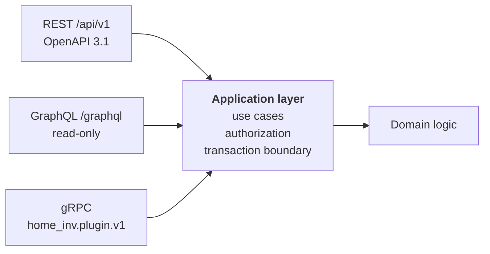

# 08 — API Contract

## 8.1 Three surfaces, one set of domain logic



**The rule without which three surfaces would be dangerous:** authorization and
domain rules live **exclusively** in the application layer. The surfaces
translate protocol, nothing more. A new surface therefore cannot open a security
hole — it can only invoke things that are already checked. An ArchUnit rule
forbids database and repository access from the access blocks.

| Surface | For whom | Scope |
|---|---|---|
| **REST** | Web PWA, apps, third-party systems, automation | Complete: read and write. The binding, versioned contract. |
| **GraphQL** | Demanding views and reporting | **Read-only.** No mutations — see [ADR-0010](../adr/0010-api-surfaces.md). |
| **gRPC** | Plugins, future internal services | The plugin contract in both directions |

## 8.2 REST

### Design principles

| Principle | Implementation |
|---|---|
| Specification first | `api/openapi.yaml` is the source. Server stubs, the TypeScript client, the Kotlin client and the documentation are **generated** from it. Hand-written clients do not exist. |
| Resources, not actions | `/items`, `/locations`, `/item-types`. Where an operation is not a resource, it becomes one: `/print-jobs`, `/stocktakes`, `/import-jobs`, `/scans`. |
| Predictability | The same pagination, the same filter syntax, the same error format, the same sort parameters **everywhere**. |
| No surprises in the status code | `200/201/202/204` · `400` syntax · `401` not authenticated · `403` authenticated but not permitted · `404` not present **or not visible** · `405` method not allowed · `406` not acceptable · `409` conflict · `412` precondition failed · **`413` payload too large** · `415` unsupported content type · `422` domain-invalid · `428` precondition required · `429` rate limit · **`500` unexpected** · `503` degraded. *`413` and `428` were missing from this list while [`problem-types.yaml`](../reference/problem-types.yaml) needed both — `428` from the ETag rule below, and `413` from the limits in the security table, which is why that condition sat in the registry's `pending` list with no status code (O24). `500`, `405`, `406` and `415` were missing too, and their absence was not cosmetic: every one of them is reachable today — `POST /api/v1/items/{id}` is a 405 — and without a token each left as Spring Boot's own error JSON rather than as problem details, on the paths a client can least anticipate (corrected 2026-09-12).*

### Resource overview

```
/api/v1
├── /auth        /login /logout /refresh /password-reset
│             /mfa  (answer a login) · /mfa/enrolment · /mfa/totp {,/confirmation,/removal}
│             /mfa/recovery-codes · /mfa/step-up  (prove it again) · /passkeys
│             /authorize /token /revoke /clients      (OAuth 2.1, see below)
├── /.well-known /oauth-authorization-server /jwks.json
├── /me          profile, devices, sessions, settings · /tenants (memberships) · /tenant (switch)
├── /tenants     {id}/members {id}/invitations {id}/quotas {id}/settings {id}/export
├── /instance    /accounts {id}/entitlements · /operators · /tenants/{id}/quotas
│             /erasures {tenantId}  what an erasure removed, per block
│                                                      (the instance operator only)
├── /invitations {token}/accept          (no session: this is how an account is made)
├── /tenant-revocations {token}          (no session: the erasure is what removed it)
├── /roles       {id}   tenant-owned roles and the permissions they add
├── /field-visibility   which roles read which sensitive fields
├── /item-types  {id}/versions {id}/fields   (the type system)
├── /location-categories
├── /items       {id} {id}/attachments {id}/relations {id}/maintenance
│                {id}/loans {id}/history {id}/codes  · /items:bulk
├── /locations   {id} {id}/children {id}/items {id}/move {id}/seal
├── /tags        {id} /tags:merge
├── /media       /uploads (tus) {id} {id}/variants
├── /codes       /resolve  {code}  (public resolution: /c/{code})
├── /scans       scan sessions and individual scans
├── /label-templates  /label-media  /print-jobs
├── /enrichment  /proposals {id}:accept {id}:reject  /resolvers
├── /search      /saved-searches
├── /stocktakes  {id}/scans {id}/report
├── /sync        /pull /push /conflicts /devices
├── /notifications  /rules /subscriptions
├── /import-jobs /export-jobs /mapping-profiles
├── /plugins     {id}/capabilities {id}/health {id}:enable {id}:disable
├── /audit       log queries
└── /webhooks    delivery targets and delivery attempts
```

Non-CRUD operations use the form `POST /resource/{id}:action` (a colon, as in
Google AIP) — that keeps them distinguishable from sub-resources.

> **`identity` is an OAuth 2.1 authorization server, not just a login endpoint.**
> `REQ-AUTH-007` and `REQ-SEC-019` require the apps to authenticate through
> Authorization Code + PKCE in the system browser, with no password in the app —
> which needs `/authorize`, `/token`, a metadata document and a JWKS endpoint.
> They were specified without ever appearing in this list, which made `identity`
> look like a session service. It is not, and the difference is a substantial part
> of that building block. Clients are registered by the operator
> (`/auth/clients`); there is no dynamic client registration, because every client
> here is one the operator installed.

### Querying, pagination, sorting

```
GET /api/v1/items
  ?q=drill                              full text
  &filter=type:power-tool               structured filter, repeatable
  &filter=attr.purchasePrice:gte:100
  &filter=location:subtree:{uuid}
  &filter=tag:in:broken,repair
  &sort=-updatedAt,name                 minus = descending
  &fields=id,name,primaryPhoto          sparse fields
  &cursor=eyJ2IjoxLCJrIjoi…             cursor, never an offset
  &limit=50                             max. 200
```

**Cursor pagination exclusively.** Offsets are wrong on mutable data (skipped and
duplicated rows) and slow at large offsets. The cursor is opaque, signed, and
carries the sort key plus a filter checksum — a cursor with changed filters is
rejected instead of silently returning wrong results.

```jsonc
{
  "data": [ … ],
  "page": { "nextCursor": "…", "hasMore": true, "estimatedTotal": 1284 },
  "meta": {
    "degraded": false,          // true when a derived store is unavailable
    "degradedReason": null,     // a stable token, e.g. "search-fallback"
    "took": 41
  }
}
```

`estimatedTotal` is explicitly an estimate — an exact total over a million rows
costs more than it is worth.

**`meta.degraded` is the contract for degradation**, not a header
([ADR-0039](../adr/0039-degraded-response-signalling.md)). `degradedReason` is a
stable token from a documented set — clients branch on it the way they branch on
`problem.type`, never on prose — and a new token is a minor change. Degradation
never changes the status code: a degraded search returns `200`, because its
results are correct, only poorer. `503` stays reserved for "this will not work".

### Concurrency and idempotency

| Mechanism | Rule |
|---|---|
| **ETag / If-Match** | Every single resource returns `ETag: "<version>"`. `PUT`/`PATCH`/`DELETE` **require** `If-Match`. A missing header → `428 Precondition Required`; a mismatch → `412`. There is no blind overwrite. |
| **Idempotency-Key** | Every creating `POST` accepts `Idempotency-Key`. Key plus payload hash are written to **PostgreSQL in the same transaction as the record they protect** and retained 24 h ([ADR-0009](../adr/0009-messaging-and-events.md)) — so there is no window in which the entity exists and the key does not. A repeat with the same payload → the original response; with a different payload → `409`. Indispensable for mobile clients on unreliable networks, which is why it may not depend on a cache. |
| **Client-generated IDs** | The client may supply `id` (UUIDv7). If it already exists with the same content, the result is `200` instead of `201`. A prerequisite for offline creation. |
| **Bulk operations** | `POST /items:bulk` handles up to 500 entries, **partially successful**, with a status line per entry (a `207`-style payload) and an idempotency key per entry. |

### Error format (RFC 9457)

```jsonc
{
  "type": "https://home-inv.example/problems/validation-failed",
  "title": "The attributes do not match the type definition",
  "status": 422,
  "detail": "2 fields are invalid.",
  "instance": "/api/v1/items",
  "traceId": "0af7651916cd43dd8448eb211c80319c",
  "errors": [
    { "pointer": "/attributes/isbn",
      "code": "pattern",
      "message": "Not a valid ISBN-13.",
      "expected": "^97[89][0-9]{10}$" },
    { "pointer": "/attributes/purchasePrice/currency",
      "code": "enum",
      "message": "Unknown currency code." }
  ]
}
```

**The set of `type` values is a registry, not a convention.** It lives at
[`docs/reference/problem-types.yaml`](../reference/problem-types.yaml), is
generated into the OpenAPI document, and is guarded by `oasdiff`: a new token is
a minor change, a removed one or a changed status code is breaking
([8.3](#83-versioning)). The companion registry for `meta.degradedReason` is
[`degraded-reasons.yaml`](../reference/degraded-reasons.yaml). Until 2026-09-11
neither set was enumerated anywhere — three tokens appeared in worked examples
and a client author had no list to program against.

**Rules:** `type` is a stable, documented URI — **fixed for the product, not per
deployment**, or a client talking to two instances could not branch on it at all.
Clients branch on it, not on the text. `title`/`detail` are localised (`Accept-Language`). `traceId` connects the
response to the server log. Error messages **never** reveal whether a foreign
resource exists, and never contain internal paths, SQL or stack traces.

### Security-related headers and rules

| Rule | Implementation |
|---|---|
| Authentication | `Authorization: Bearer <JWT>` (short-lived, 10 min) for apps and third-party systems. For the web a `__Host-` session cookie with `Secure`, `HttpOnly`, **`SameSite=Strict`** plus a CSRF token for state-changing calls — and, scoped to `/c` only, a second `__Secure-` cookie with `SameSite=Lax` that exists for one purpose: so a QR scan from a foreign camera app recognises the signed-in user instead of bouncing them to the login page. It grants no authority of its own ([ADR-0029](../adr/0029-session-cookie-and-oidc-state.md)). |
| CORS | The configured frontend origin only; never `*`, never a reflection of the request origin. |
| Rate limiting | Per user, per tenant and per IP; the response is `429` with `Retry-After` and `RateLimit-*` headers. Login attempts and code resolution have their own, stricter limits. |
| Payload limits | JSON max. 1 MB, bulk operations max. 500 entries, uploads through the dedicated tus path with its own limit. The JSON limit is enforced by `JsonBodyLimitFilter` **before the body is read** when a `Content-Length` is declared, and while it is read when the request is chunked — a header alone would put the limit one header away from not applying. |
| Timeouts | A server-side ceiling of 30 s per request; long operations are `202` plus a job resource, never a long-held connection. It is enforced where a request can actually block rather than by a watchdog: `statement_timeout = 30s` on the database roles (set in [`deploy/postgres/initdb/00-roles.sql`](../../deploy/postgres/initdb/00-roles.sql), so a client cannot forget it), `lock_timeout` lower again because waiting for a lock is waiting for another transaction, and Tomcat's `connection-timeout` and `keep-alive-timeout` for a client that sends or reads slowly. A servlet container cannot interrupt a thread that is computing; what it can do is refuse to wait for a query, a lock or a socket, which is every way a request in this application waits. |

## 8.3 Versioning

Four contracts are versioned **separately**, because they evolve at different
speeds:

| Contract | Scheme | Breaking-change check |
|---|---|---|
| REST API | `/api/v1`, SemVer inside the OpenAPI document | `oasdiff` in CI, every change against the last release |
| GraphQL | No version, fields get deprecated | Schema comparison in CI |
| Plugin / gRPC contract | `home_inv.plugin.v1` | `buf breaking` in CI |
| Event schemas | `de.greluc.homeinv.item.created.v1` | Schema comparison in CI |

### What counts as breaking

| Allowed in a minor version | Breaking — requires `/api/v2` |
|---|---|
| New optional fields in responses | Removing or renaming a field |
| New optional parameters | Making a parameter required |
| New endpoints | Removing an endpoint, changing a path |
| New enum values **in responses** (clients must tolerate unknown ones — this is documented) | Requiring new enum values in **requests** |
| New `problem.type` values | Changing the status code of an existing case |
| Loosening limits | Tightening limits |

### Deprecation

```http
Deprecation: @1780358400
Sunset: Wed, 02 Jun 2027 00:00:00 GMT
Link: <https://…/docs/migration/v1-to-v2>; rel="deprecation"
```

`Deprecation` (RFC 9745) names the moment the endpoint was declared deprecated —
here 2026-06-02 — and `Sunset` (RFC 8594) the moment it stops answering. **The
gap is twelve months**, per the table below; the example previously showed 28
days and contradicted the rule three lines under it. There is deliberately no
`Warning: 299` line: RFC 9111 §5.5 obsoleted that field in 2022, and the three
headers above already carry the same information in parseable form
([ADR-0039](../adr/0039-degraded-response-signalling.md)).

| Rule | Value |
|---|---|
| Minimum period between deprecation and shutdown | **12 months** for the main API, 6 months for the plugin contract |
| Parallel operation | `v1` and `v2` run side by side; `v2` is an adapter onto the same application layer, not a second implementation |
| Visibility | Usage of deprecated endpoints is collected as a metric per tenant and client — shutdown happens only when usage is zero or the period has elapsed |
| Announcement | Changelog, the three headers above, a notice in the UI for tenant administrators. **Not** a `Warning` header — this row still named one three lines under the paragraph that drops it ([ADR-0039](../adr/0039-degraded-response-signalling.md), `REQ-API-012`) |

## 8.4 GraphQL

**Read-only.** The rationale is in [ADR-0010](../adr/0010-api-surfaces.md): two
writing surfaces mean duplicated authorization, validation and idempotency logic
— the main source of holes that get closed on one surface and forgotten on the
other.

```graphql
type Query {
  item(id: ID!): Item
  items(filter: ItemFilter, sort: [ItemSort!], first: Int, after: String): ItemConnection!
  location(id: ID!): Location
  locationTree(rootId: ID, depth: Int = 3): [Location!]!
  itemTypes: [ItemType!]!
  savedSearch(id: ID!): SavedSearchResult
  stats(groupBy: StatsDimension!, filter: ItemFilter): [StatsBucket!]!
}

type Item {
  id: ID!
  name: String!
  type: ItemType!
  location: Location
  tags: [Tag!]!
  attributes: JSON!               # filtered by the role's field visibility
  photos(first: Int = 3): [Media!]!
  relations: [ItemRelation!]!
  history(first: Int = 20): RevisionConnection!
}
```

| Safeguard | Value |
|---|---|
| Depth limit | max. 10 — which is **below** the default maximum location depth of 12 ([04 `locations`](04-building-blocks.md)). A deep tree therefore cannot be walked to its leaves in one query; `locationTree(rootId:, depth:)` is the intended path and pages by subtree. The mismatch is deliberate: raising the limit to 12 would raise the cost ceiling of every other query too |
| Cost analysis | A budget per query; field costs declared; exceeding it → rejection **before** execution |
| Persisted queries | In production only registered queries; free-form queries only for authenticated administrators and in development |
| Introspection | Disabled in production (the schema ships with the documentation) |
| N+1 | `DataLoader` for every relation, guarded by a test |
| Field visibility | The same rule as in REST — `sensitive` fields are removed per role, not masked |
| Alias abuse | A limit on identical aliases per query |

## 8.5 gRPC — plugins and internal services

```protobuf
syntax = "proto3";
package home_inv.plugin.v1;

// The core calls the plugin
service CodeFormatPlugin {
  rpc Describe (DescribeRequest) returns (PluginDescription);
  rpc Claims   (ClaimsRequest)   returns (ClaimsResponse);
  rpc Parse    (ParseRequest)    returns (ParseResponse);
  rpc Render   (RenderRequest)   returns (RenderResponse);
}

service MetadataResolverPlugin {
  rpc Describe (DescribeRequest) returns (PluginDescription);
  rpc Supports (SupportsRequest) returns (SupportsResponse);
  rpc Resolve  (ResolveRequest)  returns (ResolveResponse);
}

service PrintTargetPlugin {
  rpc Describe     (DescribeRequest)     returns (PluginDescription);
  rpc ListPrinters (ListPrintersRequest) returns (ListPrintersResponse);
  rpc Print        (PrintRequest)        returns (stream PrintProgress);
}

// The plugin calls the core — narrowly bounded, capability-checked
service CoreApi {
  rpc GetItem      (GetItemRequest)      returns (ItemView);
  rpc UpdateItem   (UpdateItemRequest)   returns (ItemView);
  rpc EmitEvent    (EmitEventRequest)    returns (EmitEventResponse);
  rpc GetSetting   (GetSettingRequest)   returns (SettingValue);
  rpc StoreBlob    (stream BlobChunk)    returns (BlobRef);
}
```

| Rule | Value |
|---|---|
| Transport | gRPC over mTLS. Every plugin has its own certificate; the fingerprint is recorded in the registration. |
| Deadline | Every call has a deadline (default 10 s, configurable per port). No call without one. |
| Payload limit | 8 MB per message; anything larger goes through `StoreBlob` as a stream. |
| Capability check | **Every** `CoreApi` call re-checks the granted capability and the tenant scope — no trust derived from the connection. |
| Tooling | `buf` for generation, `buf lint` and `buf breaking` against the published state in CI |
| Backward compatibility | Field numbers are never reused; removed fields are marked `reserved` |

## 8.6 Public code resolution

A special case: the URL on the label must work from **any** camera app, so it has
to be reachable without authentication.

```
GET /c/{code}
```

| Case | Behaviour |
|---|---|
| Authenticated, permitted | Redirect to the item view |
| Not authenticated | Redirect to login with a return target — **without** any information about the item. A signed-in user arriving by cross-site navigation *is* recognised, through the `__Secure-` cookie scoped to `/c` ([ADR-0029](../adr/0029-session-cookie-and-oidc-state.md)); without it `SameSite=Strict` would send every scan from a foreign camera app to the login page |
| Unknown code | A neutral page, "this code is not assigned" — identical to the response for a missing permission |
| Legacy hostnames | `/c/{code}` is also accepted under the bases listed in `HOMEINV_LEGACY_BASE_URLS`, so labels keep working after a domain change ([10 §10.2.1](10-identification-and-labels.md)) |
| Rate limiting | Strict per IP with increasing delay. The code carries **50 bits** of entropy, so at 10⁶ issued codes a random guess hits with probability ≈ 1 : 1.1 · 10⁹ — that is what makes rate limiting sufficient rather than merely helpful ([ADR-0030](../adr/0030-public-code-format.md)). |
| Logging | Every access to an unknown code is counted; conspicuous patterns raise an alert. |

Additionally there is an **offline mode**: if the QR code carries the item UUID in
the fragment alongside the URL (`…/c/7Q2M4X9KD2F#i=<uuid>`), the installed PWA or app
can resolve the item from the local store without a network. Browsers do **not**
send the fragment to the server, so it leaks nothing.

## 8.7 Contract enforcement in CI

| Check | Tool | Fails the build |
|---|---|---|
| OpenAPI is valid and complete | `spectral` with a project ruleset | yes |
| No unannounced breaking change | `oasdiff` against the last release state | yes |
| Implementation matches the specification | Generated stubs + response validation in integration tests | yes |
| Examples in the specification are valid | Schema validation of the examples | yes |
| GraphQL schema unbroken | Schema comparison | yes |
| Protobuf unbroken | `buf breaking` | yes |
| Generated clients compile | TS `tsc`, Kotlin build | yes |
| Event schemas unbroken | Schema comparison | yes |
| Every endpoint has an authorization test | A dedicated rule: an endpoint declaring none of `@RequiresPermission`, `@RequiresEntitlement` ([ADR-0057](../adr/0057-the-instance-operator.md)) and an explicit `@PublicEndpoint` marker fails the build, in `ArchitectureRulesTest` and again in `PermissionInterceptor` at run time | yes |
