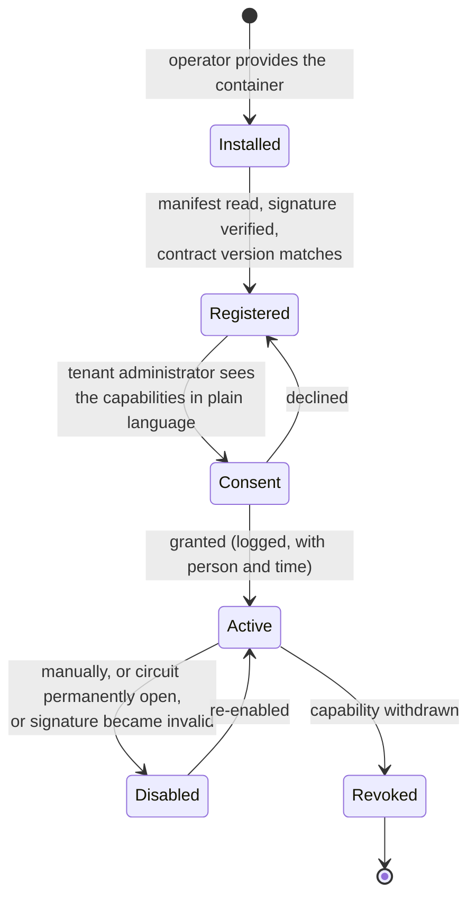
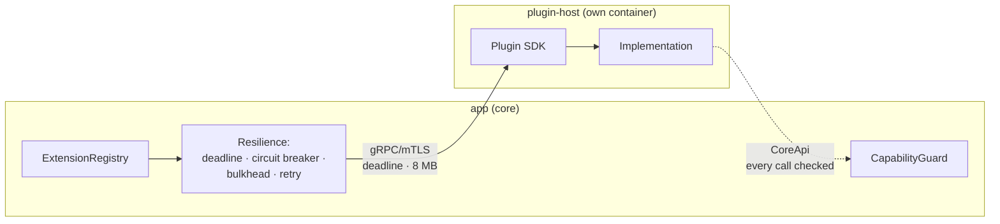

# 09 — Extensibility and Plugins

## 9.1 The three extension levels

Extending does not automatically mean code. The lowest level that suffices is
always the one chosen.

| Level | Means | Who may | Risk |
|---|---|---|---|
| **1 — Configuration** | Data in the running system | Tenant administrators | low |
| **2 — Out-of-process plugin** | Own container, gRPC/mTLS | Operator (installation), tenant administrator (activation) | medium, bounded by the process and network boundary |
| **3 — In-process plugin** | JAR in an isolated classloader | **operator only**, signed only | high — see 9.7 |

### What level 1 already covers

Configurable without a line of code: item types and their fields, location
categories, value lists, tags and tag groups, roles and permissions, label
templates and label geometries (including new Avery formats), saved searches,
notification and reminder rules, mapping profiles for import and enrichment,
webhook targets, tenant settings.

> This is deliberate: the most common extension wishes of an inventory system —
> "I need a field", "I need a different label format" — must never require a
> software release.

## 9.2 Extension points (ports)

Every port is a narrow, functionally motivated interface. The core knows only the
port, never an implementation.

| Port | Purpose | Example implementations |
|---|---|---|
| `CodeFormat` | Generate a code and claim/parse a raw scan | QR (shipped), DataMatrix, Code128, EAN-13, ITF-14, Aztec, GS1 Digital Link, NFC tag |
| `ScanSource` | The origin of a scan | Browser camera (shipped), app camera, HID handheld scanner, Bluetooth ring scanner, image file, clipboard |
| `LabelRenderer` | Template + data → a printable artifact | PDF sheet (shipped), PNG, ZPL, EPL, Brother raster |
| `PrintTarget` | Artifact → printer | Download (shipped), CUPS/IPP, Brother QL over the network, Zebra over TCP 9100, Dymo |
| `LabelMediaProvider` | Contribute label geometries | Avery Zweckform catalogue (shipped), Herma, continuous rolls |
| `MetadataResolver` | Code → metadata | ISBN (Open Library, DNB), EAN/GTIN (Open Food Facts, GS1), MPN, Discogs, TMDB, IGDB |
| `BlobStore` | Binary storage | Filesystem, S3/MinIO, **Nextcloud/WebDAV** (all three shipped), FTP, Backblaze |
| `SearchIndex` | Index and search | OpenSearch (shipped), PostgreSQL (shipped), Meilisearch, Typesense |
| `NotificationChannel` | Deliver a message | E-mail (shipped), webhook (shipped), Web Push/VAPID (shipped), **Firebase and APNs as plugins** ([ADR-0023](../adr/0023-push-notifications.md)), ntfy, Matrix, Signal |
| `IdentityProvider` | Federated login | OIDC (shipped), LDAP, SAML |
| `ImageProcessor` | Image derivatives | libvips (shipped), ImageMagick |
| `VirusScanner` | Check uploads | **ClamAV (shipped, mandatory)**; other scanners are interchangeable, but "no scanner" is not a supported configuration |
| `ValuationProvider` | Estimate current and replacement value | Straight-line depreciation (shipped), declining balance, market-price and dealer services |
| `ImportMapper` | Read a foreign format | CSV profile (shipped), Homebox, InvenTree, Snipe-IT |

**Admission criterion for a new port:** there must be at least two plausible,
genuinely different implementations. A port with exactly one conceivable
implementation is not an abstraction but ballast.

## 9.3 The manifest

Every plugin brings a signed manifest. It is the basis for registration,
permission granting and compatibility checking.

```yaml
apiVersion: home-inv.plugin/v1
metadata:
  id: de.greluc.homeinv.plugin.isbn        # reverse domain, globally unique
  name: "ISBN metadata"
  version: "1.4.2"                          # SemVer of the plugin
  vendor: "greluc"
  license: "Apache-2.0"
  homepage: "https://github.com/greluc/homeinv-plugin-isbn"
  descriptions:
    de: "Löst ISBN-10 und ISBN-13 über Open Library und die DNB auf."
    en: "Resolves ISBN-10 and ISBN-13 via Open Library and DNB."

spec:
  contract: ">=1.0.0 <2.0.0"                # supported contract versions
  runtime: out-of-process                   # out-of-process | in-process
  implements:
    - port: MetadataResolver
      schemes: [ISBN10, ISBN13]
      priority: 100

  capabilities:                             # each granted individually
    - id: network:outbound
      hosts: ["openlibrary.org", "services.dnb.de"]
      reason: "Querying the metadata sources"
    - id: core:item:read
      reason: "Read existing fields so that only gaps are proposed"

  settings:                                 # surfaced in the UI
    - key: dnbApiToken
      type: secret
      required: false
      label: { de: "DNB-Zugangstoken", en: "DNB access token" }
    - key: preferredSource
      type: enum
      values: [openlibrary, dnb]
      default: openlibrary

  health:
    endpoint: /healthz
    intervalSeconds: 60

  resources:                                # guidance for the operator's limits
    memoryMiB: 128
    timeoutSeconds: 5
```

| Field | Security meaning |
|---|---|
| `capabilities` | **Exhaustive.** What is not in the manifest is not possible — not even with consent granted. An extension requires a new manifest and new consent. |
| `network:outbound.hosts` | A fixed target list. The plugin container gets a network rule that permits only these names. |
| `contract` | A range, not a point. The core rejects a plugin outside its range at startup without failing itself. |
| Signature | Manifest and artifact are signed (`cosign`). Unsigned plugins are permitted only if the operator explicitly enables that — with a permanent warning. |

## 9.4 The capability model

A plugin has **no** permissions at all until they are granted. There is no base
entitlement, no "read access, which is harmless anyway".

| Capability | Permits | Note |
|---|---|---|
| `core:item:read` | Reading items of the granting tenant | Field visibility applies here too: `sensitive` fields are removed |
| `core:item:write` | Modifying items | Changes appear in the audit log **with the plugin as the actor** |
| `core:location:read` / `:write` | Locations | |
| `core:media:read` / `:write` | Media | Writing only through `StoreBlob`, never directly into the store |
| `core:event:emit` | Raising its own events | Only from a declared list of event types |
| `core:event:subscribe` | Receiving events | Only the types named in the manifest |
| `core:setting:read` | Reading its own settings | **Its own only**, never anyone else's |
| `network:outbound` | Outbound network connections | With a fixed target list, enforced in the network, not in code |
| `ui:panel` | Its own area in the UI | Served in an isolated `iframe` with its own origin and a strict CSP |
| `print:target` | Appearing as a print target | |

**Granting:**



Capabilities are granted **per tenant**. An installed plugin is active for tenant
A and invisible to tenant B until B's administrator consents. A manifest change
(a new version with an additional capability) resets the consent — the plugin
continues with the old capabilities or is paused; it never escalates silently.

## 9.5 Out-of-process: the normal case



| Protection | Implementation |
|---|---|
| Process boundary | Own container, **rootless**, own user, `read_only`, `cap_drop: ALL`, `no-new-privileges`, memory and CPU limits. An escape lands as an unprivileged user on the host, not as `root` — see [ADR-0022](../adr/0022-rootless.md). |
| Namespace boundary | Each plugin gets its **own UID range** where feasible (`UserNS=auto`), so two plugins cannot see each other even at host level |
| Network boundary | Its own network segment. No access to PostgreSQL, OpenSearch, RabbitMQ, Valkey. Outbound only to the hosts named in the manifest. |
| Identity | Its own mTLS certificate; the fingerprint is recorded in the registration and checked on every connection |
| Deadline | A deadline per call; exceeding it aborts and counts towards the circuit breaker |
| Bulkhead | A bounded, dedicated concurrency pool per plugin — a slow plugin consumes no core resources |
| Circuit breaker | Opens above an error rate; calls then fail immediately and visibly instead of piling up |
| Observability | Duration, result, payload size and errors per call as metrics and in the plugin log |
| Language | **Any.** Java, Kotlin, Python, Go, Rust, Node — the contract is protobuf. |

## 9.6 The plugin calling the core

A plugin may call the core, but narrowly bounded:

1. The connection identifies the plugin through mTLS.
2. Every call carries a short-lived token issued for **plugin + tenant +
   capability**. No trust is derived from the connection alone.
3. `CapabilityGuard` re-checks on **every** call: is the capability still granted
   for this tenant? Is the plugin still active?
4. Data access goes through the same authorization and the same RLS as user
   access — a plugin cannot see more than the role it acts under.
5. Every write appears in the audit log with the plugin as the actor.

## 9.7 In-process: the exception, and why it stays one

Since Java 24 there is **no functioning `SecurityManager`**. There is therefore no
effective way on the JVM to take privileges away from loaded code: an in-process
plugin can read files, open network connections, reach into the core by
reflection and call `System.exit()`. A dedicated classloader separates
namespaces, **not privileges**.

From this follows, without an escape:

| Rule | |
|---|---|
| Default | In-process is **off** |
| Admission | Only by the operator, only for signed artifacts whose signing key is on an explicit trust list |
| No tenant path | A tenant administrator **cannot** install in-process plugins — otherwise tenant separation would be defeatable by a plugin |
| Visibility | The administration UI permanently shows that in-process code is running, with publisher and fingerprint |
| Isolation, as far as possible | A dedicated classloader with a parent filter: the plugin sees only `de.greluc.homeinv.plugin.api.*` and the JDK base, not the core implementation |
| Reason to use it | Latency and call volume only — e.g. code generation for 5 000 labels, where 5 000 gRPC calls would be disproportionate |

## 9.8 The plugin SDK

What is provided:

| Artifact | Content |
|---|---|
| `homeinv-plugin-api` (Maven) | Java interfaces for the ports, carrier types, error types |
| `homeinv-plugin-sdk-java` | gRPC server scaffolding, manifest validation, health endpoint, logging, test helpers |
| `homeinv-plugin-sdk-python` | The same for Python — because metadata and device integrations often already exist there |
| `home_inv.plugin.v1` (`buf` module) | Protobuf definitions for every other language |
| `homeinv-plugin-testkit` | **Contract tests**: a suite every port implementation must pass (correct error handling, deadlines, idempotency, behaviour on missing capabilities) |
| Example plugins | Complete and runnable, in the repository: a `MetadataResolver` (Java), a `PrintTarget` (Python), a `CodeFormat` (Java, in-process) |

**This is how a plugin comes about:**

```bash
# 1. Scaffold it
homeinv-plugin init --port MetadataResolver --lang java --id com.example.mpn

# 2. Implement: exactly three methods

# 3. Run it against the contract tests
./gradlew pluginContractTest

# 4. Test locally against a running instance
homeinv-plugin dev --core https://localhost:8443 --tenant dev

# 5. Build, sign, ship
docker build -t example/mpn:1.0.0 . && cosign sign example/mpn:1.0.0
```

## 9.9 Distribution and discovery

| Path | Description |
|---|---|
| Shipped | Contained in the core image, always available (QR, PDF sheet, filesystem, S3, Nextcloud, OpenSearch, PostgreSQL search, e-mail, webhook, Web Push, OIDC, ClamAV, the Avery catalogue) |
| Operator installation | A container from a registry, added to the service matrix (whence the Quadlet unit or Compose service, or Helm values); registered in the administration UI with the manifest URL and the certificate fingerprint |
| Directory | A **curated list in the repository** (`PLUGINS.md`) with name, publisher, ports, manifest URL, certificate fingerprint, contract version and licence. Admission by pull request, conditional on passing the contract test suite and a signed manifest. **No** distribution, **no** counter-signature and **no** security assurance by this project — that is stated at the top of the list. Installation remains a deliberate act by the operator. |

**Explicitly not planned:** a "marketplace" with one-click installation from
inside the running system. That would bypass the operator's decision and is the
main route by which plugin ecosystems get compromised.

## 9.10 Example: a DataMatrix plugin from start to finish

| Step | What happens | Core change |
|---|---|---|
| 1 | Implement the `CodeFormatPlugin` service: `Describe`, `Claims`, `Parse`, `Render` | none |
| 2 | Manifest: `implements: CodeFormat`, `priority: 50`, no capabilities (pure computation) | none |
| 3 | Pass the contract tests from the testkit | none |
| 4 | Build the container, sign it, add it to the service matrix | none |
| 5 | Operator registers it, tenant administrator activates it | none |
| 6 | `identification` picks the format up into the resolution chain | none |
| 7 | `labeling` offers DataMatrix in label templates | none |
| 8 | Web and apps show the new symbology, because they **query** the format list rather than knowing it | none |

**Zero core changes.** That is exactly the test for quality goal Q3, and exactly
this sequence runs as an automated test in CI.

## 9.11 Evolution of the plugin SDK contract

| Rule | Value |
|---|---|
| Version | SemVer on `home_inv.plugin.vN` |
| Extension | New optional fields and new methods are minor |
| Break | A new major version `v2`; `v1` stays served for **at least 6 months** |
| Check | `buf breaking` against the published state, blocking in CI |
| Compatibility matrix | Published: which core version serves which contract range |
| Behaviour on mismatch | The plugin is disabled and reported; the core starts normally. **A foreign plugin must never prevent the system from starting.** |
