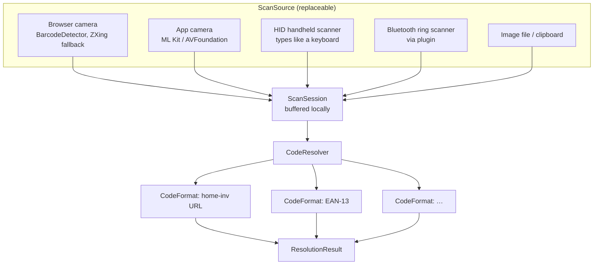
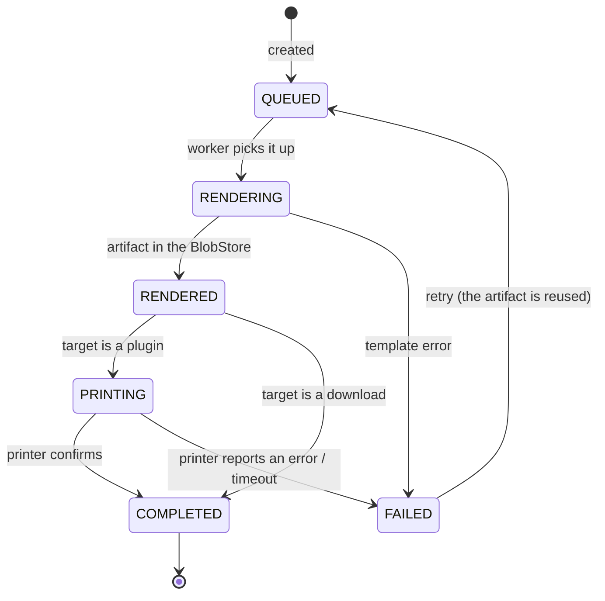

# 10 — Identification, Codes and Labels

## 10.1 Three kinds of identifier

They are kept strictly apart. This is the most important decision in this
chapter.

| Identifier | Example | Issued by | Used for | Visible |
|---|---|---|---|---|
| **UUID** | `0199d3a4-7c31-7a5e-9f21-0242ac120002` | Client or server (UUIDv7) | Primary key, API, sync, durable identity | in the API |
| **Public code** | `7Q2M-4X9K-D2F` | `identification`, on demand | What is printed on the label and gets scanned | on the label and in the UI |
| **Foreign code** | ISBN `9783836287456`, EAN `4006381333931` | Manufacturer/publisher | Already present on the object, the basis for enrichment | as printed |

### Why the public code is not the UUID

It would be simpler to print the UUID onto the label. **Two** reasons argue
against it, and they weigh more. Two further reasons were written down, and both
were withdrawn on 2026-09-11 for the same underlying mistake — they argued against
printing something this label prints anyway.

1. **Human readability.** A label must still be useful when the scan fails. You
   can read and type `7Q2M-4X9K-D2F`; you cannot do that with a UUID. This is the
   reason that carries the most weight in practice, because a smudged or
   badly-lit label is the normal case in a cellar.
2. **Decoupling.** A label can be reassigned (the item is disposed of, the label
   stays on the container). The code is tied to a **binding**, not to the
   identity. The binding history is preserved.

> **A third reason was withdrawn on 2026-09-11.** It read: *"Length. 36 characters
> produce a QR code of version 3–4. An 11-character code stays far smaller and
> sharply readable on a 25 × 10 mm label."* It compared the code alone against a
> UUID alone, and the symbol carries neither: it carries the URL **and** the UUID
> in the fragment ([10.2](#102-what-the-qr-code-contains)). Measured out at error
> correction level M:
>
> | What the symbol actually carries | Characters | QR version | Modules + quiet zone |
> |---|---|---|---|
> | `https://<base>/c/<code>#i=<uuid>` — **as specified** | ≈ 76 | **5** | 45 |
> | `https://<base>/c/<uuid>` — the rejected variant | ≈ 62 | **4** | 41 |
>
> The design prints the **larger** symbol. The argument does not merely fail to
> support the decision; it points the other way. Reasons 1 and 2 carry it on their
> own, exactly as they did after O12.
>
> The second half of that sentence was wrong too, and it mattered more: 45 modules
> at the 0.33 mm minimum module size this chapter itself requires
> ([10.5](#105-the-label-model), `REQ-LBL-007`)
> needs **≈ 15 mm of label edge**, not 10 (the figures are in
> [10.5](#105-the-label-model), where the renderer checks them). The starter
> catalogue is unaffected —
> its smallest format, Avery Zweckform 3667 at 48.5 × 16.9 mm, yields 0.376 mm per
> module. What was wrong was the prose, not the geometry.

> **A fourth reason was withdrawn on 2026-09-11** (open point **O12**). It read:
> *"Information leakage — UUIDv7 contains a timestamp; on a label every visitor
> can scan, that is needlessly given away."* It could not stand, because
> [10.2](#102-what-the-qr-code-contains) prints the UUID on the same label in the
> fragment. Not sending it to the *server* is not the same as not printing it:
> whoever photographs a label has the UUID, timestamp included.
>
> **The fragment stays and the reason goes.** Offline resolution is the stronger
> claim: it works from *any* label, including one whose binding the device has
> never synchronised — a device seeded for one location that walks into another,
> or a label printed after the last sync. Resolving by the code alone would work
> only where the device already holds the binding, which is the case where it
> least needs help.
>
> **What is accepted with it, stated plainly:** the creation timestamp of an item
> is readable by anyone who photographs its label. For a household inventory that
> is a low-value disclosure, and it is bounded — the UUID discloses *when the
> record was made*, nothing about the object, the tenant or its value. It is
> recorded as an accepted risk in [12 §12.3](12-security.md) rather than left
> unsaid. Reasons 1 and 2 carry the decision on their own.

### Structure of the public code

```
7Q2M-4X9K-D2F
└─┬┘ └─┬┘ └┬┘
  │    │   └── 2 payload characters + 1 check symbol
  │    └────── 4 payload characters
  └─────────── 4 payload characters
```

| Property | Value |
|---|---|
| Alphabet | **Crockford Base32** — `0123456789ABCDEFGHJKMNPQRSTVWXYZ`. Without `I`, `L`, `O`, `U`: no confusing `0`/`O` or `1`/`I`/`l`, and no accidental profanity |
| Length | **10 payload characters = 50 bits** ≈ 1.13 · 10¹⁵ possibilities, plus 1 check symbol ([ADR-0030](../adr/0030-public-code-format.md)) |
| Generation | Cryptographically random, **not** sequential — otherwise other people's codes would be guessable |
| Check symbol | **Damm algorithm** over the same 32 symbols. Catches every single-character error and every adjacent transposition — the same guarantee as Crockford's modulo-37, but the symbol stays inside the payload alphabet. Crockford's version draws its check symbol from 37 values, five of which (`*`, `~`, `$`, `=`, `U`) are outside it: awkward in a URL, in input normalisation and in QR alphanumeric encoding, and `U` is excluded from the payload on purpose |
| Collision handling | On a unique violation a new code is drawn. At 10⁶ issued codes the chance of that happening at all is ≈ 0.044 %; the redraw rate is a metric, not an assumption. At the previous 40 bits it would have been ≈ 36 % |
| Uniqueness | Global, not per tenant (`UNIQUE(code)`). Otherwise a scan could not be resolved unambiguously. The code reveals **nothing** about the tenant. |
| Input tolerance | Hyphens, case and the confusable characters are normalised on input (`o`→`0`, `l`/`i`→`1`) |
| Pre-issuing | Codes can be generated and printed **in advance**, before the item exists. A sheet of unassigned labels is bound on first scan — the fastest capture path there is. |

## 10.2 What the QR code contains

```
https://inv.example.org/c/7Q2M4X9KD2F#i=0199d3a4-7c31-7a5e-9f21-0242ac120002
└───────────────┬────────────────────┘└──────────────┬─────────────────────┘
       resolved by the server             fragment — never reaches the server
```

| Part | Purpose |
|---|---|
| URL form | Any camera app leads to the target. A bare numeric code would not — and that is exactly where many inventory systems fail in practice. |
| `/c/<code>` | Resolution by the server, with login and permission check (see [08 §8.6](08-api-contract.md)) |
| `#i=<uuid>` | **Offline resolution from any label**, including one whose code→item binding the device has never synchronised. Browsers do not send the fragment to the server. It **is** printed on the label, and the accepted disclosure that follows is stated in [10.1](#why-the-public-code-is-not-the-uuid) and in [12 §12.3](12-security.md) — the earlier claim of "no additional information leakage" was wrong and is withdrawn. Lowercase hex also forces the QR into byte mode, so the symbol is one or two versions larger than the code alone would need |
| Base URL | **Configurable at deployment time** (`HOMEINV_PUBLIC_BASE_URL`). It is printed on every label — changing it later invalidates them. How that is safeguarded is in 10.2.1. |

Optionally without a URL (`homeinv:7Q2M4X9KD2F`) for operators who want nothing
resolvable on their labels — then only a scan from our own app works. The choice
is a tenant setting.

### 10.2.1 The base URL is deployment configuration — and a one-way valve

The domain is set at deployment time and is not hard-coded. But it is the only
configuration value in this system that writes itself into the **physical
world**: a printed label cannot be recalled. It is therefore not merely
configurable but accompanied by four mechanisms.

#### Configuration

| Variable | Required | Meaning |
|---|---|---|
| `HOMEINV_PUBLIC_BASE_URL` | yes | The **currently valid** base. Printed onto new labels and linked in e-mails. |
| `HOMEINV_LEGACY_BASE_URLS` | no | Comma-separated list of former bases. `/c/{code}` is accepted under these hostnames too, so that **old labels keep working**. |

#### What the instance remembers

```sql
CREATE TABLE identification.label_base_url_usage (
    base_url        text PRIMARY KEY,
    first_used_at   timestamptz NOT NULL,
    last_used_at    timestamptz NOT NULL,
    label_count     bigint NOT NULL DEFAULT 0
);
```

Populated while rendering each print job; in addition **every `PrintJob`** records
the base it used. That makes the question "which labels carry the old domain?"
answerable — down to the individual item.

#### The four warning levels

| When | Behaviour |
|---|---|
| **Before the first label print** | The UI requires explicit confirmation of the base URL: *"This value is printed onto every label. Changing it later invalidates every label already printed."* Without confirmation there is no print job. |
| **At startup after a change** | If `HOMEINV_PUBLIC_BASE_URL` differs from a base already printed and that base is not in `HOMEINV_LEGACY_BASE_URLS`, the application logs a `WARN` **with the number of affected printed labels**. Startup is **not** blocked — otherwise a domain migration would require downtime. |
| **During operation** | A permanent banner in the administration UI pointing at the migration path, until the operator acknowledges it. |
| **In the installation guide** | The warning sits **next to the variable**, not in a footnote. |

#### The migration path, should it happen anyway

1. Set the new domain in `HOMEINV_PUBLIC_BASE_URL`, add the old one to
   `HOMEINV_LEGACY_BASE_URLS`.
2. **Keep the old domain running permanently as a redirect.** That is the real
   protection — a reverse-proxy rule costs nothing and keeps every printed label
   alive. The operations documentation names it as a precondition for any domain
   change.
3. Produce the *labels with the old base* report from the print jobs and re-label
   the affected items specifically — not the whole inventory.
4. If a redirect is impossible: switch future labels to the host-free form
   `homeinv:<code>`. Then no label will ever carry a hostname again.

#### What a domain change does **not** affect

- **Scanning from the PWA and the apps.** They recognise a code by its path part
  `/c/{code}` and by the fragment `#i=<uuid>`, independent of the hostname. An old
  label therefore keeps working in our own app even without a redirect.
- **Manual entry.** The short code read off the label is host-free.
- **Foreign codes.** ISBN and EAN are not ours to begin with.

The only case affected is *a third-party camera app scanning an old label* — and
that is exactly what the redirect covers.

## 10.3 Scanning



### In the browser

| Aspect | Implementation |
|---|---|
| Preferred | The `BarcodeDetector` API (Chromium, Android, Safari 17+) — hardware-accelerated, easy on the battery |
| Fallback | ZXing-WASM in a web worker so the UI stays responsive |
| Prerequisite | A secure context (HTTPS) — without TLS there is no camera access. Stated explicitly in the documentation, because it is the most common stumbling block for self-hosters. |
| Continuous mode | A sustained scan mode: several codes in a row without restarting the camera; audible and haptic feedback; debouncing against duplicate capture (a 2 s lock per code) |
| Lighting | Torch control through `MediaStreamTrack` where available — cellars and cupboards are the normal case |

### Handheld scanners

An HID scanner behaves like a keyboard. It is detected by evaluating input speed
and terminator (> 20 characters/s, terminated by Enter/Tab). Input recognised
this way is treated as a scan rather than as typing — and that needs no plugin
and no installation.

### Scan sessions

A `ScanSession` groups related scans with a **mode**:

| Mode | Effect of a scan |
|---|---|
| `LOOKUP` | Open the item |
| `ASSIGN` | Bind an unassigned label to the item being edited |
| `MOVE` | Scan the target location first, then any number of items — relocation in a flow |
| `STOCKTAKE` | Match against the location's expected list |
| `CAPTURE` | Scan a foreign code (EAN/ISBN) → enrichment → new item |
| `LEND` / `RETURN` | Lending and return |

Sessions are kept **locally** and run entirely offline. Reconciliation happens
later through the sync protocol.

## 10.4 Supported symbologies

| Symbology | Generate | Read | Purpose |
|---|---|---|---|
| QR | ✓ shipped | ✓ | Our own labels — the default |
| DataMatrix | plugin | ✓ | Very small labels (from ~8 × 8 mm) |
| Code128 | plugin | ✓ | Classic warehouse marking, good for laser scanners |
| EAN-13 / EAN-8 / UPC-A | — | ✓ | Recognising retail goods |
| ITF-14 | — | ✓ | Outer cartons |
| ISBN (as EAN-13) | — | ✓ | Books |
| GS1-128 / GS1 Digital Link | plugin | ✓ | Structured data (batch, best-before) |
| PDF417 / Aztec | — | ✓ | ID cards, tickets |
| NFC/RFID | plugin | plugin | Containers without a line of sight |

## 10.5 The label model

### Geometry (`LabelMedia`)

A data record, not code. Covers sheet stock and continuous rolls with the same
fields.

```jsonc
{
  "id": "avery-zweckform-3474",
  "vendor": "Avery Zweckform",
  "articleNumber": "3474",
  "kind": "SHEET",                  // SHEET | ROLL
  "pageSize":   { "width": 210.0, "height": 297.0, "unit": "mm" },
  "margin":     { "top": 0.5, "left": 0.0, "right": 0.0, "bottom": 0.5 },
  "grid":       { "columns": 3, "rows": 8 },
  "label":      { "width": 70.0, "height": 37.0, "cornerRadius": 0 },
  "pitch":      { "x": 70.0, "y": 37.0 },
  "verified":   true
}
```

For rolls, `grid` is absent; instead there is `feedLength` and `gapLength`.

#### The verification flag is the point, not decoration

The starter catalogue lives as
**[`docs/reference/label-media.yaml`](../reference/label-media.yaml)** in the
repository and is loaded into `labeling.label_media` during implementation.

| `verified` | Meaning |
|---|---|
| `true` | Dimensions, grid, margins **and** pitch come from the manufacturer's data sheet or a verified template file. Source and verification date are in the entry. |
| `false` | At least one value is derived or comes from a retail source. Before any bulk print the calibration sheet is mandatory, and the UI says so. |

**Why the distinction is necessary:** from label size and count you can guess the
grid, but **not** how the slack is distributed. With 64 labels of 48.5 mm across
210 mm, 16 mm are left over — that could be 8 mm of margin on each side, gaps
between the columns, or both. All three look identical on the first label and
diverge from the fourth column onwards. Nothing is therefore marked verified that
was merely computed.

#### Catalogue status (verified 2026-09-11)

| Format | Size | Printable area | `verified` |
|---|---|---|---|
| Avery Zweckform **3474** | 70 × 37 mm | 3 × 8, marginless, 0.5 mm top/bottom | **yes** — two independent sources agree |
| Avery Zweckform **3667** | 48.5 × 16.9 mm | 4 × 16 | **no** — size and count sourced, margins derived |
| Brother **DK-11201** | 29 × 89.8 mm die-cut | **25.9 × 83.9 mm** | **yes** — Brother raster reference |
| Brother **DK-11209** | 29 × 62 mm die-cut | **25.9 ×** *length unsourced* | **no** — width evidenced, length not |
| Brother **DK-22205** | 62 mm continuous | **58.9 mm** wide, length from the template | **yes** — Brother raster reference |
| Dymo **99012** | 36 × 89 mm | *not sourced* | **no** |
| Dymo **11354** | 32 × 57 mm | *not sourced* | **no** |

### What reading the Brother data sheet actually changed

The outstanding point *"the printable width is smaller than the media width, the
exact value is still to be added"* is **closed** (2026-09-11, ADR-0000 **A2**),
from Brother's *Raster Command Reference QL-800/810W/820NWB* v1.01 §2.3.2 and
§2.3.4. It produced two facts, and the second was not on anyone's list:

1. **The margins are larger than "a bit".** Every DK medium loses 1.5 mm per side
   across the web, and every die-cut label a further **3.0 mm at each end**. A
   nominal "29 × 90 mm" label is 29 × **89.8** mm of medium and **25.9 × 83.9 mm**
   of print area. A template laid out to 90 mm loses 6 mm at the ends — which is
   where a QR code's quiet zone goes first, and the quiet zone is the single most
   common reason a printed code will not read.
2. **The medium is not centred on the print head, and the offset is not derivable
   from the width.** The raster line is always 720 dots (90 bytes) at 300 dpi, and
   the print window sits at a different place per medium:

   | Medium | left margin | print area | right margin |
   |---|---|---|---|
   | 29 mm | **408 pins** | 306 pins | 6 pins |
   | 62 mm | 12 pins | 696 pins | 12 pins |

   The 62 mm medium is centred; the 29 mm medium is not, by a wide margin. A
   renderer that centres a 29 mm raster on the head prints off the label
   entirely. **This is the clearest example in the whole catalogue of why
   `verified` exists**: the figure cannot be calculated from anything else on the
   label, it has to be read — and everything about it looks plausible until the
   first sheet comes out wrong.

The same pass **downgraded the two Dymo entries to `verified: false`**. Nothing
about them changed; the rule did. Adding the printable area to the definition of
"verified" made a field mandatory that they never carried, and leaving them at
`true` would have meant the flag stopped meaning one thing. Their printable areas
have to come from Dymo's SDK documentation the way Brother's came from Brother's.

The catalogue stays **deliberately small**. Few verified formats beat many
half-verified ones — anyone who needs a missing format creates it themselves
(extension level 1) and calibrates it. That is the intended path, not a fallback.

### Template (`LabelTemplate`)

A template describes what the label says: elements on a surface, with data
bindings.

| Element type | Properties |
|---|---|
| `code` | Symbology, error-correction level, size, quiet zone |
| `text` | Expression (e.g. `{{item.name}}`, `{{location.path}}`, `{{item.attributes.serialNumber}}`), font, size, wrapping, auto-shrink, truncation |
| `image` | Primary photo, tenant logo, fixed content |
| `line` / `rect` | Decoration |

| Rule | Reason |
|---|---|
| The expression language is **not Turing-complete** (field access, formatting, conditionals only) | A template is user input. A full language inside a template is a code-execution hole. |
| Rendering runs in the worker with memory and time limits | A pathological template must not take the core down |
| The preview is to scale and shows quiet zones | Too small a quiet zone is the most common reason a printed QR code will not read |
| The minimum module size is checked and warned about | A QR code below ~0.33 mm module size is unreliable with phone cameras |
| **The minimum label edge follows from it, and is computed rather than assumed** | The specified payload (`https://<base>/c/<code>#i=<uuid>`, ≈ 76 characters) is a QR **version 5** symbol — 37 × 37 modules, **45** including the four-module quiet zone. At 0.33 mm that is **≈ 15 mm**, and a template placing a code on a shorter edge than that fails the preview check rather than producing a label that will not scan. Where the tenant has chosen the host-free form `homeinv:<code>` ([10.2](#102-what-the-qr-code-contains)) the payload drops to ≈ 19 characters, a version 2 symbol, ≈ 11 mm. The renderer computes this from the actual payload; the figures here are the two shipped cases |

## 10.6 Print jobs



| Property | Implementation |
|---|---|
| Source of the set | A single item, a selection, a **saved search**, a whole location subtree, or "n blank codes in advance" |
| Start offset | Selectable for sheet stock, so partly used sheets can be reused — one of the most-missed features in comparable software |
| Artifact | Stored in the `BlobStore`, retained for 30 days, re-downloadable and re-printable |
| Traceability | The job records which codes were printed on which sheet at which position — after a paper jam you know what to repeat |
| Base URL | Every job records the base URL it used, which feeds the *labels with the old base* report (10.2.1) |
| Offline | A job can be created offline; it runs at the next reconciliation |

## 10.7 Capture flows in practice

These three flows decide whether the system gets used day to day — and are
therefore part of the architecture, not of later design work.

| Flow | Steps |
|---|---|
| **Pre-printed labels** | Print a sheet of 24 unassigned codes → stick them on → scan each one, take a photo, speak or type the name → done. **Three interactions per item.** |
| **Retail goods** | Scan the EAN → enrichment proposes title, manufacturer, image → accept → print your own label or bind the EAN as a foreign code |
| **Moving house** | Create and label a box as a mobile location → scan the box code (`MOVE` mode) → scan the items into it → seal the box → at the destination move the box as a whole into the new room: **one** operation for the entire contents |
