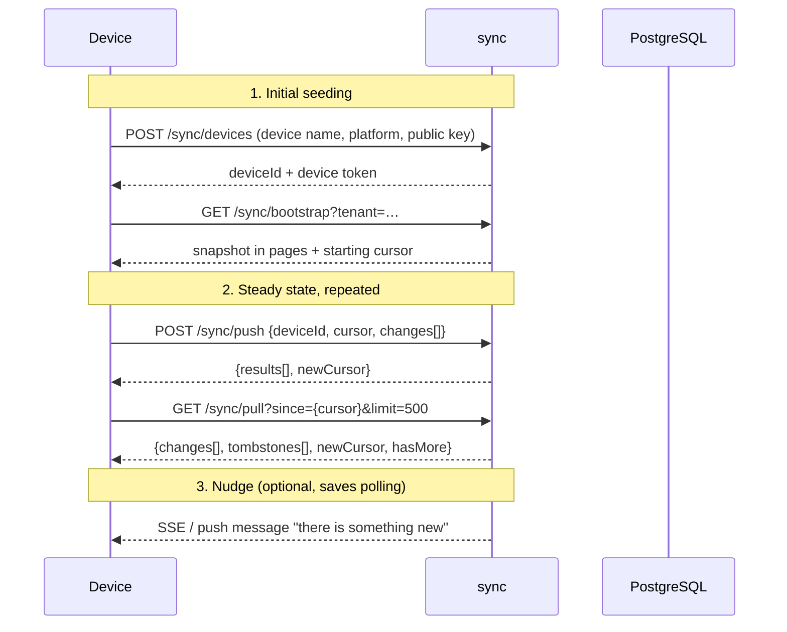
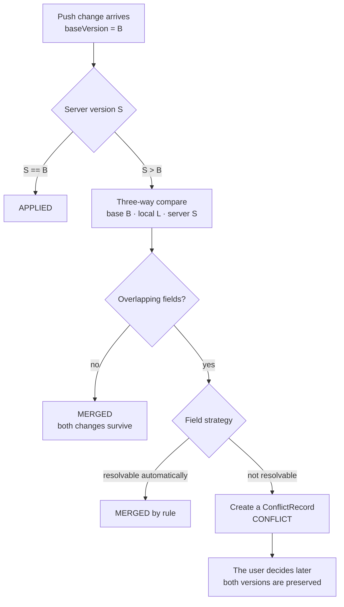
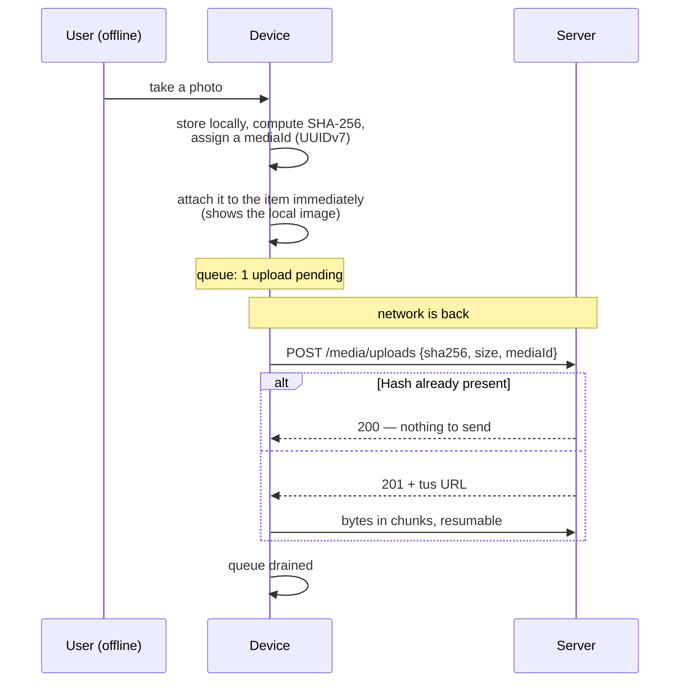

# 11 — Offline Synchronisation

## 11.1 The promise and its limits

The chosen approach is **full bidirectional reconciliation**: a device keeps the
inventory visible to its user entirely locally, allows reading and writing
without a network, and reconciles later.

That is the most expensive of the available paths. The limits therefore come
first:

| Guaranteed | Not guaranteed |
|---|---|
| Reading the entire visible inventory without a network | Real-time consistency between devices |
| Creating, editing, moving, lending, stocktaking without a network | Automatic resolution of **every** conflict |
| Taking photos offline and uploading them later | Offline search of the same quality as OpenSearch (locally: prefix and substring) |
| No data loss — every discarded version stays retrievable | Offline changes to type definitions and permissions (deliberately online only) |
| Reliable conflict detection | Convergence without any user decision (no CRDT — see [ADR-0014](../adr/0014-offline-synchronisation.md)) |

## 11.2 What gets reconciled

| Class | Examples | Direction | Editable offline |
|---|---|---|---|
| **Domain data** | Items, locations, tags, assignments, maintenance entries, loans, stocktake runs | both | **yes** |
| **Configuration** | Item types, field definitions, location categories, label templates, value lists | down only | no |
| **Media** | Photos, documents | both, over a dedicated path | yes (capture) |
| **Identity and permissions** | Roles, memberships, sessions | down only | no |
| **Derived data** | Search results, previews, enrichment proposals | **not** reconciled | — |

**Why configuration goes down only:** a field definition edited offline would
have to be merged — together with values already captured offline — against a
definition changed online in the meantime. That is a schema conflict, not a data
conflict, and it is not reliably resolvable automatically. Type changes are rare
and deliberate; they do not need to work offline.

## 11.3 The protocol



**Push before pull.** That way our own changes are known before foreign ones
arrive — which prevents conflicts that would otherwise not exist at all.

### Push

```jsonc
POST /api/v1/sync/push
{
  "deviceId": "0199d3…",
  "cursor": 148230,
  "changes": [
    {
      "changeId":   "0199e1a0-…",        // UUIDv7, idempotent
      "entityType": "item",
      "entityId":   "0199d3a4-…",        // generated offline
      "operation":  "UPSERT",
      "baseVersion": 7,                   // 0 = newly created
      "payload":    { "name": "Cordless drill", "attributes": { … } },
      "changedFields": ["name", "attributes.condition"],
      "intent":     { "quantity": "ADJUST" },   // SET | ADJUST, per numeric field.
                                                // Absent means SET — "set it to 12"
                                                // and "take two out" look identical
                                                // in an absolute payload, and they
                                                // merge differently (ADR-0014).
      "occurredAt": "2026-09-11T09:14:22.481Z",
      "hlc":        "2026-09-11T09:14:22.481Z-0003-0199d3…"
    }
  ]
}
```

```jsonc
// Response — one result per change; partial success is normal
{
  "results": [
    { "changeId": "…", "status": "APPLIED",  "newVersion": 8 },
    { "changeId": "…", "status": "MERGED",   "newVersion": 11, "mergedFields": ["name"] },
    { "changeId": "…", "status": "CONFLICT", "conflictId": "0199e2…" },
    { "changeId": "…", "status": "REJECTED", "problem": { "type": "…/validation-failed", … } },
    { "changeId": "…", "status": "DUPLICATE","newVersion": 8 }
  ],
  "newCursor": 148277
}
```

| Status | Meaning | What the device does |
|---|---|---|
| `APPLIED` | Applied cleanly | Mark as reconciled locally |
| `MERGED` | Merged automatically, affected fields named | Adopt the server version |
| `CONFLICT` | Not automatically resolvable | Keep the local version, mark it "pending resolution", inform the user |
| `REJECTED` | Domain-invalid (e.g. the location was deleted, the attribute no longer fits the type version) | Mark locally as faulty, guide the user to a correction |
| `DUPLICATE` | `changeId` already processed | Mark as reconciled |

`changeId` makes the whole push idempotent. A network drop after the write but
before the response is therefore harmless — the single most important failure
case in mobile operation.

### Pull

```jsonc
GET /api/v1/sync/pull?since=148277&limit=500

{
  "changes": [
    { "seq": 148278, "entityType": "item", "entityId": "…",
      "operation": "UPSERT", "version": 12, "payload": { … },
      "originDeviceId": "0199aa…" }
  ],
  "tombstones": [
    { "seq": 148279, "entityType": "item", "entityId": "…", "deletedAt": "…" }
  ],
  "newCursor": 148279,
  "hasMore": false
}
```

| Rule | |
|---|---|
| Ordering | Strictly by `seq`. The device applies in exactly that order. |
| Echo suppression | Entries with the device's own `originDeviceId` are skipped — saves bandwidth and prevents self-conflicts |
| Cursor too old | `410 Gone` with `type: …/cursor-expired` → the device performs a full seeding. This is why the change log and the tombstones must be retained (30–365 days, default 90). |
| **Authorization** | The change log is written once per tenant, but it is **read per principal**. Every entry passes the same `AccessControl` check as a REST read of that entity — subtree scope (`REQ-TEN-007`) included — before it is put on the wire. Tenant filtering alone is **not** sufficient: a `VIEWER` scoped to "garage" would otherwise receive the whole tenant in `payload`. |
| **Field visibility** | `sensitive` fields are **removed** from every `payload` and every `tombstone`, by the same rule as REST and GraphQL (`REQ-SEC-027`). The server never ships a licence key to a device, regardless of what the device would do with it — [11.7](#117-devices) says the PWA does not *store* them, which is a second line, not the first. |
| **Permission change** | When a principal loses access to a subtree, the entries they can no longer see appear **to that device** as tombstones, so the local copy is removed. These are synthesised per device from the permission change, not read from the shared log — the log has no per-principal dimension and cannot carry them. |

## 11.4 Conflict detection and resolution



### Why a three-way compare is possible at all

Because the device keeps the **base version** it went offline with. Without it,
only "last writer wins" would remain — and with it silent data loss. The base
version is the price local storage pays, and it is worth it.

### Resolution rules by field kind

| Field kind | Rule | Rationale |
|---|---|---|
| Scalar (text, number, date, enum) | Both changed → **conflict**. Only one changed → that value. | Two different names cannot be meaningfully mixed |
| Sets (tags, relations) | **Union** of additions, **union** of removals; a removal wins over a concurrent addition | That matches expectation; corresponds to a 2P-set |
| Attachments (media) | Union — a photo is never lost through a conflict | |
| Location | Both moved → **conflict**, with both paths offered | An item is in exactly one place; only a human can decide that |
| Quantity (consumables) | Governed by `intent`. Two `ADJUST`s → **the deltas are summed** (`+3` and `−1` → `+2`). Two `SET`s → conflict, like any scalar. `SET` against `ADJUST` → the `SET` is taken as the base and the `ADJUST` applied on top | Counting operations are additive; a stocktake correction is not. Deriving this from the values alone is impossible — both look the same in an absolute payload, and guessing wrong makes a withdrawal count twice ([ADR-0014](../adr/0014-offline-synchronisation.md)) |
| Append-only lists (maintenance entries, scans, stocktake results) | Union, sorted by time, deduplicated by ID | They are events, not states — conflict-free |
| Lifecycle | A fixed precedence: `PURGED` > `DISPOSED`/`SOLD` > `TRASHED` > `ARCHIVED` > `LENT` > `ACTIVE` | A disposal should not lose to a concurrent edit |
| `sensitive` fields (licence keys) | Always a **conflict**, never automatic | Silently overwritten secrets are not recoverable |

### The conflict record

```jsonc
{
  "id": "0199e2…",
  "entityType": "item",
  "entityId": "0199d3a4-…",
  "detectedAt": "2026-09-11T09:20:00Z",
  "base":   { "version": 7,  "snapshot": { … } },
  "local":  { "deviceId": "…", "actor": "…", "snapshot": { … }, "occurredAt": "…" },
  "server": { "version": 11, "actor": "…", "snapshot": { … }, "occurredAt": "…" },
  "conflictingFields": ["name", "attributes.condition"],
  "state": "OPEN",
  "resolution": null
}
```

| Rule | |
|---|---|
| While open | The **server version** is the valid one. The device shows its own version alongside, clearly marked. |
| Resolution | Field by field: take the local value, keep the server value, or enter a new one. The resolution is an ordinary change with `baseVersion` = the server version. |
| Retention | Resolved conflicts stay retrievable for 90 days — including the discarded version. **Nothing is lost silently.** |
| Visibility | Open conflicts appear as a task list inside the tenant, not only on the device that caused them |
| Ageing | A conflict open for 30 days raises a reminder |

## 11.5 Time and ordering

Device clocks are wrong — sometimes by years. Therefore:

| Purpose | Source |
|---|---|
| **Ordering and authority** | `change_log.seq` — a server-side sequence, monotonic per tenant. The only binding order. |
| Display "changed at" | The server timestamp |
| User-entered dates (purchase date, maintenance date) | Entered by the user, the device clock only as a suggestion |
| Ordering **within** an offline period on **one** device | A hybrid logical clock (HLC): wall time + counter + device ID |

The device clock **never** decides who wins. The server reports a detected skew
above 5 minutes back to the device, which warns the user.

## 11.6 Media offline



| Rule | |
|---|---|
| Content addressing | The hash makes the upload idempotent **within the tenant** ([ADR-0032](../adr/0032-per-tenant-blob-addressing.md)) — which is the whole of the offline catch-up case: the same device re-sending the same photo. A photo sent twice costs storage once. |
| Resumption | The tus protocol — an upload survives a network change and an app restart |
| Ordering | Metadata first, binary afterwards. The item is visible immediately; the image carries a "on this device only" marker until it is uploaded. |
| Local budget | A configurable storage budget per device (default 2 GB). On reaching it the least recently viewed thumbnails are discarded — **never** captures that have not been uploaded yet. |
| Downloads | Thumbnails in advance, large versions only on demand or on Wi-Fi |

## 11.7 Devices

| Aspect | Decision |
|---|---|
| Registration | Every device has a `deviceId`, its own long-lived token (rotating, with reuse detection) and a name |
| Overview | The user sees their devices with the last reconciliation, the local data volume and any unsent changes |
| Remote wipe | A device can be deregistered remotely. On next contact it deletes its local store — **after** transmitting unsent changes, where possible. |
| Local encryption | Apps: the operating system key store (Keystore/Keychain). Web: IndexedDB is **not** encrypted — the PWA therefore stores no `sensitive` fields locally and says so. |
| Limit | Up to 10 devices per user (configurable). Every device creates permanent load in the change log. |
| Dormant devices | A device without contact for 180 days is deregistered and its cursor released |

## 11.8 Local storage

| Platform | Technology | Note |
|---|---|---|
| Web PWA | IndexedDB behind a thin project-specific layer; a service worker for the application code; the Cache API for images | No `localStorage` for domain data. The browser may evict storage → request `navigator.storage.persist()` and warn the user if it is refused. |
| Android / iOS (KMP) | SQLDelight on SQLite, a shared schema and shared sync logic in `commonMain` | The most expensive part is written once |
| Both | The same sync protocol, the same resolution rules, **the same test suite** | Diverging behaviour between web and app would be a bug class nobody finds |

## 11.9 Verification through tests

A sync protocol without systematic verification is a data-loss machine. Binding:

| Kind of test | Content |
|---|---|
| **Property-based** | Random sequences of offline operations across n simulated devices. Invariant: after full reconciliation all devices hold the same state, and **no record has disappeared without a conflict record**. |
| **Determinism** | The same set of changes in a different arrival order yields the same end state |
| **Fault injection** | Abort between write and response, duplicate push, cursor jump, clock jumps, expired cursor |
| **Two runtimes** | The same suite runs against the web implementation and against the KMP implementation |
| **Volume** | Initial seeding with 100 000 items and 10 000 media within defined time and storage limits |
| **Permission withdrawal** | After a permission is withdrawn, no data of the withdrawn scope demonstrably remains on the device |
