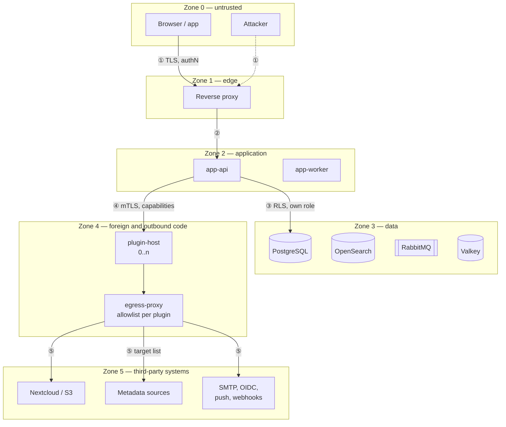

# 12 — Security

Security is quality goal **Q1** and takes precedence in every conflict of goals.
This chapter is binding; the corresponding testable requirements are in
[requirements/03](../requirements/03-security-and-privacy.md).

## 12.1 Assets

| Asset | Why it needs protecting | On loss |
|---|---|---|
| **Inventory data** | Reveals what someone owns, where it is and what it is worth — burglary preparation in data form | Not recoverable |
| **Photos** | Show living spaces; unintentionally contain people, documents, keys | Not recoverable |
| **Licence keys and credentials of digital goods** | Directly worth money | Immediate damage |
| **Credentials** | Access to everything above | Full compromise |
| **Tenant separation** | The basis for shared operation | Loss of trust, notification duty |
| **The audit log** | Ability to establish facts after an incident | The incident cannot be investigated |
| **Availability** | Subordinate — an outage is annoying, not damaging | — |

## 12.2 Trust boundaries



**There is no arrow from Zone 2 to Zone 5.** That is the whole point of
[ADR-0026](../adr/0026-core-outbound-via-plugins.md): every connection leaving the
deployment starts in Zone 4 and passes ⑤. Earlier versions of this diagram drew a
boundary ⑥ (`app` → Nextcloud, on an app password) while the surrounding text
claimed the core could not reach the internet. Both could not be true; the arrow
is gone and the claim is now the one that holds.

| Boundary | Checks on crossing |
|---|---|
| ① Zone 0 → 1 | TLS 1.3, HSTS, rate limiting, payload limits, basic WAF rules |
| ② Zone 1 → 2 | Authentication, CSRF, origin check, schema validation, **authorization**, setting the tenant context |
| ③ Zone 2 → 3 | A dedicated DB role without DDL and without `BYPASSRLS`, RLS active, parameterised queries only. **Every store in zone 3 authenticates its caller** — PostgreSQL by password per role, Valkey by ACL user, RabbitMQ by user, OpenSearch by client user over TLS, and `blobstore` by mTLS with a pinned fingerprint. Until 2026-09-11 only PostgreSQL did; the rest treated *"reachable from `internal`"* as authorisation ([ADR-0044](../adr/0044-internal-is-not-a-trust-boundary.md)) |
| ④ Zone 2 ↔ 4 | mTLS, capability check **per call**, deadline, payload limit, bulkhead, circuit breaker. **Zone 4 is not one room.** Each plugin has its own network segment holding only itself, `api`, `worker` and the proxy ([ADR-0037](../adr/0037-per-plugin-network-segments.md)), so a plugin reaches no other plugin, no scanner and no management endpoint — those bind to `internal`. Until 2026-09-11 every plugin shared one segment with `clamd` and with both core roles' port 8090, which put per-tenant metrics and the fail-closed scanner within reach of code holding no capability at all |
| ⑤ Zone 4 → 5 | The **only** way out of the deployment, in **every** profile ([ADR-0036](../adr/0036-scanner-egress.md)). Outbound goes through the egress proxy, which applies the granting plugin's manifest allowlist — plus one fixed deployment entry for the malware scanner's signature mirror, which has no manifest — and logs every attempt, permitted or refused ([ADR-0027](../adr/0027-egress-enforcement.md)). The caller is identified by the segment interface the connection arrived on, not by a claimed source address. Credentials for the target — the Nextcloud app password with access to exactly one folder, SMTP and OIDC secrets — belong to the plugin, not to the core, which narrows what a core compromise yields |

**Everything runs rootless.** No container and no container daemon runs as `root`
on the host ([ADR-0022](../adr/0022-rootless.md)). An escape from zone 4 — the
only place where foreign code runs — is therefore confined to an unprivileged
service user without `sudo`. Under Podman there is moreover no daemon at all, and
hence no root-equivalent socket.

**`app-api` and `app-worker` do not reach the internet.** They sit only on segments
with no route out of the deployment, and after
[ADR-0026](../adr/0026-core-outbound-via-plugins.md) they have no external target
left to reach: object storage, mail, federated login, webhooks and push all became
plugins. The property is verified rather than asserted — a CI test takes them,
tries every external host, and expects a refusal.

**`internal` is a network, not a trust boundary.** That sentence is new, and its absence
was the gap. The chapter was exhaustive about the outward boundary — one egress proxy, one
segment per plugin, a management listener bound rather than merely unpublished — and said
nothing about what a compromised member of `internal` could reach. Two things followed from
that silence: no store but PostgreSQL held a credential, and `web` — the single container
with a published port — was a full member, able to open `postgres:5432`, `valkey:6379`
(every session), `opensearch:9200`, `rabbitmq:5672`, `blobstore:8100` and `:8090` on both
core roles. `web` now sits on a two-member `frontend` segment with `api` alone, and every
store authenticates ([ADR-0044](../adr/0044-internal-is-not-a-trust-boundary.md),
`REQ-SEC-104`, `REQ-SEC-105`). The connectivity suite asserts it, because a segment flag is
a claim and a refused connection is evidence.

**Two containers do have a route out, and naming them is part of the claim**
([ADR-0042](../adr/0042-edge-is-not-internal.md)). A published port requires a
non-internal segment — measured, not assumed — so `web`, the ingress, has one; and
`egress-proxy`, the designed chokepoint, has one because that is its function.
Neither holds data, a database credential, an encryption key or domain logic.
This section previously said "the core" reached nothing, which was a claim with
two counterexamples in its own topology; the narrower sentence is the one that is
true and the one a test can check (`REQ-SEC-102`). **And what `web` *holds* was never the
whole question** — what it could *reach* is the paragraph above.

That is what confines **SSRF** to Zone 4. Webhook delivery is the one place where a
tenant supplies the URL, and it now happens inside a container that holds no data,
holds no database credential, and can only reach hosts its manifest declared.

## 12.3 Threats by STRIDE

Only the entries that shape this design; the full set is in the requirements
catalogue.

| Category | Threat | Countermeasure |
|---|---|---|
| **S** Spoofing | A stolen session or device token | Short-lived access tokens (10 min), rotating refresh tokens with reuse detection, binding to client characteristics, a session overview with remote sign-out |
| | Guessing credentials | Argon2id, rate limiting per account **and** per IP, increasing delay, checking against known breached passwords (k-anonymity, offline list), a mandatory second factor for `OWNER`/`ADMIN` |
| | A forged plugin | mTLS with a pinned certificate fingerprint, signed artifacts |
| **T** Tampering | Mass assignment | Separate input types per use case; no binding onto entities; unknown fields are **rejected**, not ignored |
| | IDOR / addressing foreign objects | Authorization on the loaded object, never on the ID alone; RLS as the second line; `404` instead of `403` for foreign objects |
| | A tampered audit log | Append-only, the application role without `UPDATE`/`DELETE`, a hash chain **per tenant**, and an hourly Merkle anchor across all tenants. The chain alone would only prove that nobody careless touched it — whoever can rewrite rows can recompute a chain. The anchor is the part that cannot be reproduced ([ADR-0031](../adr/0031-audit-chain-per-tenant.md)) |
| **R** Repudiation | "That was not me" | Audit with actor, time, IP, client, correlation ID; plugin writes recorded with the plugin as actor |
| **I** Information disclosure | Cross-tenant access | RLS with `FORCE`, application authorization, an automated isolation proof across all tables |
| | GPS in photos | EXIF stripping by default |
| | **A label discloses its item's creation time** — the QR fragment carries the UUIDv7, and UUIDv7 embeds a timestamp. **Accepted** (open point O12, decided 2026-09-11): offline resolution from any label is worth more than hiding a creation date, and the disclosure is bounded — nothing about the object, the tenant or its value follows from it. An operator who disagrees switches the tenant to the host-free code form, which carries no fragment | — |
| | Enumerating public codes | **50 bits** of randomness ([ADR-0030](../adr/0030-public-code-format.md)) — at 10⁶ issued codes a guess hits with probability ≈ 1 : 1.1 · 10⁹ · rate limiting with increasing delay · a neutral response for unknown codes, identical to the one for a missing permission |
| | Revealing error messages | A uniform error format without internals; different causes yield identical responses |
| | Timing differences at login | Constant-time comparison, a dummy hash operation for unknown accounts |
| | **SSRF — a tenant points the system at an address of their choosing** (a webhook target, a resolver host). Classic escalation: the cloud metadata endpoint, a service on the internal network, a port scan by timing | The core makes **no** outbound connection at all ([ADR-0026](../adr/0026-core-outbound-via-plugins.md)), so there is nothing to coerce. Delivery happens in a plugin that holds no data and no database credential, and whose only route out is the egress proxy with its declared allowlist ([ADR-0027](../adr/0027-egress-enforcement.md)). The proxy refuses private, link-local and metadata ranges outright and resolves the name itself rather than trusting the caller. **A redirect to an undeclared host is refused because it needs a new `CONNECT` the allowlist rejects — not because the proxy inspects it.** Under `CONNECT` the proxy sees host and port and nothing else, so it cannot read a redirect inside TLS; the allowlist is what carries this, and saying "re-checks on redirect" would promise a mechanism that cannot exist |
| **D** Denial of service | Expensive queries | Cost analysis for GraphQL, result limits, a request timeout, rate limiting per tenant |
| | Image bombs (decompression bombs) | A pixel limit before decoding, memory and time limits in the image process, processing in the worker |
| | A slow plugin | Deadline, bulkhead, circuit breaker |
| | Filling up storage | Per-tenant quotas for counts, bytes and API calls |
| **E** Elevation of privilege | A plugin reaching core data | The capability model, process and network separation, in-process only signed and only by the operator |
| | **Escaping a container** (a kernel or runtime bug) | **Rootless**: the escapee is an unprivileged user without `sudo` on the host · no root daemon, no root-equivalent socket · `no-new-privileges`, `cap_drop: ALL`, a read-only filesystem · a separate UID range **and a separate network segment** per plugin, which now fail independently rather than together · [ADR-0022](../adr/0022-rootless.md), [ADR-0037](../adr/0037-per-plugin-network-segments.md) |
| | **A plugin reading the core's management endpoints.** `/actuator/prometheus` carries per-tenant counts and byte volumes ([13 §13.3](13-operations-and-observability.md)); reaching it needs no capability, only a route | The management port binds to `internal` and is unreachable from any plugin segment (`REQ-SEC-099`). "Unpublished" was never the same as "unreachable" — it hides a port from the host, not from a neighbour on the same segment |
| | **A plugin stopping the malware scanner.** The scan is fail-closed, so an unreachable `clamd` blocks **every** upload in the instance ([ADR-0024](../adr/0024-malware-scan.md)) | `clamd` sits on the `scanner` segment with `worker` alone; no plugin is on it (`REQ-SEC-098`) |
| | Role manipulation | Permission granting only by `OWNER`/`ADMIN`, nobody grants themselves permissions, every change audited |
| | SQL injection | Parameterised queries only; dynamic SQL only through a checked builder with field names from an allowlist |
| | Template injection in labels | A non-Turing-complete expression language, field access from an allowlist |

## 12.4 Authentication

| Mechanism | Decision |
|---|---|
| Password | Argon2id (≥ 19 MiB, t=2, p=1 — aligned with the OWASP recommendation, raisable by configuration), minimum length 12, no forced complexity, no forced rotation, checked against a breach list |
| Second factor | TOTP (RFC 6238) and **WebAuthn/passkeys**. **Mandatory** for `OWNER` and `ADMIN`. Recovery codes single-use, stored hashed. The login is then two calls: the password is answered with `401 second-factor-required` and the code goes to `POST /api/v1/auth/mfa`, against a half-done login the session holds for five minutes and spends on the first answer, right or wrong. Enrolment is two calls as well — a secret is shown once, and a code generated from it is what makes the factor count; an enrolment nobody confirmed locks nobody out. A code from a time step already accepted is refused, so one read over a shoulder is not usable for the rest of its thirty seconds (RFC 6238 §5.2; `REQ-AUTH-002`, proved by `SecondFactorIT`) |
| Passkeys | Verified by `webauthn4j` with **no attestation trusted**: `none` and self attestation are accepted and no certificate path is validated ([ADR-0062](../adr/0062-passkeys-with-webauthn4j.md)). A self-hosted instance has no business ranking authenticator manufacturers, and validating a path would mean FIDO's metadata service — an outbound connection the core does not make ([ADR-0026](../adr/0026-core-outbound-via-plugins.md)). What is verified is the origin, the relying party, the challenge, the signature and the sign counter. A passkey is a **second** factor here and not a replacement for the password, so no resident key is asked for. The relying party is `HOMEINV_PUBLIC_BASE_URL`, which makes a passkey the second thing a changed base URL invalidates — printed labels are the first ([10 §10.2.1](10-identification-and-labels.md)) |
| Where it is mandatory | `OWNER`, `ADMIN` and any role granted a `sensitive` field (`REQ-AUTH-003`). The role is **granted and locked**: the membership stands and every request in that tenant answers `403 second-factor-missing` until an authenticator exists ([ADR-0061](../adr/0061-second-factor-locks-the-role.md)) — refusing the assignment would leave a tenant nobody owns. `/api/v1/auth/**` and `/api/v1/me/**` keep answering, so the enrolment and the switch to another tenant are always reachable. A grant of a sensitive field to a role whose members have none is refused for the same reason, at the point the grant is written |
| Federation | OIDC Authorization Code + PKCE. Linking an external account to an existing one only after re-authentication. No automatic account linking by e-mail address alone — that is a known takeover route. |
| Registration | Default `invite_only`. An invitation is a single-use, time-limited token bound to the e-mail address. `closed` creates no account at all — an invitation for an address nobody has is refused with `registration-closed`, while one for an existing account still adds it to the tenant. `open` confirms the address first and therefore needs `plugin-smtp`; until one is installed an instance configured for it refuses to start, which is the same answer a value naming no mode gets (`REQ-AUTH-004`) |
| Reset | A single-use token, valid 30 min, consumption invalidates all sessions, a notification goes to the old address |
| Web session | A `__Host-` cookie, `Secure`, `HttpOnly`, **`SameSite=Strict`**, server-side in Valkey, absolute maximum 30 days, idle 7 days. The store is the **indexed** repository, so an account's sessions can be listed and one of them ended remotely (`REQ-AUTH-009`) — which is also why Valkey's ACL names **three pub/sub channels**: the indexed store subscribes to the two keyspace events and one pattern that keep the index from filling with sessions that are gone, and an ACL grants no channel by default ([ADR-0044](../adr/0044-internal-is-not-a-trust-boundary.md)); what they are indexed **by** is the account id and not the principal's name, which would put an e-mail address into a Valkey key. A session records what the client called itself and the **network** it came from — `203.0.113.0/24`, never the address (`REQ-PRIV-006`) — and the list names each session by a keyed hash of its id, because the id is what the cookie carries |
| Code resolution | A second cookie, `__Secure-` prefixed with `Path=/c` and `SameSite=Lax`, referencing the same server-side session. `Strict` withholds the session cookie on a cross-site top-level navigation — which is exactly what a QR scan from a foreign camera app is, and it is the system's primary lookup path. The narrow cookie restores recognition on that one path without weakening the session cookie everywhere. It cannot carry the `__Host-` prefix, because that prefix mandates `Path=/` ([ADR-0029](../adr/0029-session-cookie-and-oidc-state.md)) |
| OIDC `state` and PKCE verifier | **Server-side, never in a cookie.** A single-use, high-entropy handle travels in the `state` parameter; the callback looks the verifier up and consumes it. Stricter than a state cookie in two ways — the verifier never reaches the browser, and a replayed callback fails |
| App / third party | OAuth 2.1: Authorization Code + PKCE through the system browser. **No** password in the app. Access token 10 min, refresh token rotating with reuse detection. |
| Machine access | Service accounts with tokens, scoped to a tenant and permissions, with an expiry date, shown in clear exactly once. The token is `homeinv_sa_` plus 32 random bytes — the prefix so a secret scanner recognises one in a configuration file — and what is stored is its **SHA-256**, so "shown once" is a property of the storage (`REQ-AUTH-010`). SHA-256 and not Argon2id, deliberately: there is no dictionary to slow down against 32 random bytes, and the token is presented on *every* request a machine makes. It holds one of the six roles like a member, so `AccessControl` answers for it unchanged; it has **no session**, no second factor, and therefore cannot perform anything that asks for one again (`REQ-AUTH-011`) — the operations a person is asked to confirm are exactly the ones a machine may not do unattended |
| Re-confirmation | Critical operations require the second factor again (granting permissions, deleting a tenant, exporting, plugin capabilities, viewing `sensitive` fields). **Fifteen minutes** from the last accepted code, whether at the login or at `POST /api/v1/auth/mfa/step-up`, recorded in the session and never in the client (`REQ-AUTH-011`). An endpoint says it needs one with `@RequiresRecentSecondFactor` and is refused with `second-factor-stale`; a **sensitive field is removed instead**, and the answer stays `200` — a list with one sensitive column in it would otherwise become unreadable, and a refusal somebody meets while scrolling is one they learn to click past |

## 12.5 Authorization

**One place, one answer.** `AccessControl.require(action, resource)` in the
application layer. No access adapter, no repository and no plugin makes its own
decision.

| Layer | Task |
|---|---|
| 1 — Tenant context | Derived from authentication, **never** from a request parameter. Sets `app.tenant_id` for the transaction. |
| 2 — Permissions | RBAC: role → permissions. Permission ID `<block>:<resource>:<action>`. A role that requires a second factor is refused before any of this when the account has none (`REQ-AUTH-003`, [ADR-0061](../adr/0061-second-factor-locks-the-role.md)): the permissions it carries are not the question while the session may not use the role at all |
| 3 — Object scope | Checked on the **loaded** object: does it belong to the tenant, does it lie in the permitted location subtree. This is what produces a comprehensible answer — a `404` for a place the caller may not see — and it is **not the only** line: since [ADR-0059](../adr/0059-subtree-scope-has-two-lines.md) the subtree is enforced in layer 5 as well, so a query that forgets the filter returns nothing rather than somebody else's room |
| 4 — Field visibility | `sensitive` fields are **removed** per role, not masked — masked fields reveal existence and length |
| 5 — RLS | An independent second line in the database, for **both** boundaries: the tenant (`app.tenant_id`, [ADR-0003](../adr/0003-multi-tenancy.md)) and the location subtree a membership is confined to (`app.location_scope`, [ADR-0059](../adr/0059-subtree-scope-has-two-lines.md)). Both settings are published by the transaction manager and written on every transaction, scope or none, so a pooled connection cannot carry one request's scope into the next |

| Rule | |
|---|---|
| Default | **Deny.** An endpoint without `@RequiresPermission` and without an explicit `@PublicEndpoint` marker fails the build. |
| Subtree permissions | A role can be scoped to a location subtree (e.g. "garage only") — the check uses the `ltree` path, in the application **and** in the policies on `locations.location` and `inventory.item` ([ADR-0059](../adr/0059-subtree-scope-has-two-lines.md)). An item with no place is invisible to a scoped session: a digital item is in nobody's garage. A scope that resolves to nothing — a place since deleted — yields **nothing**, never everything |
| Whole-tenant permissions | Some acts are about the tenant rather than about things in it, and a **scoped membership holds none of them**, whatever its role. `Permission.wholeTenant` marks one and `DefaultAccessControl.holds` refuses it whenever the caller carries a `scope_location_id`. The export is the first: there is no archive of a shelf, so the only thing a scoped caller could be handed is an archive of everything — which is exactly what the scope says they may not have ([ADR-0068](../adr/0068-an-export-opens-what-its-requester-may-read.md)). It is a property of the permission and not a check in a controller, so the next tenant-wide act is one flag rather than a rule somebody has to remember |
| Privilege escalation | Nobody can grant permissions they do not hold themselves |
| Proof | Every endpoint has a test for "no permission → 403" and "foreign tenant → 404" |

**Sealed values in an export.** A field marked `sensitive` is stored sealed
([ADR-0019](../adr/0019-sensitive-field-encryption.md)) and an archive of ciphertext is
one no other instance can open — data lost on the way out with nothing having failed. An
export therefore **opens a sealed value exactly as far as the person who requested the
archive may read it**, through the same `AttributeRedaction` port the REST layer uses, and
names every field it withheld in the manifest
([ADR-0068](../adr/0068-an-export-opens-what-its-requester-may-read.md)). The authority is
copied onto the job at request time — role, tenant-owned role and the moment the second
factor was proved — because the worker that builds the archive minutes later has no caller
of its own. Two consequences are deliberate: a role granted **after** the request does not
widen the archive, and a job with no caller at all opens nothing.

## 12.6 Input

| Rule | |
|---|---|
| Validation at the boundary | JSON Schema from the type version plus Bean Validation. **Unknown fields lead to rejection.** |
| Canonicalisation | Unicode NFC, control characters removed, lengths bounded — before any check |
| Output | Context-aware encoding; React escapes by default, `dangerouslySetInnerHTML` is forbidden by a lint rule |
| User text in Markdown | A permitted subset, sanitised server-side, no HTML, no `javascript:` targets |
| URLs from user input | `http`/`https` only, no internal address ranges, output with `rel="noopener noreferrer"`, never fetched server-side |
| File names | Never taken from input; storage happens under the hash |
| Regular expressions from field definitions | Checked for catastrophic backtracking when the definition is saved (`PatternSafety`) **and** executed under a 100 ms budget (`BoundedRegularExpressions`, wired into the schema validator). Two lines because the set of patterns that explode is larger than the set of shapes anybody has written down; a match that runs out of budget reads as not matching, which is a `422` on the value rather than a `500` on the definition (`REQ-SEC-035`, `PatternSafetyTest`) |

## 12.7 Uploads

The riskiest input in the system.

| Stage | Measure |
|---|---|
| 1 | A size limit enforced **before** reading (default 25 MB) |
| 2 | Type detection through magic bytes; the client-reported extension and MIME type are discarded |
| 3 | An allowlist: JPEG, PNG, WebP, AVIF, PDF, TXT, CSV. **SVG is rejected** (active content). **HEIC is accepted at the API boundary but transcoded to AVIF on ingest and never stored as HEIC** — decoding it needs `libheif`, a comparatively young dependency with a poor CVE record, so it runs inside the image worker's memory and time limits and its output, not its input, is what is kept. |
| 4 | A pixel limit before decoding (default 100 MP) against decompression bombs |
| 5 | **Re-encoding** of every image through libvips — reliably destroys embedded payloads |
| 6 | EXIF removed entirely, **especially GPS**. Retention only on an explicit tenant setting, with a warning. |
| 7 | **A mandatory malware scan** (ClamAV through the `VirusScanner` port), **fail-closed**: on a finding the blob is deleted from the store and the file is detached from everything it hangs on; with no verdict the file stays unretrievable and no signed URL is minted for it. The scan runs in the `worker`, so the upload is answered `202` and `GET /api/v1/media/{id}` carries the outcome — `422` after a finding, `503` while there is none ([ADR-0024](../adr/0024-malware-scan.md), [ADR-0054](../adr/0054-the-scan-is-asynchronous.md)). *This row said the upload is rejected `503` until 2026-09-12, which no asynchronous scan can do.* |
| 8 | Storage under `sha256/<tenantId>/<hash>`, outside any web root — content-addressed **within a tenant**, never across ([ADR-0032](../adr/0032-per-tenant-blob-addressing.md)). A global namespace would have been an existence oracle across the tenant boundary and would have let a second tenant inherit the first one's malware verdict |
| 9 | Serving from a **dedicated hostname** (`HOMEINV_MEDIA_BASE_URL`), with `Content-Disposition: attachment`, `X-Content-Type-Options: nosniff`, `Content-Security-Policy: sandbox`, without cookies |
| 10 | Access only through signed, short-lived URLs (15 min), bound to the user and the media ID |
| 11 | PDFs are **never** displayed inline, only offered for download |

## 12.8 Secrets and encryption

| Subject | Method |
|---|---|
| Passwords | Argon2id, never reversible |
| Tokens in the database | Stored only as a SHA-256 hash |
| Second-factor secrets | A dedicated key, `HOMEINV_CREDENTIAL_KEY_FILE`, sealing the TOTP secrets with AES-GCM (`REQ-SEC-109`). A password is hashed and never recovered; a shared secret cannot be, because verifying a code means generating one — so a database dump without this file is not a set of working second factors, which is the whole point of having a second one. Separate from the media key for the plainest reason: rotating what signs a URL must not lock every account out of its own authenticator. Recovery codes are **hashed** with the password encoder instead, because a code is used once and typed by a person |
| Signed URLs and cursors | A dedicated key, `HOMEINV_URL_SIGNING_KEY_FILE`, separate from the JWT signing key. `REQ-MED-010` requires short-lived signed media URLs from stage 0 and [08 §8.2](08-api-contract.md) an opaque **signed** cursor; neither named a key until 2026-09-11, and the only key in the matrix was an identity key. A URL signature must not be forgeable by anything that can mint a session token ([ADR-0044](../adr/0044-internal-is-not-a-trust-boundary.md)) |
| `sensitive` fields (licence keys, credentials of digital goods) | **Envelope encryption**: a data key per tenant, encrypted with a master key from the environment. AES-256-GCM with additional authenticated data (tenant + field + item) — an encrypted value cannot be moved into another record. See [ADR-0019](../adr/0019-sensitive-field-encryption.md). |
| Plugin settings of type `secret` | Encrypted likewise; a plugin reads only its own |
| Nextcloud access | An app password with access to exactly one folder, never the main password |
| Key rotation | Per-tenant data keys can be re-wrapped without touching the data; the master key supports two active versions for a seamless rotation |
| In logs | A filter list prevents emitting tokens, keys, passwords and `sensitive` values; a test verifies it with known test values |
| In the repository | `gitleaks` in CI and as a pre-commit hook |

## 12.9 Security-related HTTP headers

Served by the `web` container, from configuration that lives in this repository —
**not** by the operator's reverse proxy, because a header set outside this
repository is one `REQ-SEC-060`'s CI comparison cannot check
([ADR-0038](../adr/0038-csp-delivery-and-first-paint.md)).

```
Content-Security-Policy: default-src 'none'; script-src 'self' 'sha256-{bootstrap}';
  style-src 'self' 'sha256-{critical}'; img-src 'self' {MEDIA_ORIGIN} data: blob:;
  connect-src 'self' {MEDIA_ORIGIN}; font-src 'self';
  frame-src {PLUGIN_UI_ORIGIN}; worker-src 'self' blob:;
  manifest-src 'self'; media-src 'self' {MEDIA_ORIGIN};
  frame-ancestors 'none'; base-uri 'none'; form-action 'self';
  object-src 'none'; require-trusted-types-for 'script'; trusted-types default
Strict-Transport-Security: max-age=63072000; includeSubDomains
X-Content-Type-Options: nosniff
Referrer-Policy: strict-origin-when-cross-origin
Permissions-Policy: camera=(self), geolocation=(), microphone=(), payment=()
Cross-Origin-Opener-Policy: same-origin
Cross-Origin-Resource-Policy: same-site
```

> **`preload` is deliberately absent from `Strict-Transport-Security`**, and
> `includeSubDomains` is deliberately present (open point **O20**, decided
> 2026-09-11). The two are often shipped together and do very different things.
>
> `includeSubDomains` carries the protection: it stops an attacker downgrading
> `media.inv.example.org` or a plugin-panel subdomain, both of which this design
> puts on subdomains of the application host by default. It stays.
>
> `preload` carries no protection of its own. It is a **consent flag**: the
> browser preload list only accepts a domain whose header contains it, and
> enrolment still requires the operator to submit the domain themselves. So
> sending it changes nothing until someone acts — but what it consents to is a
> commitment over the operator's **whole registrable domain**, which for a
> self-hoster is often their private main domain carrying unrelated services, and
> removal from the list takes months. That is not a default this project gets to
> set on someone else's domain. The installation guide describes it as a
> deliberate step, next to the rest of the header set.
>
> The CI comparison of `REQ-SEC-060` therefore expects the header **without**
> `preload`, the same way it fails if `COEP` appears: a fixed expected string, not
> a configurable one.

> **`Cross-Origin-Embedder-Policy` is deliberately absent**
> ([ADR-0040](../adr/0040-no-cross-origin-isolation.md)). `require-corp` exists to
> earn cross-origin isolation — `SharedArrayBuffer` and full-resolution timers —
> and nothing here uses either: the ZXing-WASM fallback is single-threaded, local
> web storage is IndexedDB, and the apps are native. It costs two obligations that
> fail **silently**: CORP on every embedded cross-origin response, and COEP on
> every cross-origin document the page frames — which would make a plugin panel
> from an author who never heard of the header render as an empty box.
>
> It is listed here rather than simply missing, so nobody adds it back as an
> oversight. **The CI header comparison fails if COEP appears**, for the same
> reason. The trigger for reversing this is written into ADR-0040: the first thing
> that wants threaded WASM.

> **`trusted-types default` is not decoration beside `require-trusted-types-for`.** On its
> own the enforcement directive requires DOM XSS sinks to take a `TrustedType` and leaves
> **policy creation unrestricted** — anything that achieves script execution can mint its
> own policy and satisfy the check. The allowlist names the single policy this bundle
> creates. It is the same argument as hashes over nonces
> ([ADR-0038](../adr/0038-csp-delivery-and-first-paint.md)): authorise what is known, not
> whatever presents itself. The directive was absent until 2026-09-11, and `REQ-SEC-060`
> now expects both.

`{MEDIA_ORIGIN}` and `{PLUGIN_UI_ORIGIN}` are substituted at startup from
`HOMEINV_MEDIA_BASE_URL` and `HOMEINV_PLUGIN_UI_BASE_URL`. They are the
deployment's own hostnames, not third-party hosts — which is what `REQ-PRIV-015`
means by "no external host": no host the operator does not run.

`{bootstrap}` and `{critical}` are **hashes emitted by the build**, not nonces. A
nonce is per-response by definition, and nothing that emits this document can mint
one: the shell is a static bundle served by nginx. A hash is also the more precise
statement — it authorises that exact script and no other, where a nonce authorises
whatever the server chooses to mark. A CI check recomputes both from the built
bundle and fails on a mismatch, the same drift mechanism as `deploy/services.yaml`
and `tokens.json`. The one inline script the shell needs is the theme bootstrap
that beats first paint ([ADR-0038](../adr/0038-csp-delivery-and-first-paint.md));
`'strict-dynamic'` is deliberately absent, because a self-hosted bundle that
contacts no third-party host has nothing to load dynamically.

**Four directives are present because the previous policy silently disabled
features it was written to protect.** They are listed rather than quietly added:

| Directive | Why it is needed |
|---|---|
| `frame-src {PLUGIN_UI_ORIGIN}` | `frame-src` falls back to `child-src` and then to `default-src`, which is `'none'`. Without this directive **no plugin UI panel can load at all** (`REQ-PLG-012`) — the feature was specified and the policy forbade it |
| `connect-src … {MEDIA_ORIGIN}` | The service worker fetches media to populate the offline cache ([11 §11.6](11-offline-synchronisation.md)). `` loads are covered by `img-src`, but a `fetch()` is not — with `connect-src 'self'` alone, **offline images would never be cached** |
| `worker-src 'self' blob:` | The ZXing-WASM fallback runs in a web worker ([10 §10.3](10-identification-and-labels.md)); bundlers instantiate workers from a `blob:` URL |
| `img-src … blob:` | Camera frames and locally captured photos are rendered from `blob:` URLs before upload |

`camera=(self)` is necessary — without it scanning does not work. Everything else
is switched off. **No `unsafe-inline`, no `unsafe-eval`**: the Vite build is set
up accordingly, and a CI test compares the served CSP against an expected string.

> **`Cross-Origin-Resource-Policy` still constrains the media hostname, and
> dropping COEP does not change that.** The two are easy to conflate. CORP is
> enforced on every cross-origin no-cors subresource load regardless of COEP; what
> COEP changed was the other direction, by making an *absent* CORP header fatal.
> So the media host's value still has to be right:
>
> | Media host | CORP value | Result |
> |---|---|---|
> | a subdomain of the application's registrable domain (`media.inv.example.org` next to `inv.example.org`) | `same-site` | loads |
> | a **different** registrable domain | `same-site` | **blocked — every image silently fails** |
> | a different registrable domain | `cross-origin` | loads |
>
> The installation guide states this next to `HOMEINV_MEDIA_BASE_URL`, and a
> startup check warns when the two hosts are not same-site. CORP is kept on
> purpose — it stops foreign sites embedding tenant media — not as a leftover of a
> header that is no longer sent.

Plugin UI panels (`ui:panel`) run in an `iframe` with `sandbox` on **their own
origin** (`HOMEINV_PLUGIN_UI_BASE_URL`, one subdomain per plugin ID); communication
goes through `postMessage` with a verified origin and a fixed message schema. The
panel document sends its own CSP with `frame-ancestors` restricted to the
application origin — the main page's `frame-ancestors 'none'` protects the
application from being framed and says nothing about what it may frame itself.

## 12.10 Supply chain

| Measure | Tool |
|---|---|
| Dependencies pinned | Gradle version catalog + lock files; npm with `package-lock.json` and `npm ci` |
| Vulnerability scanning | OWASP Dependency-Check and `osv-scanner` in CI; the build fails on "high"/"critical" |
| Updates | Renovate, auto-merging patch versions only and only on a green build |
| SBOM | CycloneDX per release, published as an artifact |
| Containers | A distroless base, `trivy` scanning, referenced by digest, signed with `cosign`, with build provenance |
| Reproducibility | Builds without network access apart from the dependency cache |
| CI permissions | Least privilege, `pull_request_target` forbidden, no secrets for foreign pull requests |
| Licence check | Automated AGPL compatibility check; incompatible licences fail the build |

## 12.11 Data protection

| Requirement | Implementation |
|---|---|
| Data minimisation | Only e-mail, display name and language are mandatory. No legal name, no date of birth, no phone number. |
| Purpose limitation | Photos and inventory data are not analysed for any other purpose; there are no analytics services and no outbound telemetry |
| Access (Art. 15) and portability (Art. 20) | `portability` produces a complete, machine-readable archive |
| Erasure (Art. 17) | Account and tenant deletion with a 30-day grace period and **a completion report per building block** ([05 §5.9](05-runtime-view.md)) |
| Log data | IP addresses removed from application logs after 7 days; in the audit log only for security-relevant events and truncated there |
| Processors | Nextcloud and SMTP are processors; a template for a processing register and for the description of technical and organisational measures ships with the documentation |
| Location | All data stays on the operator's instance. Outbound connections exclusively through explicitly enabled plugins, with a visible target list. |
| Consent for enrichment | A request to an external metadata source transmits a code (ISBN/EAN). This must be disclosed to the tenant and is switchable per resolver. |
| **Push through third parties** | Firebase and APNs are attached as a **plugin**, not in the core ([ADR-0023](../adr/0023-push-notifications.md)). What is transmitted is device token, timestamp and category only — **no inventory data**; the app fetches the content through the authenticated API. Three separate opt-ins: the operator installs, the tenant administrator grants `network:outbound`, the user switches it on. Google and Apple must be listed as processors; a template ships with the documentation. |

## 12.12 Verification and evidence

| Check | Frequency | Blocking |
|---|---|---|
| SAST (CodeQL, SpotBugs + `find-sec-bugs`, `oxlint`, `cargo clippy -D warnings`) | every push | yes | *This row named **ESLint security** until 2026-09-20, three weeks after `REQ-SEC-076` recorded that it could not be satisfied as written and named the replacements.* |
| Dependency and container scanning | every push, daily | yes on high/critical |
| Secret scanning | every push + pre-commit | yes |
| **Tenant isolation** — an automated proof across all tables | every push | yes |
| **Authorization coverage** — negative tests for every endpoint | every push | yes |
| CSP and header verification against expected values | every push | yes |
| Upload attack patterns (polyglots, bombs, traversal) as a test suite | every push | yes |
| DAST (a ZAP baseline run against the test environment) | nightly | no, reports |
| Threat model review | per release that adds a zone or a port | — |
| Restore rehearsal | quarterly | — |

### 12.12.1 Findings that are dismissed, and why

A blocking gate is worth having only if a red one means something. Four CodeQL
rules fire on this code and none of them describes a defect here; each is
dismissed in the code-scanning UI as *false positive*, with a comment pointing at
the row below. **The rules stay switched on**, so the same shape in code written
tomorrow fires again — which is the difference between answering a finding and
turning off the question.

Nothing is dismissed because it was inconvenient. Where a finding is real it is
fixed, and where the reason is a property of the system rather than of one call
site, that property gets a test — because a sentence in a table is not evidence.

> **Alerts are per ref, and a pull request has three of them.** Dismissing the
> alerts listed by default clears them on the **default branch** and leaves the
> pull request red, because the check that comments on a pull request analyses
> `refs/pull/<n>/merge` — the merge commit, which is neither the branch nor the
> base. Its alerts are separate records with their own numbers. Found on
> 2026-09-20, after a first pass dismissed fifteen alerts and the check went on
> reporting four that were not among them.

| Rule | Where | Why it is not a defect here |
|---|---|---|
| `java/log-injection` (×18) | Every place a request value reaches a log statement | The only appender is the **ECS JSON encoder** (`REQ-NFR-041`), which escapes control characters inside the `message` value: a `CRLF` payload produces **one** line, not two, so nothing a caller sends can end the line and start a forged one. Held by `LogFormatIT.aValueWithNewlinesCannotForgeALine`, which logs the payload a forger would use and asserts both halves — exactly one line out, and the payload intact inside the value. **No sanitiser is added, deliberately:** scrubbing the value would make the log say less than what happened, and the attempt is the thing worth reading |
| `java/tainted-permissions-check` (×2) | `TypeAdministrationAdapter.permittedChildren` | It is a **domain rule**, not an access-control check: `catalog.location_category_child` says which location category may sit beneath which (`REQ-CORE-047`), and the rule fires on the identifier. Authorisation for these endpoints is where [ADR-0010](../adr/0010-api-surfaces.md) puts all of it — `@RequiresPermission` in the REST adapter (`REQ-SEC-022`…`025`) — and the query is parameterised and scoped by `TenantContext.require()` under RLS |
| `java/user-controlled-bypass` (×1) | `ServiceAccountAuthenticationFilter` | **Fail-closed.** The condition decides only whether *this* authenticator runs; a request whose `Authorization` header is absent or of another scheme continues down the chain still **unauthenticated**, which grants nothing. Every endpoint carries `@RequiresPermission` and the build fails without one (`REQ-SEC-022`), so not running the filter cannot bypass authorisation |
| `java/potentially-weak-cryptographic-algorithm` (×1) | `DefaultPasswordPolicy.sha1Hex` | **SHA-1 by protocol, not by choice.** The breached-password check is a *k*-anonymity range query, and the range query every such service answers is defined over SHA-1 ([ADR-0067](../adr/0067-breached-passwords-from-a-shipped-list.md)). It is a **lookup key**: five of its forty characters select a bucket and the rest is compared locally, and nothing about the scheme rests on the digest being collision-resistant. What actually stores the password is Argon2id (`REQ-SEC-010`). The same finding is excluded for SpotBugs in `config/spotbugs-exclude.xml`, for the same reason |
| `java/uncontrolled-arithmetic` (×1) | `TenantDataKeys.wrap` | `iv.length + sealed.length` adds a 12-byte GCM nonce to the AES-GCM output over a 32-byte data key. Both are bounded by the private caller, which wraps a freshly generated key and never anything a request supplies; for the sum to overflow an `int` the ciphertext would have to approach 2 GiB, which `Cipher.doFinal` would have failed to allocate long before |

## 12.13 Incident handling

| Point | Decision |
|---|---|
| Reporting channel | `SECURITY.md` with a contact address and GPG key, coordinated disclosure, 90 days |
| Response times | Acknowledgement within 72 h, initial assessment within 7 days |
| Immediate measures | Terminate all sessions (an account's own, or any account's on the operator's word), revoke every token of a tenant at once, disable a plugin for every tenant, suspend a tenant — each an administrative function, not improvised, and each reversible without a re-consent or a re-enrolment. Suspension does **not** reach the erasure states in either direction: that decision is the tenant's and its withdrawal needs the revocation token (`REQ-SEC-082`, `REQ-TEN-011`, `ImmediateMeasuresIT`) |
| Traceability | The audit log must be able to answer "what did this account do in this period". That is the requirement its design is measured against. |
| Notification | On suspicion of personal data exposure: data subjects and the supervisory authority within 72 h (Art. 33/34 GDPR); text templates ship with the documentation |
| Security updates | A dedicated release channel, announcement through GitHub Security Advisories, CVE request where warranted |
