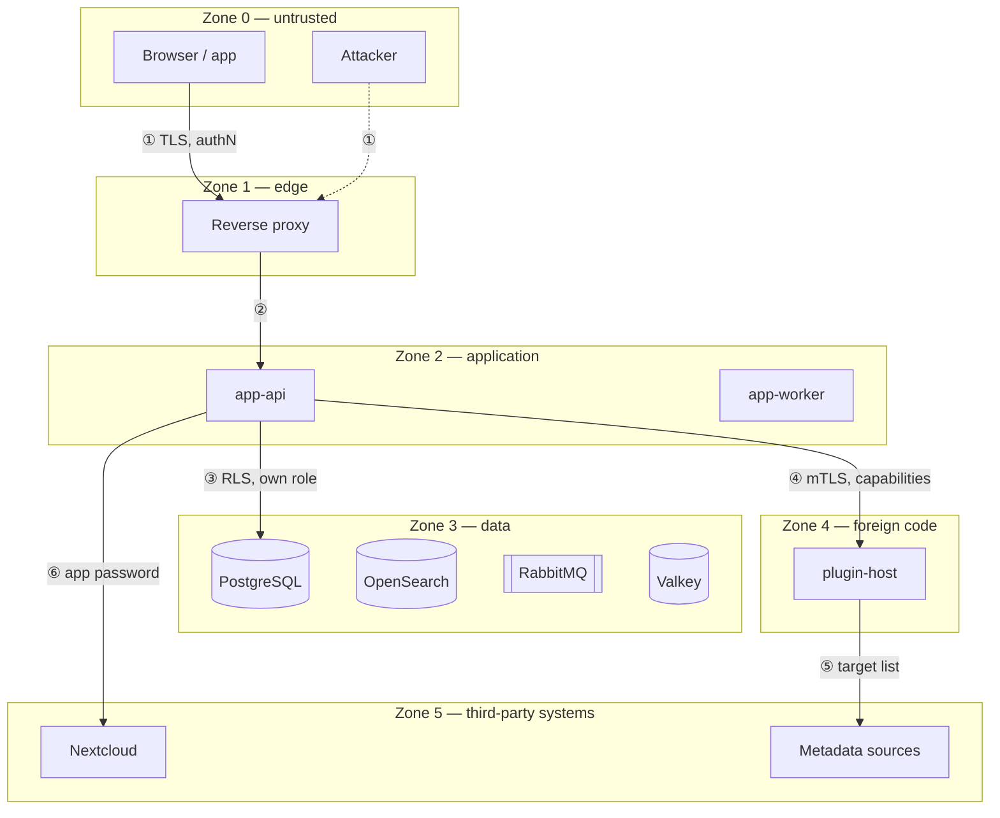

# 12 — Security

Security is quality goal **Q1** and takes precedence in every conflict of goals.
This chapter is binding; the corresponding testable requirements are in
[requirements/03](../requirements/03-security-and-privacy.md).

## 12.1 Assets

| Asset | Why it needs protecting | On loss |
|---|---|---|
| **Inventory data** | Reveals what someone owns, where it is and what it is worth — burglary preparation in data form | Not recoverable |
| **Photos** | Show living spaces; unintentionally contain people, documents, keys | Not recoverable |
| **Licence keys and credentials of digital goods** | Directly worth money | Immediate damage |
| **Credentials** | Access to everything above | Full compromise |
| **Tenant separation** | The basis for shared operation | Loss of trust, notification duty |
| **The audit log** | Ability to establish facts after an incident | The incident cannot be investigated |
| **Availability** | Subordinate — an outage is annoying, not damaging | — |

## 12.2 Trust boundaries



| Boundary | Checks on crossing |
|---|---|
| ① Zone 0 → 1 | TLS 1.3, HSTS, rate limiting, payload limits, basic WAF rules |
| ② Zone 1 → 2 | Authentication, CSRF, origin check, schema validation, **authorization**, setting the tenant context |
| ③ Zone 2 → 3 | A dedicated DB role without DDL and without `BYPASSRLS`, RLS active, parameterised queries only |
| ④ Zone 2 ↔ 4 | mTLS, capability check **per call**, deadline, payload limit, bulkhead, circuit breaker |
| ⑤ Zone 4 → 5 | Outbound connections only to the manifest's target list, enforced in the network |
| ⑥ Zone 2 → 5 | A dedicated Nextcloud app password with access to **exactly one** folder |

**Everything runs rootless.** No container and no container daemon runs as `root`
on the host ([ADR-0022](../adr/0022-rootless.md)). An escape from zone 4 — the
only place where foreign code runs — is therefore confined to an unprivileged
service user without `sudo`. Under Podman there is moreover no daemon at all, and
hence no root-equivalent socket.

**The core must not reach the internet.** `app-api` and `app-worker` sit in
networks without an outbound route; external calls happen exclusively through
plugins in zone 4. That confines the impact of SSRF to a container with no data
access.

## 12.3 Threats by STRIDE

Only the entries that shape this design; the full set is in the requirements
catalogue.

| Category | Threat | Countermeasure |
|---|---|---|
| **S** Spoofing | A stolen session or device token | Short-lived access tokens (10 min), rotating refresh tokens with reuse detection, binding to client characteristics, a session overview with remote sign-out |
| | Guessing credentials | Argon2id, rate limiting per account **and** per IP, increasing delay, checking against known breached passwords (k-anonymity, offline list), a mandatory second factor for `OWNER`/`ADMIN` |
| | A forged plugin | mTLS with a pinned certificate fingerprint, signed artifacts |
| **T** Tampering | Mass assignment | Separate input types per use case; no binding onto entities; unknown fields are **rejected**, not ignored |
| | IDOR / addressing foreign objects | Authorization on the loaded object, never on the ID alone; RLS as the second line; `404` instead of `403` for foreign objects |
| | A tampered audit log | Append-only, hash chain, the application role without `UPDATE`/`DELETE` |
| **R** Repudiation | "That was not me" | Audit with actor, time, IP, client, correlation ID; plugin writes recorded with the plugin as actor |
| **I** Information disclosure | Cross-tenant access | RLS with `FORCE`, application authorization, an automated isolation proof across all tables |
| | GPS in photos | EXIF stripping by default |
| | Enumerating public codes | ≥ 40 bits of randomness, rate limiting, a neutral response for unknown codes |
| | Revealing error messages | A uniform error format without internals; different causes yield identical responses |
| | Timing differences at login | Constant-time comparison, a dummy hash operation for unknown accounts |
| **D** Denial of service | Expensive queries | Cost analysis for GraphQL, result limits, a request timeout, rate limiting per tenant |
| | Image bombs (decompression bombs) | A pixel limit before decoding, memory and time limits in the image process, processing in the worker |
| | A slow plugin | Deadline, bulkhead, circuit breaker |
| | Filling up storage | Per-tenant quotas for counts, bytes and API calls |
| **E** Elevation of privilege | A plugin reaching core data | The capability model, process and network separation, in-process only signed and only by the operator |
| | **Escaping a container** (a kernel or runtime bug) | **Rootless**: the escapee is an unprivileged user without `sudo` on the host · no root daemon, no root-equivalent socket · `no-new-privileges`, `cap_drop: ALL`, a read-only filesystem · a separate UID range per plugin · [ADR-0022](../adr/0022-rootless.md) |
| | Role manipulation | Permission granting only by `OWNER`/`ADMIN`, nobody grants themselves permissions, every change audited |
| | SQL injection | Parameterised queries only; dynamic SQL only through a checked builder with field names from an allowlist |
| | Template injection in labels | A non-Turing-complete expression language, field access from an allowlist |

## 12.4 Authentication

| Mechanism | Decision |
|---|---|
| Password | Argon2id (≥ 19 MiB, t=2, p=1 — aligned with the OWASP recommendation, raisable by configuration), minimum length 12, no forced complexity, no forced rotation, checked against a breach list |
| Second factor | TOTP (RFC 6238) and **WebAuthn/passkeys**. **Mandatory** for `OWNER` and `ADMIN`. Recovery codes single-use, stored hashed. |
| Federation | OIDC Authorization Code + PKCE. Linking an external account to an existing one only after re-authentication. No automatic account linking by e-mail address alone — that is a known takeover route. |
| Registration | Default `invite_only`. An invitation is a single-use, time-limited token bound to the e-mail address. |
| Reset | A single-use token, valid 30 min, consumption invalidates all sessions, a notification goes to the old address |
| Web session | A `__Host-` cookie, `Secure`, `HttpOnly`, `SameSite=Strict`, server-side in Valkey, absolute maximum 30 days, idle 7 days |
| App / third party | OAuth 2.1: Authorization Code + PKCE through the system browser. **No** password in the app. Access token 10 min, refresh token rotating with reuse detection. |
| Machine access | Service accounts with tokens, scoped to a tenant and permissions, with an expiry date, shown in clear exactly once |
| Re-confirmation | Critical operations require the second factor again (granting permissions, deleting a tenant, exporting, plugin capabilities, viewing `sensitive` fields) |

## 12.5 Authorization

**One place, one answer.** `AccessControl.require(action, resource)` in the
application layer. No access adapter, no repository and no plugin makes its own
decision.

| Layer | Task |
|---|---|
| 1 — Tenant context | Derived from authentication, **never** from a request parameter. Sets `app.tenant_id` for the transaction. |
| 2 — Permissions | RBAC: role → permissions. Permission ID `<block>:<resource>:<action>`. |
| 3 — Object scope | Checked on the **loaded** object: does it belong to the tenant, does it lie in the permitted location subtree |
| 4 — Field visibility | `sensitive` fields are **removed** per role, not masked — masked fields reveal existence and length |
| 5 — RLS | An independent second line in the database |

| Rule | |
|---|---|
| Default | **Deny.** An endpoint without `@RequiresPermission` and without an explicit `@PublicEndpoint` marker fails the build. |
| Subtree permissions | A role can be scoped to a location subtree (e.g. "garage only") — the check uses the `ltree` path |
| Privilege escalation | Nobody can grant permissions they do not hold themselves |
| Proof | Every endpoint has a test for "no permission → 403" and "foreign tenant → 404" |

## 12.6 Input

| Rule | |
|---|---|
| Validation at the boundary | JSON Schema from the type version plus Bean Validation. **Unknown fields lead to rejection.** |
| Canonicalisation | Unicode NFC, control characters removed, lengths bounded — before any check |
| Output | Context-aware encoding; React escapes by default, `dangerouslySetInnerHTML` is forbidden by a lint rule |
| User text in Markdown | A permitted subset, sanitised server-side, no HTML, no `javascript:` targets |
| URLs from user input | `http`/`https` only, no internal address ranges, output with `rel="noopener noreferrer"`, never fetched server-side |
| File names | Never taken from input; storage happens under the hash |
| Regular expressions from field definitions | Checked for catastrophic backtracking, executed with a time limit |

## 12.7 Uploads

The riskiest input in the system.

| Stage | Measure |
|---|---|
| 1 | A size limit enforced **before** reading (default 25 MB) |
| 2 | Type detection through magic bytes; the client-reported extension and MIME type are discarded |
| 3 | An allowlist: JPEG, PNG, WebP, AVIF, HEIC, PDF, TXT, CSV. **SVG is rejected** (active content). |
| 4 | A pixel limit before decoding (default 100 MP) against decompression bombs |
| 5 | **Re-encoding** of every image through libvips — reliably destroys embedded payloads |
| 6 | EXIF removed entirely, **especially GPS**. Retention only on an explicit tenant setting, with a warning. |
| 7 | **A mandatory malware scan** (ClamAV through the `VirusScanner` port), **fail-closed**: on a finding the blob is discarded; if the scanner is unreachable the upload is rejected with `503` and the blob stays `PENDING_SCAN` and unretrievable ([ADR-0024](../adr/0024-malware-scan.md)). |
| 8 | Storage under `sha256/<hash>`, outside any web root |
| 9 | Serving from a **dedicated hostname** (`HOMEINV_MEDIA_BASE_URL`), with `Content-Disposition: attachment`, `X-Content-Type-Options: nosniff`, `Content-Security-Policy: sandbox`, without cookies |
| 10 | Access only through signed, short-lived URLs (15 min), bound to the user and the media ID |
| 11 | PDFs are **never** displayed inline, only offered for download |

## 12.8 Secrets and encryption

| Subject | Method |
|---|---|
| Passwords | Argon2id, never reversible |
| Tokens in the database | Stored only as a SHA-256 hash |
| `sensitive` fields (licence keys, credentials of digital goods) | **Envelope encryption**: a data key per tenant, encrypted with a master key from the environment. AES-256-GCM with additional authenticated data (tenant + field + item) — an encrypted value cannot be moved into another record. See [ADR-0019](../adr/0019-sensitive-field-encryption.md). |
| Plugin settings of type `secret` | Encrypted likewise; a plugin reads only its own |
| Nextcloud access | An app password with access to exactly one folder, never the main password |
| Key rotation | Per-tenant data keys can be re-wrapped without touching the data; the master key supports two active versions for a seamless rotation |
| In logs | A filter list prevents emitting tokens, keys, passwords and `sensitive` values; a test verifies it with known test values |
| In the repository | `gitleaks` in CI and as a pre-commit hook |

## 12.9 Security-related HTTP headers

```
Content-Security-Policy: default-src 'none'; script-src 'self' 'nonce-{r}';
  style-src 'self' 'nonce-{r}'; img-src 'self' https://media.example.org data:;
  connect-src 'self'; font-src 'self'; frame-ancestors 'none';
  base-uri 'none'; form-action 'self'; object-src 'none';
  require-trusted-types-for 'script'
Strict-Transport-Security: max-age=63072000; includeSubDomains; preload
X-Content-Type-Options: nosniff
Referrer-Policy: strict-origin-when-cross-origin
Permissions-Policy: camera=(self), geolocation=(), microphone=(), payment=()
Cross-Origin-Opener-Policy: same-origin
Cross-Origin-Resource-Policy: same-site
Cross-Origin-Embedder-Policy: require-corp
```

`camera=(self)` is necessary — without it scanning does not work. Everything else
is switched off. **No `unsafe-inline`, no `unsafe-eval`**: the Vite build is set
up accordingly, and a CI test compares the served CSP against an expected string.

Plugin UI panels (`ui:panel`) run in an `iframe` with `sandbox` and their own
origin; communication goes through `postMessage` with a verified origin and a
fixed message schema.

## 12.10 Supply chain

| Measure | Tool |
|---|---|
| Dependencies pinned | Gradle version catalog + lock files; npm with `package-lock.json` and `npm ci` |
| Vulnerability scanning | OWASP Dependency-Check and `osv-scanner` in CI; the build fails on "high"/"critical" |
| Updates | Renovate, auto-merging patch versions only and only on a green build |
| SBOM | CycloneDX per release, published as an artifact |
| Containers | A distroless base, `trivy` scanning, referenced by digest, signed with `cosign`, with build provenance |
| Reproducibility | Builds without network access apart from the dependency cache |
| CI permissions | Least privilege, `pull_request_target` forbidden, no secrets for foreign pull requests |
| Licence check | Automated AGPL compatibility check; incompatible licences fail the build |

## 12.11 Data protection

| Requirement | Implementation |
|---|---|
| Data minimisation | Only e-mail, display name and language are mandatory. No legal name, no date of birth, no phone number. |
| Purpose limitation | Photos and inventory data are not analysed for any other purpose; there are no analytics services and no outbound telemetry |
| Access (Art. 15) and portability (Art. 20) | `portability` produces a complete, machine-readable archive |
| Erasure (Art. 17) | Account and tenant deletion with a 30-day grace period and **a completion report per building block** ([05 §5.9](05-runtime-view.md)) |
| Log data | IP addresses removed from application logs after 7 days; in the audit log only for security-relevant events and truncated there |
| Processors | Nextcloud and SMTP are processors; a template for a processing register and for the description of technical and organisational measures ships with the documentation |
| Location | All data stays on the operator's instance. Outbound connections exclusively through explicitly enabled plugins, with a visible target list. |
| Consent for enrichment | A request to an external metadata source transmits a code (ISBN/EAN). This must be disclosed to the tenant and is switchable per resolver. |
| **Push through third parties** | Firebase and APNs are attached as a **plugin**, not in the core ([ADR-0023](../adr/0023-push-notifications.md)). What is transmitted is device token, timestamp and category only — **no inventory data**; the app fetches the content through the authenticated API. Three separate opt-ins: the operator installs, the tenant administrator grants `network:outbound`, the user switches it on. Google and Apple must be listed as processors; a template ships with the documentation. |

## 12.12 Verification and evidence

| Check | Frequency | Blocking |
|---|---|---|
| SAST (CodeQL, SpotBugs + `find-sec-bugs`, ESLint security) | every push | yes |
| Dependency and container scanning | every push, daily | yes on high/critical |
| Secret scanning | every push + pre-commit | yes |
| **Tenant isolation** — an automated proof across all tables | every push | yes |
| **Authorization coverage** — negative tests for every endpoint | every push | yes |
| CSP and header verification against expected values | every push | yes |
| Upload attack patterns (polyglots, bombs, traversal) as a test suite | every push | yes |
| DAST (a ZAP baseline run against the test environment) | nightly | no, reports |
| Threat model review | per release that adds a zone or a port | — |
| Restore rehearsal | quarterly | — |

## 12.13 Incident handling

| Point | Decision |
|---|---|
| Reporting channel | `SECURITY.md` with a contact address and GPG key, coordinated disclosure, 90 days |
| Response times | Acknowledgement within 72 h, initial assessment within 7 days |
| Immediate measures | Terminate all sessions of a tenant, revoke tokens, disable a plugin, suspend a tenant — each available as an administrative function, not improvised |
| Traceability | The audit log must be able to answer "what did this account do in this period". That is the requirement its design is measured against. |
| Notification | On suspicion of personal data exposure: data subjects and the supervisory authority within 72 h (Art. 33/34 GDPR); text templates ship with the documentation |
| Security updates | A dedicated release channel, announcement through GitHub Security Advisories, CVE request where warranted |
