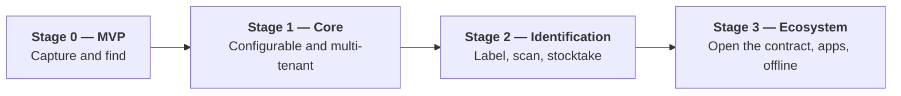
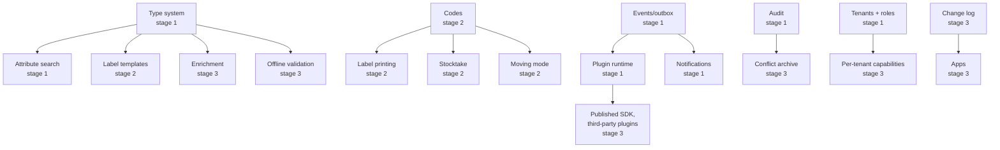

# 04 — Stages and Sequence

Four stages. Each is **usable and deployable on its own** — no stage is half a
product waiting for the next. After each stage the remainder is re-assessed
(risk R1: the overall scope is large for one person).

---

## Stage 0 — MVP: "capture and find"

**Done when:** an item can be created, photographed, stored and found again —
through a hardened instance reachable from the internet.

| Included | Not included |
|---|---|
| Password login, sessions, rate limiting | Second factor, OIDC, invitations |
| **One** tenant (the model is multi-tenant, the UI shows one) | Tenant administration, roles beyond admin/user |
| Items with **fixed** fields — name, description, kind, type reference, quantity with unit (`REQ-CORE-002`, and the columns `inventory.item` actually carries) | The configurable type system · **notes** (`REQ-CORE-014`, stage 1) · **purchase data** (`REQ-LIFE-001`, stage 1) · **condition**, which is a tag or a type field, not a fixed column |
| A location tree with fixed categories | Category configuration, mobile locations |
| Photos and documents: upload, re-encoding, EXIF stripping, thumbnails, the **mandatory malware scan** — with the `egress-proxy` it needs for its signatures ([ADR-0036](../adr/0036-scanner-egress.md)) — serving through signed URLs from the media hostname, `BlobStore` (filesystem, in-core) | S3 and Nextcloud adapters (they are plugins), resumable upload |
| Full-text search (PostgreSQL), cursor pagination | OpenSearch, facets, saved searches |
| A REST API `/api/v1` with OpenAPI and problem details | GraphQL, gRPC, webhooks |
| The web PWA (read and write, online) | Offline operation |
| **Both container runtimes rootless** (Podman/Quadlet and Docker/Compose), the service matrix, migrations, health endpoints, logging | Helm, OpenSearch, RabbitMQ |
| **All security foundations**: the RLS schema, CSP served by `web` with hashes **and `trusted-types`**, upload hardening, parameterised queries, the authorization scaffolding, the network segmentation with the management port bound to `internal`, **a credential on every datastore and `web` on its own two-member segment** ([ADR-0044](../adr/0044-internal-is-not-a-trust-boundary.md)), **the WAL archive volume** ([ADR-0045](../adr/0045-wal-archive-volume.md)) and **the URL signing key** | — |

**Binding requirements:** every requirement whose **Stage** column reads `0`.

> **The fixed-field list above was a fourth description of the same thing** and
> agreed with none of the other three (open point **O19**, decided 2026-09-11).
> It named *note* and *purchase data* as stage-0 fields while `REQ-CORE-014` and
> `REQ-LIFE-001` both say stage 1; `REQ-CORE-002` named *condition*, which has no
> column and no type system at stage 0; and the `inventory.item` DDL in
> [07 §7.3](../architecture/07-data-model.md) had none of the three. All four now
> say the same five fields.

> That list used to be spelled out here as well, and the two had already drifted
> apart in three places — `REQ-NFR-063` was listed as stage 0 while its row said
> stage 1, and `REQ-CON-012` and `REQ-NFR-030` were stage 0 in their rows and
> missing here. The catalogue is the single source; this file no longer repeats
> it. A CI check renders the per-stage lists from the Stage column, so the two
> cannot diverge again.

> **Why the security requirements are already in stage 0:** retrofitting RLS,
> CSP, the authorization scaffolding and upload hardening means touching every
> table, every endpoint and every test again. They cost little at the beginning
> and a great deal later.
>
> That claim used to be contradicted by the catalogue itself. Stage 0 accepted
> uploads — PDFs included — while the malware scan, the signed URLs and the
> dedicated media hostname were filed under stage 1, and row-level security was
> filed under stage 1 while this page asserted three times that it was not
> deferred. Both were catalogue errors, not plan changes: ClamAV is mandatory in
> every profile ([ADR-0024](../adr/0024-malware-scan.md)) and ships in the stage-0
> container set, and the RLS schema is stage-0 work by everyone's account. The
> Stage column now says what this page always said.
>
> **A third error of the same shape, found 2026-09-11:** the scanner shipped in
> stage 0 and the `egress-proxy` it needs for its signatures did not — the proxy
> was filed with the plugin runtime in stage 1, and in `minimal` it was not
> scheduled at all. Stage 0 would therefore have had a mandatory, **fail-closed**
> scanner running on whatever signature set was baked into its image: reporting
> clean and meaning nothing, with a 48-hour staleness alert firing forever. The
> proxy moves to stage 0 carrying one fixed allowlist entry, which is the smallest
> possible version of the same component
> ([ADR-0036](../adr/0036-scanner-egress.md)); its plugin-facing half stays in
> stage 1 with the runtime.

---

## Stage 1 — Core: "configurable and multi-tenant"

**Done when:** a tenant administrator sets up types, fields, location categories,
tags and roles themselves — without a developer and without a restart.

| Area | Content |
|---|---|
| **Type system** | Item types and location categories with freely definable fields, inheritance, versioning, the generated JSON Schema, value lists, type templates |
| **Attribute storage** | JSONB plus `item_attr_index`, the consistency reconciliation, the rebuild run |
| **Tenants** | Creation, memberships, invitations, roles and permissions, subtree scoping, field visibility, quotas, deletion with a grace period |
| **Login** | Second factor (TOTP, passkeys), re-confirmation, the session overview, service accounts |
| **Tags** | Tags, groups, merging |
| **Lifecycle** | Warranty, maintenance log, lending, sale, disposal, trash, history with restore, value reporting (purchase price, current value, replacement value, the insurance report) |
| **Search** | OpenSearch with facets, filters, sorting, saved searches, the PostgreSQL fallback |
| **Events** | The outbox, RabbitMQ, the worker role |
| **Plugin runtime** | Registry, manifests, signature verification, the per-tenant capability model, lifecycle, health, gRPC over mTLS, bulkheads and circuit breakers, the **per-plugin network segments** ([ADR-0037](../adr/0037-per-plugin-network-segments.md)), and the **plugin-facing half of the egress proxy** — its manifest-driven allowlist, the per-segment interfaces and the TCP forwarding mode. The proxy container itself already exists from stage 0, for the scanner ([ADR-0036](../adr/0036-scanner-egress.md)). Moved here from stage 3 ([ADR-0028](../adr/0028-plugin-runtime-stage-1.md)) because the core makes no outbound connection any more — so mail, remote storage and federated login are all plugins, and stage 1 needs all three |
| **First-party plugins** | `plugin-smtp`, `plugin-blobstore-s3`, `plugin-blobstore-nextcloud`, `plugin-webhook`, `plugin-oidc` — built against the same contract third parties get in stage 3, which is what proves the contract before it is published |
| **Media** | S3 and **Nextcloud adapters as plugins**, resumable upload, reference counting, the mandatory malware scan |
| **API** | GraphQL (read-only), ETag/If-Match, idempotency, SSE, the versioning policy with measurement |
| **Audit** | The append-only log with a hash chain, history queries, the hourly anchor, and the `homeinv_housekeeping` role with the truncation marker that lets per-tenant retention be enforced without looking like tampering ([ADR-0046](../adr/0046-truncatable-audit-chain.md)) |
| **Notifications** | Rules as data, reminders — delivered through `plugin-smtp` and `plugin-webhook` |
| **Import/export** | CSV with a mapping profile and dry run, the tenant export, GDPR access, the Homebox and InvenTree profiles |
| **Operations** | Metrics, tracing, backup with **automated restore verification**, housekeeping runs, runbooks |

---

## Stage 2 — Identification: "label, scan, stocktake"

**Done when:** a label sheet is printed, stuck on, scanned, and leads to the item
— and a stocktake in the cellar works.

| Area | Content |
|---|---|
| **Codes** | The public short code, pre-issuing, binding and reassignment, resolution at `/c/{code}` with a neutral response |
| **Generation** | QR shipped, the `CodeFormat` port in place |
| **Scanning** | Browser camera with `BarcodeDetector` where the browser has it and **ZXing-WASM everywhere else — including all of iOS**, where it is the only path (risk R17); continuous scan mode, HID handheld scanners, scan sessions in all modes |
| **Foreign codes** | Recognising and binding EAN, UPC, ITF-14, ISBN |
| **Labels** | Templates with the bounded expression language, the `LabelMedia` catalogue with verification flags, start offset, calibration sheet, to-scale preview |
| **Printing** | The print job as an aggregate, the PDF target shipped, the `PrintTarget` port, the position record |
| **Flows** | Stocktake mode with a discrepancy report, **moving mode** with sealable mobile locations |
| **Deployment** | The Helm chart, tested in CI against `kind`, with the `restricted` PodSecurity profile and user namespaces |

---

## Stage 3 — Ecosystem: "open the contract, apps, offline"

**Done when:** an **external** author, working only from the published SDK and
without access to this repository, gets a plugin running without a core change —
and the app works a week offline and then reconciles without loss.

> "A plugin runs without a core change" is proved already in **stage 1**, with a
> first-party plugin. What stage 3 adds is the part that cannot be faked
> in-house: someone else, on the published contract, with the documentation as
> their only guide ([ADR-0028](../adr/0028-plugin-runtime-stage-1.md)).

| Area | Content |
|---|---|
| **Opening the contract** | `home_inv.plugin.v1` is **published** here, and only from this point is it binding under [ADR-0011](../adr/0011-api-versioning.md)'s six-month rule. The runtime itself was built in stage 1 ([ADR-0028](../adr/0028-plugin-runtime-stage-1.md)) |
| **Plugin SDK** | `homeinv-plugin-api` (Apache-2.0), SDKs for Java and Python, the protobuf module, the **contract test suite**, a project template, three example plugins, `PLUGINS.md`, `ui:panel` |
| **Enrichment** | The `MetadataResolver` port, ISBN and EAN resolvers, the proposal model, `FieldMapping`, caching |
| **Further ports** | Printer plugins, `ScanSource` for Bluetooth scanners, push channels (Firebase, APNs, Web Push), `ValuationProvider` |
| **Apps** | Kotlin Multiplatform with Compose Multiplatform, OAuth 2.1 with PKCE, camera, scanner |
| **Offline** | Full bidirectional reconciliation, the three-way compare, conflict records and their resolution, device management with remote wipe, the media queue, property-based tests |
| **Web offline** | The PWA with IndexedDB, a service worker, local search |

---

## Dependencies between the stages

**Hard ordering constraints:**

| First | Then | Why |
|---|---|---|
| Type system (1) | Enrichment (3) | Without target fields there is nothing to map onto |
| Type system (1) | Offline validation (3) | The client validates against the generated JSON Schema |
| Codes (2) | Labels, stocktake, moving (2) | Everything hangs on the code |
| Outbox and RabbitMQ (1) | Plugin event delivery (1) | Plugins receive events |
| Plugin runtime (1) | Invitations, password reset, remote storage (1) | Mail and object storage are plugins ([ADR-0026](../adr/0026-core-outbound-via-plugins.md)) — this is the ordering constraint that moved the runtime forward |
| Plugin runtime (1) | The published SDK (3) | The contract is exercised by first-party plugins before it is opened |
| Tenants and roles (1) | Per-tenant capabilities (3) | Capabilities are granted per tenant |
| Change log (3) | Apps (3) | Without a reconciliation protocol there is no offline app |

---

## What was deliberately deferred

| Deferred | To | Why |
|---|---|---|
| Offline operation | Stage 3 | The most expensive and most error-prone part; it needs a stable data model underneath |
| GraphQL | Stage 1 | Only useful once there are complex views to serve |
| OpenSearch | Stage 1 | PostgreSQL search carries the MVP; the port exists from the start |
| ~~Plugins~~ → **the published contract and the SDK** | Stage 3 | The **runtime** moved to stage 1, because after [ADR-0026](../adr/0026-core-outbound-via-plugins.md) mail and remote storage are plugins and stage 1 needs them. What stays deferred is *publishing* the contract — early publication is what would be binding, and the contract is better tested by our own plugins first |
| The Helm chart | Stage 2 | The two container runtimes carry operation; the chart disciplines statelessness later |
| The tenant UI | Stage 1 | The **data model** is multi-tenant from stage 0; only the interface is missing |

## What was deliberately not deferred

RLS, the authorization scaffolding, CSP, upload hardening, parameterised queries,
module boundaries with machine verification, multilingual support, cursor
pagination, a `traceId` in every response, configuration through environment
variables — and **rootless in both container runtimes, including the service
matrix**. Since 2026-09-11 also: **authentication on every datastore**, because
retrofitting a credential onto a running Valkey means invalidating every session and onto
a running RabbitMQ means a queue migration; **the WAL archive volume**, because adding one
later is a PostgreSQL restart and a base backup; and **the two generated search vectors**
([ADR-0047](../adr/0047-bilingual-search-vectors.md)), because after the first million
items that is a table rewrite. Converting a running installation from rootful to rootless afterwards
means re-homing every volume; at the beginning it costs an hour of setup.

**All of it is expensive later and cheap now.**
