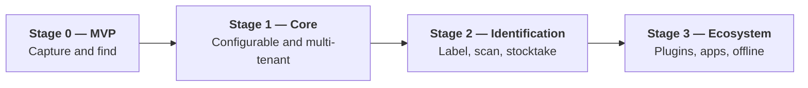
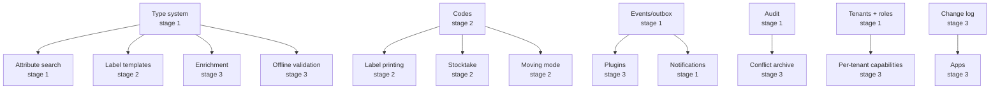

# 04 — Stages and Sequence

Four stages. Each is **usable and deployable on its own** — no stage is half a
product waiting for the next. After each stage the remainder is re-assessed
(risk R1: the overall scope is large for one person).

---

## Stage 0 — MVP: "capture and find"

**Done when:** an item can be created, photographed, stored and found again —
through a hardened instance reachable from the internet.

| Included | Not included |
|---|---|
| Password login, sessions, rate limiting | Second factor, OIDC, invitations |
| **One** tenant (the model is multi-tenant, the UI shows one) | Tenant administration, roles beyond admin/user |
| Items with **fixed** fields (name, description, quantity, note, purchase data) | The configurable type system |
| A location tree with fixed categories | Category configuration, mobile locations |
| Photos: upload, re-encoding, EXIF stripping, thumbnails, `BlobStore` (filesystem) | S3 and Nextcloud adapters, resumable upload |
| Full-text search (PostgreSQL), cursor pagination | OpenSearch, facets, saved searches |
| A REST API `/api/v1` with OpenAPI and problem details | GraphQL, gRPC, webhooks |
| The web PWA (read and write, online) | Offline operation |
| **Both container runtimes rootless** (Podman/Quadlet and Docker/Compose), the service matrix, migrations, health endpoints, logging | Helm, OpenSearch, RabbitMQ |
| **All security foundations**: the RLS schema, CSP, upload hardening, parameterised queries, the authorization scaffolding | — |

**Binding requirements:** REQ-CORE-001/002/003/040/044/045/049 ·
REQ-MED-001 to 007 · REQ-SRCH-001/009 · REQ-API-001/003 ·
REQ-AUTH-001 · REQ-NFR-010/019 to 024/027 to 029/032/033/035/041/042/045 to 047/051/054/055/059 to 063/065/067 ·
REQ-SEC-010/012/013/017/022 to 025/029 to 033/037 to 042/050/051/060 to 063/065/067/074 to 076/078/083 to 085/089 ·
REQ-PRIV-001/002/007 · REQ-CON-001 to 003

> **Why the security requirements are already in stage 0:** retrofitting RLS,
> CSP, the authorization scaffolding and upload hardening means touching every
> table, every endpoint and every test again. They cost little at the beginning
> and a great deal later.

---

## Stage 1 — Core: "configurable and multi-tenant"

**Done when:** a tenant administrator sets up types, fields, location categories,
tags and roles themselves — without a developer and without a restart.

| Area | Content |
|---|---|
| **Type system** | Item types and location categories with freely definable fields, inheritance, versioning, the generated JSON Schema, value lists, type templates |
| **Attribute storage** | JSONB plus `item_attr_index`, the consistency reconciliation, the rebuild run |
| **Tenants** | Creation, memberships, invitations, roles and permissions, subtree scoping, field visibility, quotas, deletion with a grace period |
| **Login** | Second factor (TOTP, passkeys), re-confirmation, the session overview, service accounts |
| **Tags** | Tags, groups, merging |
| **Lifecycle** | Warranty, maintenance log, lending, sale, disposal, trash, history with restore, value reporting (purchase price, current value, replacement value, the insurance report) |
| **Search** | OpenSearch with facets, filters, sorting, saved searches, the PostgreSQL fallback |
| **Events** | The outbox, RabbitMQ, the worker role, webhooks (basic form) |
| **Media** | S3 and **Nextcloud adapters**, resumable upload, reference counting, the mandatory malware scan |
| **API** | GraphQL (read-only), ETag/If-Match, idempotency, SSE, the versioning policy with measurement |
| **Audit** | The append-only log with a hash chain, history queries |
| **Notifications** | Rules as data, e-mail and webhook, reminders |
| **Import/export** | CSV with a mapping profile and dry run, the tenant export, GDPR access, the Homebox and InvenTree profiles |
| **Operations** | Metrics, tracing, backup with **automated restore verification**, housekeeping runs, runbooks |

---

## Stage 2 — Identification: "label, scan, stocktake"

**Done when:** a label sheet is printed, stuck on, scanned, and leads to the item
— and a stocktake in the cellar works.

| Area | Content |
|---|---|
| **Codes** | The public short code, pre-issuing, binding and reassignment, resolution at `/c/{code}` with a neutral response |
| **Generation** | QR shipped, the `CodeFormat` port in place |
| **Scanning** | Browser camera with `BarcodeDetector` and a ZXing fallback, continuous scan mode, HID handheld scanners, scan sessions in all modes |
| **Foreign codes** | Recognising and binding EAN, UPC, ITF-14, ISBN |
| **Labels** | Templates with the bounded expression language, the `LabelMedia` catalogue with verification flags, start offset, calibration sheet, to-scale preview |
| **Printing** | The print job as an aggregate, the PDF target shipped, the `PrintTarget` port, the position record |
| **Flows** | Stocktake mode with a discrepancy report, **moving mode** with sealable mobile locations |
| **Deployment** | The Helm chart, tested in CI against `kind`, with the `restricted` PodSecurity profile and user namespaces |

---

## Stage 3 — Ecosystem: "plugins, apps, offline"

**Done when:** a third-party plugin runs without a core change, and the app works
a week offline and then reconciles without loss.

| Area | Content |
|---|---|
| **Plugin runtime** | The registry, manifests, signature verification, the per-tenant capability model, lifecycle, health, gRPC over mTLS, bulkheads and circuit breakers |
| **Plugin SDK** | `homeinv-plugin-api` (Apache-2.0), SDKs for Java and Python, the protobuf module, the **contract test suite**, a project template, three example plugins |
| **Enrichment** | The `MetadataResolver` port, ISBN and EAN resolvers, the proposal model, `FieldMapping`, caching |
| **Further ports** | Printer plugins, `ScanSource` for Bluetooth scanners, `NotificationChannel` (including Firebase and APNs), `IdentityProvider` (OIDC), `ValuationProvider` |
| **Apps** | Kotlin Multiplatform with Compose Multiplatform, OAuth 2.1 with PKCE, camera, scanner |
| **Offline** | Full bidirectional reconciliation, the three-way compare, conflict records and their resolution, device management with remote wipe, the media queue, property-based tests |
| **Web offline** | The PWA with IndexedDB, a service worker, local search |

---

## Dependencies between the stages

**Hard ordering constraints:**

| First | Then | Why |
|---|---|---|
| Type system (1) | Enrichment (3) | Without target fields there is nothing to map onto |
| Type system (1) | Offline validation (3) | The client validates against the generated JSON Schema |
| Codes (2) | Labels, stocktake, moving (2) | Everything hangs on the code |
| Outbox and RabbitMQ (1) | Plugins (3) | Plugins receive events |
| Tenants and roles (1) | Per-tenant capabilities (3) | Capabilities are granted per tenant |
| Change log (3) | Apps (3) | Without a reconciliation protocol there is no offline app |

---

## What was deliberately deferred

| Deferred | To | Why |
|---|---|---|
| Offline operation | Stage 3 | The most expensive and most error-prone part; it needs a stable data model underneath |
| GraphQL | Stage 1 | Only useful once there are complex views to serve |
| OpenSearch | Stage 1 | PostgreSQL search carries the MVP; the port exists from the start |
| Plugins | Stage 3 | Only once the ports are functionally stable — a contract published early is binding |
| The Helm chart | Stage 2 | The two container runtimes carry operation; the chart disciplines statelessness later |
| The tenant UI | Stage 1 | The **data model** is multi-tenant from stage 0; only the interface is missing |

## What was deliberately not deferred

RLS, the authorization scaffolding, CSP, upload hardening, parameterised queries,
module boundaries with machine verification, multilingual support, cursor
pagination, a `traceId` in every response, configuration through environment
variables — and **rootless in both container runtimes, including the service
matrix**. Converting a running installation from rootful to rootless afterwards
means re-homing every volume; at the beginning it costs an hour of setup.

**All of it is expensive later and cheap now.**
